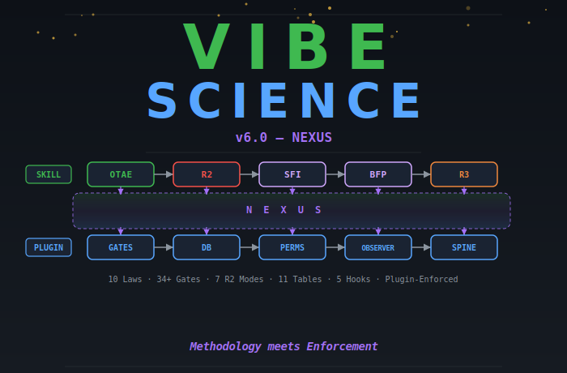

<p align="center">
  
</p>

<p align="center">
  <a href="https://doi.org/10.5281/zenodo.18665031"></a>
  <a href="LICENSE"></a>
  
  
</p>

# Vibe Science

> An AI-native research engine that loops until discovery — with adversarial review, quality gates, serendipity tracking, and plugin-enforced integrity.

Vibe Science turns an LLM into a disciplined research agent. It provides a structured methodology (OTAE loop), an adversarial review system (Reviewer 2 Ensemble), typed evidence tracking, and quality gates — while preserving room for unexpected discoveries.

**v6.0 NEXUS** introduces a dual architecture: the **skill** (prompt-level methodology) guides *what* the agent thinks, while the **plugin** (code-level enforcement) controls *what* the agent can do. Five lifecycle hooks intercept every tool use, enforce gates with exit code 2 blocking, track a Research Spine of every action, and persist everything to SQLite.

This repository tracks the evolution of Vibe Science across six major releases plus a domain-specialized photonics fork. Each version is self-contained and independently installable.

---

## The Problem

AI agents are dangerous in science. Not because they hallucinate — that's the easy problem.

The dangerous problem is that they find **real patterns** in **real data** and construct **plausible narratives** around them, without ever asking: *"What if this is an artifact?"*

<table>
<tr>
<td width="50%">

**What the agent does:**
- Optimizes for completion, not truth
- Gets excited by strong signals (p < 10⁻¹⁰⁰!)
- Constructs narratives around artifacts
- Never searches for what kills its own claims
- Declares "done" after 1 sprint

</td>
<td width="50%">

**What actually happened (21 sprints, CRISPR):**
- OR = 2.30 → **reversed sign** under propensity matching
- "Bidirectional effects" → **biologically impossible**
- "Regime switch" → Cohen's d = **0.07** (noise)
- "Generalizable rankings" → **don't generalize** between assays

</td>
</tr>
</table>

None of these were hallucinations. The data was real. The statistics were correct. The problem was dispositional: **the agent never tried to destroy its own claims.**

---

## The Solution

```
                    Builder (Researcher)              Destroyer (Reviewer 2)
                    ───────────────────               ─────────────────────
  Optimizes for:    Completion                        Survival
  Default stance:   "This looks promising"            "This is probably an artifact"
  Strong signal:    Excitement → narrative → paper     Suspicion → confounders → controls
  Web search for:   Supporting evidence               Contradictions, prior art, known artifacts
  Says "done":      When results look good            When ALL counter-verifications pass
```

**Vibe Science embeds both dispositions in the same system.** The builder builds. The destroyer destroys. Only what survives both gets published.

---

## Version Evolution

| Version | Codename | Architecture | Key Innovation | Laws | Gates |
|---------|----------|-------------|----------------|:----:|:-----:|
| [**v6.0**](#v60--nexus) | NEXUS | **Skill + Plugin** | Plugin enforcement, SQLite persistence, 5 lifecycle hooks, Research Spine | 10 | 34+ |
| [**v5.5**](archive/vibe-science-v5.5/) | ORO | OTAE-Tree + Data Quality | 7 new gates, R2 INLINE, SSOT, structured logbook, post-mortem driven | 10 | 34 |
| [**v5.0**](archive/vibe-science-v5.0/) | IUDEX | OTAE-Tree + Verification | SFI, blind-first pass, R3 judge, schema-validated gates | 10 | 27 |
| [**v4.5**](archive/vibe-science-v4.5/) | ARBOR VITAE (Pruned) | OTAE-Tree + Brainstorm | Phase 0 brainstorm, R2 6 modes, 5-stage pipeline | 10 | 25 |
| [**v4.0**](archive/vibe-science-v4.0/) | ARBOR VITAE | OTAE-Tree | Tree search, branch scoring, serendipity branches | 10 | 26 |
| [**v3.5**](archive/vibe-science-v3.5/) | TERTIUM DATUR | OTAE Loop | R2 double-pass, typed claims, evidence formula | 7 | 12 |
| [**v5.0 Codex**](archive/vibe-science-v5.0-codex/) | IUDEX | Same as v5.0 | OpenAI Codex port (condensed SKILL.md, no hooks/TEAM) | 10 | 27 |
| [**Photonics**](archive/vibe-science-photonics/) | ORO-PHOTONICS | OTAE-Tree + Expert Knowledge | v5.5 fork for photonics: R2-Physics, HE0-HE3, Expert Knowledge Injection | 10 | 36 |


---

## v6.0 — NEXUS

> *Methodology meets enforcement. The skill guides reasoning, the plugin makes violations structurally impossible.*

v5.5 proved that prompt-level methodology works — but it also proved that prompts can be ignored. 12 mistakes in the CP+CRISPR run, ZERO caught by automated checks. v6.0 solves this by splitting the system in two: the **skill** (methodology, unchanged from v5.5) guides *what to think*, while the **plugin** (new, code-level) controls *what can happen*.

### Dual Architecture

```
┌─────────────────────────────────────────────────────────────────┐
│  SKILL (prompt-level)           │  PLUGIN (code-level)          │
│  ─────────────────              │  ──────────────────           │
│  OTAE loop                      │  5 lifecycle hooks            │
│  R2 Ensemble (7 modes)          │  Gate Engine (DQ/DC/DD/L-1+)  │
│  SFI, BFP, R3 Judge             │  Permission Engine (6 roles)  │
│  Brainstorm Engine               │  Research Spine (auto-log)    │
│  Evidence Engine                 │  Context Builder (~700 tok)   │
│  Serendipity Engine              │  Narrative Engine             │
│  10 Constitutional Laws          │  R2 Auto-Calibration          │
│  21 protocols                    │  Silent Observer              │
│                                  │  SQLite (11 tables)           │
│  Guides REASONING               │  Enforces BEHAVIOR            │
└─────────────────────────────────────────────────────────────────┘
```

### Plugin Subsystems

<table>
<tr>
<td width="33%" valign="top">

**Gate Engine**

Enforces DQ1-DQ4, DC0, DD0, L-1+ at PostToolUse. Exit code 2 = BLOCK.

- DQ4: auto-verifies FINDINGS.md numbers match JSON source
- L-1+: blocks research direction without prior literature search
- Domain-aware hints from `domain-config.json`

</td>
<td width="33%" valign="top">

**Permission Engine**

TEAM mode with 6 roles: `researcher`, `reviewer2`, `judge`, `serendipity`, `lead`, `experimenter`.

- Glob-based file access control
- Role inference from prompt keywords
- Separation of powers enforced in code

</td>
<td width="33%" valign="top">

**Research Spine**

Automatic structured logging of every significant action.

- 20+ action types classified
- Timestamps, inputs, outputs, gate status
- Links every numerical claim to its source

</td>
</tr>
<tr>
<td valign="top">

**Context Builder**

Progressive disclosure in ~700 tokens:

- Layer 1: STATE.md summary (~200 tok)
- Layer 2: Semantic recall (~500 tok)
- R2 calibration hints
- Pending serendipity seeds

</td>
<td valign="top">

**Silent Observer**

Periodic integrity checks (every 10 tool uses):

- Stale STATE.md detection
- FINDINGS.md / JSON desync
- Orphaned datasets
- Design-execution drift
- Literature staleness

</td>
<td valign="top">

**R2 Auto-Calibration**

Cross-session learning for R2:

- Top weakness patterns
- SFI miss categories
- J0 score trends
- Researcher error patterns
- Hints injected at SessionStart

</td>
</tr>
</table>

### Five Lifecycle Hooks

| Hook | When | What It Does |
|------|------|-------------|
| **Setup** | Plugin install | Creates `~/.vibe-science/`, initializes SQLite DB, installs dependencies (smart marker), launches embedding worker daemon |
| **SessionStart** | New conversation | Creates session, builds ~700-token context, loads R2 calibration |
| **UserPromptSubmit** | Every user message | Identifies agent role, logs prompt hash (privacy), semantic recall |
| **PostToolUse** | Every tool action | **Gate enforcement**, permission check, auto-log to Spine, observer |
| **Stop** | Session end | Narrative summary, enforcement check (blocks if unreviewed claims), STATE.md export |

### SQLite Persistence (11 Tables)

```
sessions              ← session lifecycle
spine_entries         ← Research Spine (every action)
claim_events          ← claim lifecycle (create, review, promote, kill)
r2_reviews            ← R2 review results + weaknesses
serendipity_seeds     ← cross-session seed survival
gate_checks           ← every gate pass/fail with details
literature_searches   ← L-1+ audit trail
observer_alerts       ← Silent Observer findings
calibration_log       ← R2 calibration data
prompt_log            ← SHA-256 hashes only (privacy)
embed_queue           ← async vector embedding queue
```

Foreign keys: `calibration_log.session_id` and `prompt_log.session_id` reference `sessions(id)`. Index `idx_prompt_session` accelerates per-session prompt lookups.

### Embedding Strategy

v6.0 uses real ML embeddings for semantic search via the `all-MiniLM-L6-v2` model (~23 MB quantized ONNX). The worker daemon (`worker-embed.js`) processes the `embed_queue` table asynchronously:

- **Lazy model loading** — the transformer model is downloaded and cached on first use via `@huggingface/transformers`
- **Hash fallback** — if ML embedding fails (e.g., missing ONNX runtime), a deterministic SHA-256 hash vector provides graceful degradation
- **Async batch processing** — embeddings are computed in background ticks, keeping hook latency at zero

### Literature Engine (102 Databases)

L-1+ is domain-aware with a 4-layer architecture:

1. **Domain Registry** — 102 databases across 12 categories (genomics, chemistry, physics, materials, clinical, ...)
2. **MCP Server Stack** — PubMed, arXiv, Semantic Scholar, OpenAlex, ChEMBL, UniProt
3. **Scientific Skills** — 28+ K-Dense-AI database skills
4. **Local RAG** — Zotero, PaperQA2, NotebookLM integration

### What v6.0 Keeps from v5.5

Everything. The entire v5.5 ORO skill is preserved unchanged:
- OTAE-Tree loop, 10 Constitutional Laws, R2 Ensemble (7 modes including INLINE)
- SFI, BFP, R3 Judge, Schema-Validated Gates, Circuit Breaker
- Agent Permission Model, Serendipity Engine, 5-stage Experiment Manager
- 34 gates, 21 protocols, SSOT rule, structured logbook
- Full data discovery pipeline (download datasets, write Python scripts, serendipity detection)

### What v6.0 Adds

| Component | Lines | Purpose |
|-----------|------:|---------|
| `post-tool-use.js` | 1,482 | Gate enforcement, permissions, auto-logging, observer |
| `session-start.js` | 387 | Context injection, R2 calibration, domain config |
| `worker-embed.js` | 519 | Background embedding daemon |
| `gate-engine.js` | 630 | DQ/DC/DD/L-1+ gate logic |
| `db.js` | ~500 | SQLite wrapper with prepared statement cache |
| `prompt-submit.js` | 239 | Agent identification, semantic recall |
| `context-builder.js` | 231 | Progressive disclosure |
| `permission-engine.js` | 288 | Role-based access control |
| `narrative-engine.js` | 333 | Template-based session summaries |
| `vec-search.js` | 355 | sqlite-vec with keyword fallback |
| `r2-calibration.js` | 196 | Cross-session R2 learning |
| `schema.sql` | ~250 | 11 tables + indices |
| `stop.js` | 171 | Session end enforcement |
| `setup.js` | 363 | DB init, dependency install, worker daemon launch |
| `literature-registry.json` | ~800 | 102 databases, 12 categories |
| **Total new code** | **~6,600+** | |

---

## v5.5 — ORO

> *The post-mortem release. Every change traces to a real mistake. Now with plugin enforcement in v6.0.*

---

## v3.5 — TERTIUM DATUR

> *The foundation. Field-tested over 21 sprints of CRISPR-Cas9 research (VibeX 2026).*

v3.5 introduces the OTAE (Observe-Think-Act-Evaluate) research loop — a six-phase cycle adapted from the OpenAI Codex unrolled agent loop. Each cycle executes exactly one action, evaluates the result, and persists state to files before looping back.

### Architecture: OTAE Loop

```
╔══════════════════════════════════════════════════════════════╗
║                     OTAE-SCIENCE LOOP                        ║
╠══════════════════════════════════════════════════════════════╣
║                                                              ║
║  OBSERVE     →  Read STATE.md + PROGRESS. Identify delta.    ║
║       ↓                                                      ║
║  THINK       →  Plan highest-value next action.              ║
║       ↓         Which skill to dispatch? What to falsify?    ║
║  ACT         →  Execute ONE action                           ║
║       ↓         (search / analyze / extract / compute)       ║
║  EVALUATE    →  Extract claims → score confidence → gate     ║
║       ↓         Detect serendipity → flag for triage         ║
║  CHECKPOINT  →  R2 trigger? Serendipity triage? Stop?        ║
║       ↓                                                      ║
║  CRYSTALLIZE →  Update STATE.md, PROGRESS.md, CLAIM-LEDGER   ║
║       ↓         → LOOP BACK TO OBSERVE                       ║
║                                                              ║
╚══════════════════════════════════════════════════════════════╝
```

### 7 Constitutional Laws

| | Law | Rule |
|---|-----|------|
| **1** | DATA-FIRST | No thesis without evidence from data |
| **2** | EVIDENCE DISCIPLINE | Every claim: claim_id + evidence chain + confidence + status |
| **3** | GATES BLOCK | Quality gates are hard stops, not suggestions |
| **4** | R2 ALWAYS-ON | Every milestone passes adversarial review |
| **5** | SERENDIPITY PRESERVED | Unexpected discoveries are features, not distractions |
| **6** | ARTIFACTS OVER PROSE | If it can produce a file, it MUST |
| **7** | FRESH CONTEXT RESILIENCE | Resumable from STATE.md alone |

### Reviewer 2 Ensemble

Not a gate you pass — a co-pilot you can't fire. 4 specialist reviewers (Methods, Stats, Bio, Engineering) run a **double-pass** workflow:

1. **Fatal Hunt** (purely destructive): find what's broken
2. **Method Repair** (constructive): propose what would fix it

Every flaw gets a numeric severity score (0-100):

| Range | Level | Action |
|-------|-------|--------|
| 0-29 | MINOR | Note, continue |
| 30-59 | MAJOR | Must address before next cycle |
| 60-79 | SEVERE | Must fix + re-submit to R2 |
| 80-100 | FATAL | **REJECT** — no re-submission without new evidence |

**3-level orthogonal attack**: L1-Logic · L2-Statistics · L3-Data

### Evidence Engine

Every claim is quantified, not felt:

```
confidence = E×0.30 + R×0.25 + C×0.20 + K×0.15 + D×0.10

FLOOR: E < 0.2 → capped at 0.20
```

**4 typed claims**: `descriptive` · `correlative` · `causal` · `predictive` — evidence standard scales with claim type.

### Serendipity Engine

Active scanner, not passive logger. Quantitative triage (0-15 score) with scheduled sprints every 10 cycles:

| Score | Action |
|-------|--------|
| >= 12 | INTERRUPT — immediate attention |
| >= 8 | QUEUE — next available cycle |
| >= 4 | FILE — track for patterns |
| < 4 | NOISE — discard |

### Quality Gates

12 gates organized in 3 categories — each is a **hard stop**:

- **Pipeline (G0-G5)**: Input Sanity, Schema, Design, Training, Metrics, Artifacts
- **Literature (L0-L2)**: Source Validity (DOI verified), Coverage (>= 3 sources), Review Complete
- **Decision (D0-D2)**: Decision Justified, Claim Promotion (R2 approved), RQ Conclusion

### Field Testing: 21 Sprints

| Metric | Value |
|--------|-------|
| Sprints completed | 21 |
| Total claims registered | 34 |
| Claims killed or downgraded | 11 (32%) |
| Most dangerous claim caught | OR=2.30, p < 10⁻¹⁰⁰ — sign reversed by propensity matching |
| Paper reference | *Vibe Science: Adversarial Epistemic Architecture for LLM-Driven Research* (VibeX 2026) |

### Protocols (9)

| Protocol | Purpose |
|----------|---------|
| Loop OTAE | 6-phase cycle with emergency protocols (context rot, state corruption, infinite loop) |
| Evidence Engine | Claim Ledger, confidence formula, Assumption Register, anti-hallucination rules |
| Reviewer 2 Ensemble | 4-domain adversarial review, double-pass, typed claims, tool-use obligation |
| Search Protocol | Source priority (Scopus > PubMed > OpenAlex > bioRxiv > web), DOI verification |
| Analysis Orchestrator | Artifact contract (manifest + report + figures + metrics + scripts) |
| Serendipity Engine | Quantitative triage (0-15), scheduled Sprints, PURSUE/QUEUE/FILE/DISCARD |
| Knowledge Base | Cross-RQ persistence: library.json, patterns.md, dead-ends.md |
| Data Extraction | NO TRUNCATION rule, AnnData schema contract, GEO/SRA/ENA handling |
| Audit & Reproducibility | Decision log, run comparison, manifests, 10-point reproducibility contract |

---

## v4.0 — ARBOR VITAE

> *Evolves the flat OTAE loop into a branching tree search over hypotheses.*

The biggest architectural change since v1.0. Each OTAE cycle becomes a **node in a tree** — the agent can branch, score, prune, and backtrack through the hypothesis space.

### Architecture: OTAE-Tree

```
                         root
                        /    \
                    node-A   node-B          ← each = full OTAE cycle
                   / |  \      |
                A1  A2  A3    B1             ← children = variations
               /
             A1a                             ← deeper exploration

     Selection: Score = Evidence×0.6 + Metrics×0.3 + Novelty×0.1
     Pruning:   3 debug fails → prune | 5 non-improving → soft prune
     Health:    good_nodes / total >= 0.2 or EMERGENCY STOP
```

**7 node types:** `draft` · `debug` · `improve` · `hyperparameter` · `ablation` · `replication` · `serendipity`

**3 tree modes:** `LINEAR` (literature) · `BRANCHING` (experiments) · `HYBRID` (both)

### v3.5 → v4.0: What Changed

| Dimension | v3.5 | v4.0 |
|-----------|------|------|
| Loop | Flat OTAE | **OTAE-Tree** (nodes in a tree) |
| Exploration | Sequential | **Best-first** with branching + pruning |
| Serendipity | Linear scanning | **Cross-branch** pattern detection |
| Laws | 7 | **10** (+Explore, +Confounder Harness, +Crystallize) |
| Gates | 12 | **26** (+Tree T0-T3, +Brainstorm B0, +Stage S1-S5) |
| Protocols | 9 | **16** (+7 new) |
| Stages | None | **5-stage experiment lifecycle** |
| Agents | Single context | **SOLO + TEAM** modes |
| Configuration | Plugin only | **CLAUDE.md** constitution + hooks enforcement |
| Paper output | Manual | **Writeup Engine** (IMRAD from verified claims) |
| Figure validation | None | **VLM Gate** (vision-language model check) |

### 3 New Constitutional Laws

| | Law | Rule |
|---|-----|------|
| **8** | EXPLORE BEFORE EXPLOIT | Minimum 3 draft nodes before any is promoted |
| **9** | CONFOUNDER HARNESS | Raw → Conditioned → Matched. Sign change = ARTIFACT. `NO HARNESS = NO CLAIM` |
| **10** | CRYSTALLIZE OR LOSE | Every result written to persistent file. `NOT IN FILE = DOESN'T EXIST` |

### Serendipity Branches

Unexpected findings become **first-class tree nodes** (`serendipity` type). Cross-branch pattern detection finds connections that are invisible when exploring linearly — the same variable behaving differently in two branches becomes a discovery signal, not noise.

### SOLO vs TEAM Mode

| | SOLO | TEAM |
|---|------|------|
| Context | All roles in one window | Separate agents per role |
| R2 independence | Simulated (double-pass) | **True** (own context window) |
| Cost | 1x | ~3-4x |
| Best for | Literature, short sessions | Computational experiments, high stakes |

### 5-Stage Experiment Manager

```
S1 Preliminary (max 20 iter) → S2 Hyperparameter (max 12)
→ S3 Research Agenda (max 12) → S4 Ablation (max 18) → S5 Synthesis (max 5)

Shortcuts: Literature-only: S1 → S5 | Analysis: S1 → S2 → S4 → S5
```

### New Protocols (+7)

| Protocol | Purpose |
|----------|---------|
| Tree Search | 3 modes, 7 node types, best-first selection, pruning rules |
| Experiment Manager | 5-stage lifecycle with iteration limits |
| Auto-Experiment | Code generation → execution → metric parsing pipeline |
| Brainstorm Engine | Phase 0 structured ideation |
| Agent Teams | SOLO/TEAM architecture, shared filesystem, fallback |
| VLM Gate | Optional figure validation via vision-language model |
| Writeup Engine | IMRAD paper drafting from verified claims |

---

## v4.5 — ARBOR VITAE (Pruned)

> *Adds structured ideation (Phase 0) and a 5-stage research pipeline. 206 lines smaller than v4.0 while being more capable.*

v4.5 applies **progressive disclosure** aggressively — the SKILL.md is shorter, but protocol files are richer. The key innovations are in systematic idea generation and R2 expansion.

### Phase 0: Brainstorm Engine

A mandatory 10-step ideation phase before the OTAE loop begins:

```
UNDERSTAND → LANDSCAPE → GAPS → INVERSION → DATA →
HYPOTHESES → COLLISION-ZONE → TRIAGE → PRODUCTIVE TENSIONS →
R2 REVIEW → COMMIT
```

**Key moves:**

- **Inversion Exercise**: systematically invert top 3 consensus claims to generate contrarian hypotheses
- **Collision-Zone Thinking**: force cross-domain hypotheses (physics × biology, economics × ecology)
- **Productive Tensions**: preserve competing paradigms instead of premature convergence

R2 reviews the brainstorm output. Only `WEAK_ACCEPT` or better locks the research direction.

### R2 Expanded to 6 Modes

| Mode | Trigger | Purpose |
|------|---------|---------|
| BRAINSTORM | Phase 0 | Review ideation quality |
| FORCED | Every 20 cycles | Mandatory scheduled review |
| BATCH | Multiple claims | Group review of pending claims |
| SHADOW | Continuous | Background monitoring |
| VETO | R2-initiated | Emergency stop on a finding |
| REDIRECT | R2-initiated | Force a change of direction |

### v4.0 → v4.5: What Changed

| Intervention | What it does |
|-------------|-------------|
| **Inversion Exercise** | Systematically invert consensus claims for contrarian hypotheses |
| **Collision-Zone** | Force cross-domain hypothesis generation |
| **Productive Tensions** | Preserve competing paradigms |
| **R2 Red Flag Checklist** | 12 mandatory flags (6 statistical + 6 methodological) at every review |
| **Counter-Evidence Search** | Active hunt for contradicting evidence before claim promotion |
| **DOI Verification** | Verify every citation resolves before trusting it |
| **Progressive Disclosure** | -381 lines removed, pointers to protocol files, faster context loading |

### Evidence Engine Upgrades

- **Counter-evidence** search mandatory at confidence >= 0.60
- **DOI verification** before any claim promotion
- **Confounder Harness** (LAW 9): Raw → Conditioned → Matched — sign change = ARTIFACT (killed), collapse >50% = CONFOUNDED

### Auto-Experiment Protocol

Computational hypothesis testing pipeline:

```
1. Researcher formulates hypothesis as testable code
2. Auto-Experiment generates script with seeds + version info
3. Execution → metric parsing → artifact creation
4. R2 reviews results (not just conclusions)
5. Gate evaluation → tree node scoring
```

---

## v5.0 — IUDEX

> *The verification release. Every finding is tested before it's trusted. R2 is structurally unbypassable — not just prompted, architecturally enforced.*

Huang et al. (ICLR 2024) proved that **LLMs cannot self-correct reasoning without external feedback**. v4.5's R2 was strong but prompt-enforced. v5.0 makes adversarial review architecturally unbypassable.

### Four Innovations

<table>
<tr>
<td width="25%" valign="top">

**Seeded Fault Injection (SFI)**

Inject known errors before R2 reviews. If R2 misses them → review invalid.

*Mutation testing for scientific claims.*

Gate: **V0** (RMS >= 0.80)

</td>
<td width="25%" valign="top">

**Judge Agent (R3)**

Meta-reviewer scores R2's review on 6 dimensions.

*Reviews the review, not the claims.*

Gate: **J0** (>= 12/18)

</td>
<td width="25%" valign="top">

**Blind-First Pass (BFP)**

R2 reviews claims before seeing justifications. Breaks anchoring bias.

*Think first, then compare.*

Protocol: 2-phase within one review

</td>
<td width="25%" valign="top">

**Schema-Validated Gates (SVG)**

8 gates enforce JSON Schema. Prose claims ignored.

*Structure, not promises.*

9 schema files (READ-ONLY)

</td>
</tr>
</table>

### FORCED Review Flow (v5.0)

```
TRIGGER → SFI (inject faults) → BFP Phase 1 (blind review)
       → BFP Phase 2 (full context) → V0 (vigilance gate)
       → J0 (judge gate) → Schema Validation → Normal Gate Eval

       V0 FAIL or J0 FAIL → restart from BFP Phase 1
```

### Six Enhancements

| Enhancement | What it does |
|------------|-------------|
| **R2 Salvagente** | Killed claims with potential preserve serendipity seeds |
| **Structured Seeds** | Schema-validated research objects, not notes |
| **Exploration Budget** | LAW 8 gains measurable 20% floor at T3 |
| **Confidence Formula** | Hard veto + geometric mean with dynamic floor |
| **Circuit Breaker** | Same objection × 3 rounds → DISPUTED. Frozen, not killed. S5 poison pill. |
| **Permission Model** | R2 produces verdicts. Orchestrator executes. Separation of powers. |

### Agent Permission Model

```
R2 Ensemble (READ only) → verdict.yaml → Orchestrator (READ+WRITE)
                                              │
                    ┌─────────────────────────┤
                    ↓                         ↓
              R3 Judge (scores)         Claim Ledger (updated)

R2 NEVER writes to the claim ledger.
R3 NEVER modifies R2's report.
Schemas are READ-ONLY for all agents.
```

### v5.0 Structural Innovations (not new Laws — new enforcement mechanisms)

v5.0 keeps the same 10 Laws as v4.0/v4.5. The breakthrough is making them **architecturally unbypassable** through 4 new structural mechanisms:

| Innovation | What it does | Gate |
|------------|-------------|------|
| **Seeded Fault Injection (SFI)** | Inject known faults before R2 reviews. Miss = review INVALID. | V0 (RMS >= 0.80) |
| **Blind-First Pass (BFP)** | R2 reviews claims before seeing justifications. Breaks anchoring bias. | — (within review) |
| **Judge Agent (R3)** | Meta-reviewer scores R2's review on 6 dimensions. Reviews the review, not the claims. | J0 (>= 12/18) |
| **Schema-Validated Gates (SVG)** | 8 gates enforce JSON Schema. Prose claims of completion are ignored. | 8 schema gates |

*Plus: Circuit Breaker (deadlock → DISPUTED), Agent Permission Model (separation of powers), R2 Salvagente (killed claims must produce serendipity seeds).*

### Quality Gates: 27 Total

<table>
<tr>
<td valign="top">

**Pipeline (G0-G6)**
```
G0  Input Sanity
G1  Schema Validation
G2  Design Review
G3  Training Health
G4  Metrics Baseline
G5  Artifacts Exist
G6  VLM Validation (opt)
```

</td>
<td valign="top">

**Literature (L0-L2)**
```
L0  Source Validity (DOI)
L1  Coverage (>= 3)
L2  Review Complete
```

**Decision (D0-D2)**
```
D0  Decision Justified
D1  Claim Promotion
D2  RQ Conclusion
```

</td>
<td valign="top">

**Tree (T0-T3)**
```
T0  Node Validity
T1  Debug Limit (max 3)
T2  Branch Diversity
T3  Tree Health (>= 20%)
```

**Brainstorm + Stage**
```
B0  Brainstorm Quality
S1-S5  Stage Gates
```

**Verification (v5.0)**
```
V0  R2 Vigilance (SFI)
J0  Judge Assessment (R3)
```

</td>
</tr>
</table>

### v5.0 Protocols (21 total)

| Category | Protocols |
|----------|-----------|
| **Core Loop** | Loop OTAE, Evidence Engine, Reviewer 2 Ensemble, Search Protocol |
| **Tree & Experiment** | Tree Search, Experiment Manager, Auto-Experiment, Brainstorm Engine, Agent Teams |
| **Research Support** | Analysis Orchestrator, Data Extraction, Serendipity Engine, Knowledge Base, Audit & Reproducibility |
| **Output** | VLM Gate, Writeup Engine |
| **v5.0 Structural** | Seeded Fault Injection, Judge Agent (R3), Blind-First Pass, Schema Validation, Circuit Breaker |

---

## v5.5 — ORO

> *The post-mortem release. Every change traces to a real mistake. 12 errors, 7 root causes, ZERO caught by v5.0's automated checks — now fixed.*

v5.5 is an **additive upgrade** born from the CP+CRISPR research run post-mortem. v5.0 verified *claim quality* (is the conclusion supported?) but not *data quality* (are the features correct? do the numbers match?). v5.5 adds the data quality layer.

### Seven New Gates

| Gate | When | What It Catches |
|------|------|-----------------|
| **L-1** Literature Pre-Check | Before committing to a research direction | Missing prior art, reinventing the wheel |
| **DQ1** Post-Extraction | After feature extraction | Zero-variance columns, leakage, missing data |
| **DQ2** Post-Training | After model training | Worse-than-baseline, single-feature dominance |
| **DQ3** Post-Calibration | After calibration | Suspiciously perfect results, insufficient samples |
| **DQ4** Post-Finding | After finding formulation | Number mismatches, missing sample sizes |
| **DD0** Data Dictionary | Before using any dataset column | Undocumented columns, semantic misunderstandings |
| **DC0** Design Compliance | At stage transitions | Execution drifting from design |

All gates are **domain-general** — no hardcoded thresholds. They work for any biology research domain.

### R2 INLINE Mode (7th Activation)

Lightweight 7-point checklist applied at **every finding formulation**, not just at FORCED reviews:

```
INLINE-R2 Checklist:
 1. NUMBERS MATCH SOURCE
 2. SAMPLE SIZE ADEQUATE
 3. ALTERNATIVE EXPLANATIONS
 4. TERMINOLOGY PRECISE
 5. CLAIM <= EVIDENCE
 6. TRACEABLE
 7. SURVIVES HOSTILE READ

Verdict: 7/7 = PASS | 5-6 = WARN | <5 = BLOCKED | Item 1 FAIL = HALT
```

INLINE does NOT replace FORCED — it replaces most BATCH triggers, catching problems at formulation time instead of after 3 findings accumulate.

### Other v5.5 Changes

| Change | What it does |
|--------|-------------|
| **SSOT Rule** | All numbers originate from structured data files. Documents reference, never define. |
| **Structured Logbook** | Mandatory LOGBOOK.md entry in CRYSTALLIZE for every OTAE cycle. Not optional, not retroactive. |
| **Operational Integrity** | OBSERVE phase checks for orphaned datasets, document sync, design drift. |
| **Literature Pre-Check** | Phase 0 gains Step 2b: search for prior art BEFORE committing to research direction. |
| **Data Dictionary** | Document every column meaning before using it. Column names lie. |

### What v5.5 Does NOT Change

The OTAE-Tree loop, 10 Constitutional Laws, R2 Ensemble architecture, SFI, BFP, R3 Judge, Schema-Validated Gates, Circuit Breaker, Agent Permission Model, Serendipity Engine, 5-stage Experiment Manager, and the separation of powers between Builder and Destroyer — all unchanged.

### v5.5 Quality Gates: 34 Total

All 27 v5.0 gates unchanged, plus:

```
L-1  Literature Pre-Check (before research direction)
DQ1  Post-Extraction (features valid?)
DQ2  Post-Training (model meaningful?)
DQ3  Post-Calibration (calibration plausible?)
DQ4  Post-Finding (numbers match source?)
DD0  Data Dictionary (columns documented?)
DC0  Design Compliance (execution matches design?)
```

---

## Photonics Fork — ORO-PHOTONICS

> *Domain-specialized fork for literature-based research in photonics and high-speed optical interconnects (IM-DD, VCSEL, PAM4).*

The Photonics fork extends v5.5 ORO with **domain-specific adaptations** for photonics research, where the expert knows more than the model about device physics.

### What the Fork Adds

| Innovation | Description |
|-----------|-------------|
| **R2-Physics** | Domain-specialist reviewer replacing R2-Bio: electromagnetic plausibility, Shannon limit, thermodynamic constraints |
| **Expert Knowledge Injection** | Capture and enforce expert assertions as ground truth. Claims contradicting expert knowledge are immediately flagged |
| **Human Expert Gates (HE0-HE3)** | Four blocking gates where the domain expert validates physical plausibility, priorities, and completeness |
| **EXPERT-ASSERTIONS.md** | Persistent expert ground truth file, consulted by R2 before every review |

### Gate Architecture: 36 Total

25 base + 4 HE (Photonics) + 7 v5.5 ORO = **36 gates** (8 schema-enforced)

```
Base:      G0-G6 · L0-L2 · D0-D2 · T0-T3 · B0 · S1-S5 · V0 · J0   (25)
Photonics: HE0 (Context) · HE1 (Priority) · HE2 (Plausibility) · HE3 (Completeness)   (4)
v5.5 ORO:  L-1 · DQ1-DQ4 · DD0 · DC0   (7)
```

### What Stays the Same

The OTAE-Tree loop, 10 Laws, SFI, BFP, R3 Judge, Schema-Validated Gates, Circuit Breaker, Agent Permission Model, Serendipity Engine, 7 R2 modes (including INLINE), SSOT, structured logbook — all inherited from v5.5 ORO.

---

## Key Features Across Versions

### Reviewer 2 Ensemble — Evolution

| Feature | v3.5 | v4.0 | v4.5 | v5.0 | v5.5 | v6.0 |
|---------|------|------|------|------|------|------|
| Reviewers | 4 (Methods, Stats, Bio, Eng) | 4 | 4 | 4 | 4 | 4 |
| Modes | 3 (standard, batch, forced) | 3 | **6** (+shadow, veto, redirect) | 6 | **7** (+**INLINE**) | 7 |
| Workflow | Double-pass | Double-pass | Double-pass + red flags | Double-pass + **BFP** + **SFI** | + **INLINE at every finding** | + **auto-calibration** |
| Independence | Simulated | TEAM mode available | TEAM mode | TEAM + **R3 Judge** | TEAM + R3 + INLINE | + **plugin-enforced permissions** |
| Attack levels | 3-level orthogonal | 3-level | + 12 red flag checklist | + fault injection | + 7-point INLINE checklist | + cross-session weakness tracking |
| Schema enforcement | None | None | None | **8 gates schema-validated** | 8 schema + 7 instruction-enforced | + **code-enforced (exit code 2)** |

### Evidence Engine — Evolution

| Feature | v3.5 | v4.0+ |
|---------|------|-------|
| Formula | E·R·C·K·D weighted sum | **Geometric mean** with hard veto |
| Floor | E < 0.2 → cap at 0.20 | E < 0.05 or D < 0.05 → **zero** |
| Counter-evidence | Not required | **Mandatory** at confidence >= 0.60 |
| Confounder harness | Not systematic | **LAW 9**: Raw → Conditioned → Matched |
| Claim types | 4 typed | 4 typed + schema-validated promotion |

### Serendipity Engine — Evolution

| Feature | v3.5 | v4.0+ | v5.0 | v5.5 | v6.0 |
|---------|------|-------|------|------|------|
| Scale | 0-15 | 0-20 | 0-20 | 0-20 | 0-20 |
| Scanning | Every 10 cycles | Every EVALUATE | Every EVALUATE | Every EVALUATE | Every EVALUATE |
| Cross-branch | No | **Yes** | Yes | Yes | Yes |
| Salvagente | No | No | **Yes** — killed claims produce seeds | Yes | + **cross-session seed survival** |
| Interrupt threshold | >= 12 | >= 15 | >= 15 | >= 15 | >= 15 |
| Persistence | File-based | File-based | File-based | File-based | **SQLite + vector search** |

---

## Academic Foundations

v5.0 IUDEX is grounded in peer-reviewed research. Every architectural decision traces to an empirical finding:

<details>
<summary><b>Core: LLM Self-Correction Limitations (3 papers)</b></summary>

| Paper | Key Finding | v5.0 Response |
|-------|------------|---------------|
| **Huang et al.** (ICLR 2024) — "LLMs Cannot Self-Correct Reasoning Yet" | Intrinsic self-correction ineffective; 74.7% retain initial answer | Foundation for entire v5.0 architecture. R2 must be structurally separated, not just prompted |
| **Gou et al.** (ICLR 2024) — "CRITIC" | Self-correction works ONLY with external tool feedback | Validates R2's mandatory tool-use. But prompts can be circumvented → Schema-Validated Gates |
| **Kamoi et al.** (TACL 2024) | No prior work demonstrates successful self-correction from prompts alone | Motivates architectural triad (SFI + BFP + R3) |

</details>

<details>
<summary><b>Multi-Agent Correction (3 papers)</b></summary>

| Paper | Key Finding | v5.0 Response |
|-------|------------|---------------|
| **Du et al.** (ICML 2024) — "Multiagent Debate" | Multiple agents debating reduces factual errors by 30%+ | Direct validation of R2 multi-reviewer architecture |
| **Wang et al.** (2022) — "Self-Consistency" | Sampling N independent chains and aggregating outperforms single-pass | In SOLO mode, R2 generates N=3 independent assessments |
| **Dhuliawala et al.** (2023) — "Chain-of-Verification" | Generate verification questions independently from original draft | Strengthens BFP Phase 1 design |

</details>

<details>
<summary><b>Peer Review as Model (4 papers)</b></summary>

| Paper | Key Finding | v5.0 Response |
|-------|------------|---------------|
| **Krlev & Spicer** (JMS 2023) — "Reining in Reviewer Two" | Epistemic respect = assess on soundness, not origin | R2's calibration: destructive but rigorous. R3 enforces review quality |
| **Watling et al.** (2021) — "Don't Be Reviewer 2!" | Checklist-only reviews are mechanical | R2 Red Flag Checklist is a *floor*. R3 ensures R2 goes beyond checklist compliance |
| **Jefferson et al.** (JAMA 2002) | Interventions to improve peer review were "relatively unsuccessful" | You cannot fix peer review with better instructions alone → SFI + R3 |
| **PMC** (2024) — "Peer Reviews of Peer Reviews" | Longer reviews rated higher — a length bias | R3 rubric rewards specificity and evidence, not verbosity |

</details>

<details>
<summary><b>Mutation Testing Theory — SFI Design (2 papers)</b></summary>

| Paper | Key Finding | v5.0 Response |
|-------|------------|---------------|
| **Jia & Harman** (IEEE TSE 2011) — "Mutation Testing" | 10% random sampling ~84% as effective as exhaustive | Justifies 1-3 faults per FORCED review |
| **Papadakis et al.** (2019) — "Mutation Testing Advances" | Equivalent mutants inflate scores, must be managed | EQUIV state in fault taxonomy |

</details>

<details>
<summary><b>Concurrent Work: DeepMind Deep Think & Aletheia (4 papers)</b></summary>

| Paper | Key Finding | v5.0 Response |
|-------|------------|---------------|
| **Snell et al.** (2024) — "Scaling LLM Test-Time Compute" | Inference-time compute scaling improves reasoning | Theoretical grounding for OTAE-Tree |
| **DeepMind Aletheia** (2026) — "Autonomous Mathematics Research" | Generator-Verifier-Reviser architecture | Architecturally isomorphic to Researcher-R2-Researcher loop |
| **DeepMind** (2026) — "Accelerating Scientific Research with Gemini" | Human-AI collaboration patterns | Maps to OTAE loop, tree search, brainstorm collision-zone |
| **Kumar et al.** (ICLR 2025) — SCoRe | RL enables genuine self-correction (+15.6% MATH) | Self-correction CAN work with structural change. SFI + R3 are the agent-level analog |

</details>

### Vibe Science vs Deep Think / Aletheia

| | Deep Think / Aletheia | Vibe Science v5.0 |
|---|---|---|
| **Level** | Inference-time (within model) | Agent-time (separate agents) |
| **Verifier** | Process Reward Model (trained) | R2 Ensemble (prompted + tool-grounded) |
| **Verification type** | Logical (reasoning-based) | **Empirical** (tool-grounded: PubMed, Scopus, web) |
| **Structural enforcement** | PRM weights (non-bypassable) | JSON Schema gates + SFI + R3 |
| **Cost** | Proprietary (Google AI Ultra) | Open source (Apache 2.0, any LLM) |

**Complementary, not competing.** Deep Think catches what pure reasoning can catch. Vibe Science catches what only external empirical verification can catch.

---

## Design Philosophy

Vibe Science was built by reverse-engineering two complementary approaches:

<table>
<tr>
<td width="50%" valign="top">

**Agentic research loops**
*(Ralph, GSD, BMAD, AI-Scientist-v2)*

Excellent as **systems**: infinite loop, state management, tree search.

Missing: executability, adversarial review, serendipity.

</td>
<td width="50%" valign="top">

**Scientific toolkits**
*(Anthropic bio-research, Claude Scientific Skills, MCP)*

Excellent as **tools**: CLI scripts, database APIs, analysis pipelines.

Missing: loop, persistence, adversarial review.

</td>
</tr>
</table>

**Vibe Science fuses both:** the systematic rigor of a research loop with the concrete executability of a scientific toolkit, bound together by an adversarial co-pilot that prevents the system from lying to itself.

> *"A research system that doesn't execute is a wish.*
> *A toolkit that doesn't iterate is a toolbox.*
> *You need both: loop + tool."*

### Lineage

| Ancestor | Pattern Taken |
|----------|--------------|
| **Ralph Wiggum** | Bounded iterative loop (warn@15, forced-R2@20, alert@30) |
| **GSD** | File-based state persistence (STATE.md, PROGRESS.md) |
| **BMAD** | Multi-agent ensemble pattern |
| **OpenAI Codex loop** | OTAE cycle structure, single action per cycle |
| **Anthropic bio-research** | CLI scripts, MCP endpoints, executability |
| **Superpowers** | Dispatch/routing architecture |
| **AI-Scientist-v2** | Tree search architecture, 4-stage manager |

---

## Repository Structure

```
vibe-science/
├── README.md                   ← You are here
├── CITATION.cff                ← GitHub citation metadata (DOI)
├── LICENSE                     ← Apache 2.0
├── NOTICE                      ← Academic citation requirement
├── CHANGELOG.md                ← Version history (v1.0 → v6.0)
├── package.json                ← Node.js package (better-sqlite3, @huggingface/transformers, onnxruntime-node)
├── logos/                      ← Version-specific SVG logos
│   ├── logo-v3.5.svg ... logo-v6.0.svg
│
├── .claude-plugin/             ← Plugin manifest
│   └── plugin.json                 name, version, hooks reference
│
├── plugin/                     ← v6.0 NEXUS enforcement engine (NEW)
│   ├── hooks/
│   │   └── hooks.json              5 lifecycle hook declarations
│   ├── scripts/
│   │   ├── setup.js                DB init, directory creation
│   │   ├── session-start.js        Context injection, R2 calibration
│   │   ├── prompt-submit.js        Agent ID, semantic recall
│   │   ├── post-tool-use.js        Gate enforcement, permissions, Spine (1,482 lines)
│   │   ├── stop.js                 Narrative summary, enforcement check
│   │   └── worker-embed.js         Background embedding daemon
│   ├── lib/
│   │   ├── db.js                   SQLite wrapper + helpers
│   │   ├── gate-engine.js          DQ/DC/DD/L-1+ gate logic
│   │   ├── permission-engine.js    6-role TEAM mode enforcement
│   │   ├── context-builder.js      Progressive disclosure (~700 tok)
│   │   ├── narrative-engine.js     Template-based summaries
│   │   ├── vec-search.js           sqlite-vec + keyword fallback
│   │   └── r2-calibration.js       Cross-session R2 learning
│   └── db/
│       ├── schema.sql              11 tables + indices
│       ├── literature-registry.json    102 databases, 12 categories
│       └── domain-config-template.json DQ gate thresholds
│
├── SKILL.md                   ← v5.5 ORO methodology (~1,300 lines)
├── CLAUDE.md                  ← Constitution + agent instructions
├── protocols/                 ← 21 methodology protocols
├── gates/                     ← 34 quality gates
├── schemas/                   ← 9 JSON validation schemas
├── assets/                    ← 8 asset files (fault taxonomy, rubrics, etc.)
├── commands/                  ← start.md entry point
├── examples/                  ← walkthrough
│
├── blueprints/
│   └── v6.0-NEXUS-BLUEPRINT.md     ← Architecture document (~2,500 lines)
│
└── archive/                    ← Historical versions (v3.5 → v5.5, Photonics, Codex)
    ├── vibe-science-v3.5/
    ├── vibe-science-v4.0/
    ├── vibe-science-v4.5/
    ├── vibe-science-v5.0/
    ├── vibe-science-v5.5/
    ├── vibe-science-v5.0-codex/
    ├── vibe-science-photonics/
    ├── v5.0-IUDEX-BLUEPRINT.md
    ├── v5.5-ORO-BLUEPRINT.md
    └── PHOTONICS-BLUEPRINT.md
```

---

## Installation

### v6.0 NEXUS (Recommended — Plugin + Skill)

```bash
git clone https://github.com/vibe-science-contributors/vibe-science.git
cd vibe-science

# Install dependencies
npm install

# Install as Claude Code plugin (v6.0 with enforcement)
claude plugins add .
```

**Requirements:** Node.js >= 18.0.0, Claude Code with plugin support.

Manual worker start: `npm run worker` (normally auto-launched by setup).

The plugin will automatically:
1. Create `~/.vibe-science/` with DB and logs directories
2. Initialize the SQLite database (11 tables)
3. Attempt to load sqlite-vec for vector search (falls back to keyword search)
4. Inject ~700 tokens of context at each session start
5. Launch the background embedding worker daemon
6. Download the all-MiniLM-L6-v2 model (~23 MB quantized) on first worker run

### Previous Versions (in `archive/`)

```bash
# Skill-only (no plugin enforcement):
claude plugins add ./vibe-science/archive/vibe-science-v5.5       # v5.5 ORO
claude plugins add ./vibe-science/archive/vibe-science-photonics  # photonics fork
claude plugins add ./vibe-science/archive/vibe-science-v5.0       # v5.0 IUDEX
claude plugins add ./vibe-science/archive/vibe-science-v3.5       # v3.5 TERTIUM DATUR

# OpenAI Codex port:
# See archive/vibe-science-v5.0-codex/README.md
```

### Manual (any LLM interface)

Upload `SKILL.md` as a system prompt or project knowledge file. Upload `protocols/`, `gates/`, and `assets/` for on-demand reference loading. Note: without the plugin, gates are prompt-enforced only.

---

## For the Paper

This repository documents the evolution of Vibe Science for the **VibeX 2026** publication. Each version directory is a complete, standalone snapshot:

- **v3.5** is the version described in the paper (field-tested, 21 sprints)
- **v4.0 → v4.5 → v5.0 → v5.5** show the progression of ideas
- **v6.0** is the plugin-enforced architecture (skill + code enforcement)
- Annotated git tags (`v3.5.0`, `v4.0.0`, `v4.5.0`, `v5.0.0`, `v5.5.0`, `v6.0.0`) provide traceable evolution
- Annotated git tags and Zenodo archival provide permanent traceability

---

## Citation & Attribution

If you use Vibe Science in your research, please cite:

> Vibe Science Contributors (2026). *Vibe Science: an AI-native research engine with adversarial review and serendipity tracking.* https://github.com/vibe-science-contributors/vibe-science · DOI: [10.5281/zenodo.18665031](https://doi.org/10.5281/zenodo.18665031)

---

Se utilizzi Vibe Science nella tua ricerca, ti chiediamo di citare:

> Vibe Science Contributors (2026). *Vibe Science: un motore di ricerca AI-nativo con revisione avversariale e tracciamento della serendipità.* https://github.com/vibe-science-contributors/vibe-science · DOI: [10.5281/zenodo.18665031](https://doi.org/10.5281/zenodo.18665031)

---

## License

Apache 2.0 — see [LICENSE](LICENSE).

© 2026 Vibe Science Contributors

## Authors

**Carmine Russo, Elisa Bertelli (MD)**

---

*Built with Claude Code · Powered by Claude Opus · Made with adversarial love*
