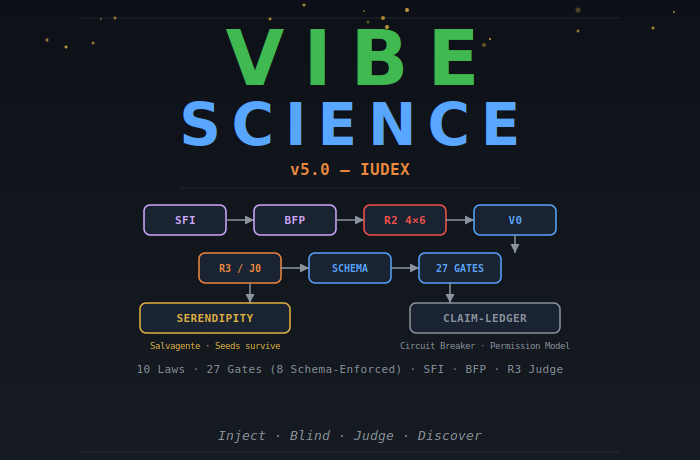
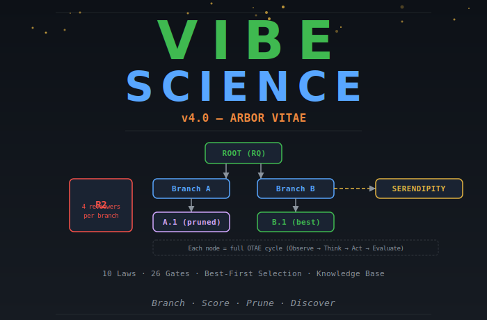
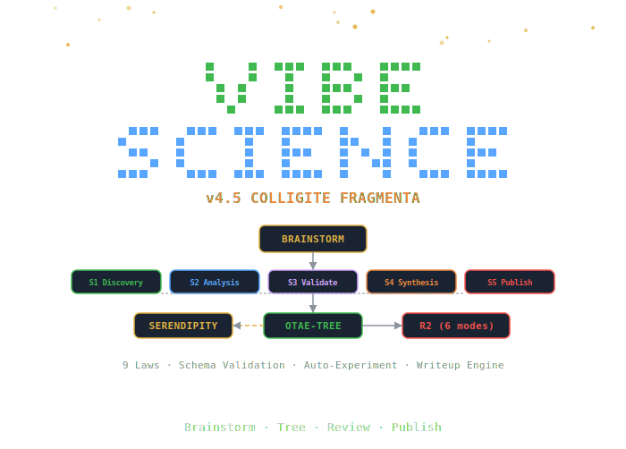

<p align="center">
  
</p>

<p align="center">
  <a href="https://doi.org/10.5281/zenodo.18663142"></a>
  <a href="vibe-science-v5.0/LICENSE"></a>
  
</p>

# Vibe Science

> An AI-native research engine that loops until discovery — with adversarial review, quality gates, and serendipity tracking.

Vibe Science turns an LLM into a disciplined research agent. It provides a structured methodology (OTAE loop), an adversarial review system (Reviewer 2 Ensemble), typed evidence tracking, and quality gates — while preserving room for unexpected discoveries.

This repository tracks the evolution of Vibe Science across four major releases, from the original OTAE loop to a fully fault-injected verification framework. Each version is self-contained and independently installable.

---

## The Problem

AI agents are dangerous in science. Not because they hallucinate — that's the easy problem.

The dangerous problem is that they find **real patterns** in **real data** and construct **plausible narratives** around them, without ever asking: *"What if this is an artifact?"*

<table>
<tr>
<td width="50%">

**What the agent does:**
- Optimizes for completion, not truth
- Gets excited by strong signals (p < 10⁻¹⁰⁰!)
- Constructs narratives around artifacts
- Never searches for what kills its own claims
- Declares "done" after 1 sprint

</td>
<td width="50%">

**What actually happened (21 sprints, CRISPR):**
- OR = 2.30 → **reversed sign** under propensity matching
- "Bidirectional effects" → **biologically impossible**
- "Regime switch" → Cohen's d = **0.07** (noise)
- "Generalizable rankings" → **don't generalize** between assays

</td>
</tr>
</table>

None of these were hallucinations. The data was real. The statistics were correct. The problem was dispositional: **the agent never tried to destroy its own claims.**

---

## The Solution

```
                    Builder (Researcher)              Destroyer (Reviewer 2)
                    ───────────────────               ─────────────────────
  Optimizes for:    Completion                        Survival
  Default stance:   "This looks promising"            "This is probably an artifact"
  Strong signal:    Excitement → narrative → paper     Suspicion → confounders → controls
  Web search for:   Supporting evidence               Contradictions, prior art, known artifacts
  Says "done":      When results look good            When ALL counter-verifications pass
```

**Vibe Science embeds both dispositions in the same system.** The builder builds. The destroyer destroys. Only what survives both gets published.

---

## Version Evolution

| Version | Codename | Architecture | Key Innovation | Laws | Gates |
|---------|----------|-------------|----------------|:----:|:-----:|
| [**v3.5**](vibe-science-v3.5/) | TERTIUM DATUR | OTAE Loop | R2 double-pass, typed claims, evidence formula | 7 | 12 |
| [**v4.0**](vibe-science-v4.0/) | ARBOR SCIENTIAE | OTAE-Tree | Tree search, branch scoring, serendipity branches | 10 | 26 |
| [**v4.5**](vibe-science-v4.5/) | COLLIGITE FRAGMENTA | OTAE-Tree + Brainstorm | Phase 0 brainstorm, R2 6 modes, 5-stage pipeline | 10 | 25 |
| [**v5.0**](vibe-science-v5.0/) | IUDEX | OTAE-Tree + Verification | SFI, blind-first pass, R3 judge, schema-validated gates | 10 | 27 |
| [**v5.0 Codex**](vibe-science-v5.0-codex/) | IUDEX | Same as v5.0 | OpenAI Codex port (condensed SKILL.md, no hooks/TEAM) | 10 | 27 |

<p align="center">
  
  
</p>
<p align="center">
  
  
</p>

---

## v3.5 — TERTIUM DATUR

> *The foundation. Field-tested over 21 sprints of CRISPR-Cas9 research (VibeX 2026).*

v3.5 introduces the OTAE (Observe-Think-Act-Evaluate) research loop — a six-phase cycle adapted from the OpenAI Codex unrolled agent loop. Each cycle executes exactly one action, evaluates the result, and persists state to files before looping back.

### Architecture: OTAE Loop

```
╔══════════════════════════════════════════════════════════════╗
║                     OTAE-SCIENCE LOOP                        ║
╠══════════════════════════════════════════════════════════════╣
║                                                              ║
║  OBSERVE     →  Read STATE.md + PROGRESS. Identify delta.    ║
║       ↓                                                      ║
║  THINK       →  Plan highest-value next action.              ║
║       ↓         Which skill to dispatch? What to falsify?    ║
║  ACT         →  Execute ONE action                           ║
║       ↓         (search / analyze / extract / compute)       ║
║  EVALUATE    →  Extract claims → score confidence → gate     ║
║       ↓         Detect serendipity → flag for triage         ║
║  CHECKPOINT  →  R2 trigger? Serendipity triage? Stop?        ║
║       ↓                                                      ║
║  CRYSTALLIZE →  Update STATE.md, PROGRESS.md, CLAIM-LEDGER   ║
║       ↓         → LOOP BACK TO OBSERVE                       ║
║                                                              ║
╚══════════════════════════════════════════════════════════════╝
```

### 7 Constitutional Laws

| | Law | Rule |
|---|-----|------|
| **1** | DATA-FIRST | No thesis without evidence from data |
| **2** | EVIDENCE DISCIPLINE | Every claim: claim_id + evidence chain + confidence + status |
| **3** | GATES BLOCK | Quality gates are hard stops, not suggestions |
| **4** | R2 ALWAYS-ON | Every milestone passes adversarial review |
| **5** | SERENDIPITY PRESERVED | Unexpected discoveries are features, not distractions |
| **6** | ARTIFACTS OVER PROSE | If it can produce a file, it MUST |
| **7** | FRESH CONTEXT RESILIENCE | Resumable from STATE.md alone |

### Reviewer 2 Ensemble

Not a gate you pass — a co-pilot you can't fire. 4 specialist reviewers (Methods, Stats, Bio, Engineering) run a **double-pass** workflow:

1. **Fatal Hunt** (purely destructive): find what's broken
2. **Method Repair** (constructive): propose what would fix it

Every flaw gets a numeric severity score (0-100):

| Range | Level | Action |
|-------|-------|--------|
| 0-29 | MINOR | Note, continue |
| 30-59 | MAJOR | Must address before next cycle |
| 60-79 | SEVERE | Must fix + re-submit to R2 |
| 80-100 | FATAL | **REJECT** — no re-submission without new evidence |

**3-level orthogonal attack**: L1-Logic · L2-Statistics · L3-Data

### Evidence Engine

Every claim is quantified, not felt:

```
confidence = E×0.30 + R×0.25 + C×0.20 + K×0.15 + D×0.10

FLOOR: E < 0.2 → capped at 0.20
```

**4 typed claims**: `descriptive` · `correlative` · `causal` · `predictive` — evidence standard scales with claim type.

### Serendipity Engine

Active scanner, not passive logger. Quantitative triage (0-15 score) with scheduled sprints every 10 cycles:

| Score | Action |
|-------|--------|
| >= 12 | INTERRUPT — immediate attention |
| >= 8 | QUEUE — next available cycle |
| >= 4 | FILE — track for patterns |
| < 4 | NOISE — discard |

### Quality Gates

12 gates organized in 3 categories — each is a **hard stop**:

- **Pipeline (G0-G5)**: Input Sanity, Schema, Design, Training, Metrics, Artifacts
- **Literature (L0-L2)**: Source Validity (DOI verified), Coverage (>= 3 sources), Review Complete
- **Decision (D0-D2)**: Decision Justified, Claim Promotion (R2 approved), RQ Conclusion

### Field Testing: 21 Sprints

| Metric | Value |
|--------|-------|
| Sprints completed | 21 |
| Total claims registered | 34 |
| Claims killed or downgraded | 11 (32%) |
| Most dangerous claim caught | OR=2.30, p < 10⁻¹⁰⁰ — sign reversed by propensity matching |
| Paper reference | *Vibe Science: Adversarial Epistemic Architecture for LLM-Driven Research* (VibeX 2026) |

### Protocols (9)

| Protocol | Purpose |
|----------|---------|
| Loop OTAE | 6-phase cycle with emergency protocols (context rot, state corruption, infinite loop) |
| Evidence Engine | Claim Ledger, confidence formula, Assumption Register, anti-hallucination rules |
| Reviewer 2 Ensemble | 4-domain adversarial review, double-pass, typed claims, tool-use obligation |
| Search Protocol | Source priority (Scopus > PubMed > OpenAlex > bioRxiv > web), DOI verification |
| Analysis Orchestrator | Artifact contract (manifest + report + figures + metrics + scripts) |
| Serendipity Engine | Quantitative triage (0-15), scheduled Sprints, PURSUE/QUEUE/FILE/DISCARD |
| Knowledge Base | Cross-RQ persistence: library.json, patterns.md, dead-ends.md |
| Data Extraction | NO TRUNCATION rule, AnnData schema contract, GEO/SRA/ENA handling |
| Audit & Reproducibility | Decision log, run comparison, manifests, 10-point reproducibility contract |

---

## v4.0 — ARBOR SCIENTIAE

> *Evolves the flat OTAE loop into a branching tree search over hypotheses.*

The biggest architectural change since v1.0. Each OTAE cycle becomes a **node in a tree** — the agent can branch, score, prune, and backtrack through the hypothesis space.

### Architecture: OTAE-Tree

```
                         root
                        /    \
                    node-A   node-B          ← each = full OTAE cycle
                   / |  \      |
                A1  A2  A3    B1             ← children = variations
               /
             A1a                             ← deeper exploration

     Selection: Score = Evidence×0.6 + Metrics×0.3 + Novelty×0.1
     Pruning:   3 debug fails → prune | 5 non-improving → soft prune
     Health:    good_nodes / total >= 0.2 or EMERGENCY STOP
```

**7 node types:** `draft` · `debug` · `improve` · `hyperparameter` · `ablation` · `replication` · `serendipity`

**3 tree modes:** `LINEAR` (literature) · `BRANCHING` (experiments) · `HYBRID` (both)

### v3.5 → v4.0: What Changed

| Dimension | v3.5 | v4.0 |
|-----------|------|------|
| Loop | Flat OTAE | **OTAE-Tree** (nodes in a tree) |
| Exploration | Sequential | **Best-first** with branching + pruning |
| Serendipity | Linear scanning | **Cross-branch** pattern detection |
| Laws | 7 | **10** (+Explore, +Confounder Harness, +Crystallize) |
| Gates | 12 | **26** (+Tree T0-T3, +Brainstorm B0, +Stage S1-S5) |
| Protocols | 9 | **16** (+7 new) |
| Stages | None | **5-stage experiment lifecycle** |
| Agents | Single context | **SOLO + TEAM** modes |
| Configuration | Plugin only | **CLAUDE.md** constitution + hooks enforcement |
| Paper output | Manual | **Writeup Engine** (IMRAD from verified claims) |
| Figure validation | None | **VLM Gate** (vision-language model check) |

### 3 New Constitutional Laws

| | Law | Rule |
|---|-----|------|
| **8** | EXPLORE BEFORE EXPLOIT | Minimum 3 draft nodes before any is promoted |
| **9** | CONFOUNDER HARNESS | Raw → Conditioned → Matched. Sign change = ARTIFACT. `NO HARNESS = NO CLAIM` |
| **10** | CRYSTALLIZE OR LOSE | Every result written to persistent file. `NOT IN FILE = DOESN'T EXIST` |

### Serendipity Branches

Unexpected findings become **first-class tree nodes** (`serendipity` type). Cross-branch pattern detection finds connections that are invisible when exploring linearly — the same variable behaving differently in two branches becomes a discovery signal, not noise.

### SOLO vs TEAM Mode

| | SOLO | TEAM |
|---|------|------|
| Context | All roles in one window | Separate agents per role |
| R2 independence | Simulated (double-pass) | **True** (own context window) |
| Cost | 1x | ~3-4x |
| Best for | Literature, short sessions | Computational experiments, high stakes |

### 5-Stage Experiment Manager

```
S1 Preliminary (max 20 iter) → S2 Hyperparameter (max 12)
→ S3 Research Agenda (max 12) → S4 Ablation (max 18) → S5 Synthesis (max 5)

Shortcuts: Literature-only: S1 → S5 | Analysis: S1 → S2 → S4 → S5
```

### New Protocols (+7)

| Protocol | Purpose |
|----------|---------|
| Tree Search | 3 modes, 7 node types, best-first selection, pruning rules |
| Experiment Manager | 5-stage lifecycle with iteration limits |
| Auto-Experiment | Code generation → execution → metric parsing pipeline |
| Brainstorm Engine | Phase 0 structured ideation |
| Agent Teams | SOLO/TEAM architecture, shared filesystem, fallback |
| VLM Gate | Optional figure validation via vision-language model |
| Writeup Engine | IMRAD paper drafting from verified claims |

---

## v4.5 — COLLIGITE FRAGMENTA

> *Adds structured ideation (Phase 0) and a 5-stage research pipeline. 206 lines smaller than v4.0 while being more capable.*

v4.5 applies **progressive disclosure** aggressively — the SKILL.md is shorter, but protocol files are richer. The key innovations are in systematic idea generation and R2 expansion.

### Phase 0: Brainstorm Engine

A mandatory 10-step ideation phase before the OTAE loop begins:

```
UNDERSTAND → LANDSCAPE → GAPS → INVERSION → DATA →
HYPOTHESES → COLLISION-ZONE → TRIAGE → PRODUCTIVE TENSIONS →
R2 REVIEW → COMMIT
```

**Key moves:**

- **Inversion Exercise**: systematically invert top 3 consensus claims to generate contrarian hypotheses
- **Collision-Zone Thinking**: force cross-domain hypotheses (physics × biology, economics × ecology)
- **Productive Tensions**: preserve competing paradigms instead of premature convergence

R2 reviews the brainstorm output. Only `WEAK_ACCEPT` or better locks the research direction.

### R2 Expanded to 6 Modes

| Mode | Trigger | Purpose |
|------|---------|---------|
| BRAINSTORM | Phase 0 | Review ideation quality |
| FORCED | Every 20 cycles | Mandatory scheduled review |
| BATCH | Multiple claims | Group review of pending claims |
| SHADOW | Continuous | Background monitoring |
| VETO | R2-initiated | Emergency stop on a finding |
| REDIRECT | R2-initiated | Force a change of direction |

### v4.0 → v4.5: What Changed

| Intervention | What it does |
|-------------|-------------|
| **Inversion Exercise** | Systematically invert consensus claims for contrarian hypotheses |
| **Collision-Zone** | Force cross-domain hypothesis generation |
| **Productive Tensions** | Preserve competing paradigms |
| **R2 Red Flag Checklist** | 12 mandatory flags (6 statistical + 6 methodological) at every review |
| **Counter-Evidence Search** | Active hunt for contradicting evidence before claim promotion |
| **DOI Verification** | Verify every citation resolves before trusting it |
| **Progressive Disclosure** | -381 lines removed, pointers to protocol files, faster context loading |

### Evidence Engine Upgrades

- **Counter-evidence** search mandatory at confidence >= 0.60
- **DOI verification** before any claim promotion
- **Confounder Harness** (LAW 9): Raw → Conditioned → Matched — sign change = ARTIFACT (killed), collapse >50% = CONFOUNDED

### Auto-Experiment Protocol

Computational hypothesis testing pipeline:

```
1. Researcher formulates hypothesis as testable code
2. Auto-Experiment generates script with seeds + version info
3. Execution → metric parsing → artifact creation
4. R2 reviews results (not just conclusions)
5. Gate evaluation → tree node scoring
```

---

## v5.0 — IUDEX

> *The verification release. Every finding is tested before it's trusted. R2 is structurally unbypassable — not just prompted, architecturally enforced.*

Huang et al. (ICLR 2024) proved that **LLMs cannot self-correct reasoning without external feedback**. v4.5's R2 was strong but prompt-enforced. v5.0 makes adversarial review architecturally unbypassable.

### Four Innovations

<table>
<tr>
<td width="25%" valign="top">

**Seeded Fault Injection (SFI)**

Inject known errors before R2 reviews. If R2 misses them → review invalid.

*Mutation testing for scientific claims.*

Gate: **V0** (RMS >= 0.80)

</td>
<td width="25%" valign="top">

**Judge Agent (R3)**

Meta-reviewer scores R2's review on 6 dimensions.

*Reviews the review, not the claims.*

Gate: **J0** (>= 12/18)

</td>
<td width="25%" valign="top">

**Blind-First Pass (BFP)**

R2 reviews claims before seeing justifications. Breaks anchoring bias.

*Think first, then compare.*

Protocol: 2-phase within one review

</td>
<td width="25%" valign="top">

**Schema-Validated Gates (SVG)**

8 gates enforce JSON Schema. Prose claims ignored.

*Structure, not promises.*

9 schema files (READ-ONLY)

</td>
</tr>
</table>

### FORCED Review Flow (v5.0)

```
TRIGGER → SFI (inject faults) → BFP Phase 1 (blind review)
       → BFP Phase 2 (full context) → V0 (vigilance gate)
       → J0 (judge gate) → Schema Validation → Normal Gate Eval

       V0 FAIL or J0 FAIL → restart from BFP Phase 1
```

### Six Enhancements

| Enhancement | What it does |
|------------|-------------|
| **R2 Salvagente** | Killed claims with potential preserve serendipity seeds |
| **Structured Seeds** | Schema-validated research objects, not notes |
| **Exploration Budget** | LAW 8 gains measurable 20% floor at T3 |
| **Confidence Formula** | Hard veto + geometric mean with dynamic floor |
| **Circuit Breaker** | Same objection × 3 rounds → DISPUTED. Frozen, not killed. S5 poison pill. |
| **Permission Model** | R2 produces verdicts. Orchestrator executes. Separation of powers. |

### Agent Permission Model

```
R2 Ensemble (READ only) → verdict.yaml → Orchestrator (READ+WRITE)
                                              │
                    ┌─────────────────────────┤
                    ↓                         ↓
              R3 Judge (scores)         Claim Ledger (updated)

R2 NEVER writes to the claim ledger.
R3 NEVER modifies R2's report.
Schemas are READ-ONLY for all agents.
```

### 3 New Constitutional Laws (v5.0)

| Law | Name | Rule |
|-----|------|------|
| 8 → | BLIND BEFORE BELIEF | Review claims without seeing justifications first |
| 9 → | FALSIFY FIRST | Inject known faults to test reviewer vigilance |
| 10 → | SCHEMA ENFORCES | 8 gates validate against JSON Schema; prose claims ignored |

*Note: Laws 8-10 from v4.0 (Explore, Confounder Harness, Crystallize) remain — v5.0 has 10 Laws total, with 3 replaced.*

### Quality Gates: 27 Total

<table>
<tr>
<td valign="top">

**Pipeline (G0-G6)**
```
G0  Input Sanity
G1  Schema Validation
G2  Design Review
G3  Training Health
G4  Metrics Baseline
G5  Artifacts Exist
G6  VLM Validation (opt)
```

</td>
<td valign="top">

**Literature (L0-L2)**
```
L0  Source Validity (DOI)
L1  Coverage (>= 3)
L2  Review Complete
```

**Decision (D0-D2)**
```
D0  Decision Justified
D1  Claim Promotion
D2  RQ Conclusion
```

</td>
<td valign="top">

**Tree (T0-T3)**
```
T0  Node Validity
T1  Debug Limit (max 3)
T2  Branch Diversity
T3  Tree Health (>= 20%)
```

**Brainstorm + Stage**
```
B0  Brainstorm Quality
S1-S5  Stage Gates
```

**Verification (v5.0)**
```
V0  R2 Vigilance (SFI)
J0  Judge Assessment (R3)
```

</td>
</tr>
</table>

### v5.0 Protocols (21 total)

| Category | Protocols |
|----------|-----------|
| **Core Loop** | Loop OTAE, Evidence Engine, Reviewer 2 Ensemble, Search Protocol |
| **Tree & Experiment** | Tree Search, Experiment Manager, Auto-Experiment, Brainstorm Engine, Agent Teams |
| **Research Support** | Analysis Orchestrator, Data Extraction, Serendipity Engine, Knowledge Base, Audit & Reproducibility |
| **Output** | VLM Gate, Writeup Engine |
| **v5.0 Structural** | Seeded Fault Injection, Judge Agent (R3), Blind-First Pass, Schema Validation, Circuit Breaker |

---

## Key Features Across Versions

### Reviewer 2 Ensemble — Evolution

| Feature | v3.5 | v4.0 | v4.5 | v5.0 |
|---------|------|------|------|------|
| Reviewers | 4 (Methods, Stats, Bio, Eng) | 4 | 4 | 4 |
| Modes | 3 (standard, batch, forced) | 3 | **6** (+shadow, veto, redirect) | 6 |
| Workflow | Double-pass | Double-pass | Double-pass + red flags | Double-pass + **BFP** + **SFI** |
| Independence | Simulated | TEAM mode available | TEAM mode | TEAM + **R3 Judge** |
| Attack levels | 3-level orthogonal | 3-level | + 12 red flag checklist | + fault injection |
| Schema enforcement | None | None | None | **8 gates schema-validated** |

### Evidence Engine — Evolution

| Feature | v3.5 | v4.0+ |
|---------|------|-------|
| Formula | E·R·C·K·D weighted sum | **Geometric mean** with hard veto |
| Floor | E < 0.2 → cap at 0.20 | E < 0.05 or D < 0.05 → **zero** |
| Counter-evidence | Not required | **Mandatory** at confidence >= 0.60 |
| Confounder harness | Not systematic | **LAW 9**: Raw → Conditioned → Matched |
| Claim types | 4 typed | 4 typed + schema-validated promotion |

### Serendipity Engine — Evolution

| Feature | v3.5 | v4.0+ | v5.0 |
|---------|------|-------|------|
| Scale | 0-15 | 0-20 | 0-20 |
| Scanning | Every 10 cycles | Every EVALUATE | Every EVALUATE |
| Cross-branch | No | **Yes** | Yes |
| Salvagente | No | No | **Yes** — killed claims produce seeds |
| Interrupt threshold | >= 12 | >= 15 | >= 15 |

---

## Academic Foundations

v5.0 IUDEX is grounded in peer-reviewed research. Every architectural decision traces to an empirical finding:

<details>
<summary><b>Core: LLM Self-Correction Limitations (3 papers)</b></summary>

| Paper | Key Finding | v5.0 Response |
|-------|------------|---------------|
| **Huang et al.** (ICLR 2024) — "LLMs Cannot Self-Correct Reasoning Yet" | Intrinsic self-correction ineffective; 74.7% retain initial answer | Foundation for entire v5.0 architecture. R2 must be structurally separated, not just prompted |
| **Gou et al.** (ICLR 2024) — "CRITIC" | Self-correction works ONLY with external tool feedback | Validates R2's mandatory tool-use. But prompts can be circumvented → Schema-Validated Gates |
| **Kamoi et al.** (TACL 2024) | No prior work demonstrates successful self-correction from prompts alone | Motivates architectural triad (SFI + BFP + R3) |

</details>

<details>
<summary><b>Multi-Agent Correction (3 papers)</b></summary>

| Paper | Key Finding | v5.0 Response |
|-------|------------|---------------|
| **Du et al.** (ICML 2024) — "Multiagent Debate" | Multiple agents debating reduces factual errors by 30%+ | Direct validation of R2 multi-reviewer architecture |
| **Wang et al.** (2022) — "Self-Consistency" | Sampling N independent chains and aggregating outperforms single-pass | In SOLO mode, R2 generates N=3 independent assessments |
| **Dhuliawala et al.** (2023) — "Chain-of-Verification" | Generate verification questions independently from original draft | Strengthens BFP Phase 1 design |

</details>

<details>
<summary><b>Peer Review as Model (4 papers)</b></summary>

| Paper | Key Finding | v5.0 Response |
|-------|------------|---------------|
| **Krlev & Spicer** (JMS 2023) — "Reining in Reviewer Two" | Epistemic respect = assess on soundness, not origin | R2's calibration: destructive but rigorous. R3 enforces review quality |
| **Watling et al.** (2021) — "Don't Be Reviewer 2!" | Checklist-only reviews are mechanical | R2 Red Flag Checklist is a *floor*. R3 ensures R2 goes beyond checklist compliance |
| **Jefferson et al.** (JAMA 2002) | Interventions to improve peer review were "relatively unsuccessful" | You cannot fix peer review with better instructions alone → SFI + R3 |
| **PMC** (2024) — "Peer Reviews of Peer Reviews" | Longer reviews rated higher — a length bias | R3 rubric rewards specificity and evidence, not verbosity |

</details>

<details>
<summary><b>Mutation Testing Theory — SFI Design (2 papers)</b></summary>

| Paper | Key Finding | v5.0 Response |
|-------|------------|---------------|
| **Jia & Harman** (IEEE TSE 2011) — "Mutation Testing" | 10% random sampling ~84% as effective as exhaustive | Justifies 1-3 faults per FORCED review |
| **Papadakis et al.** (2019) — "Mutation Testing Advances" | Equivalent mutants inflate scores, must be managed | EQUIV state in fault taxonomy |

</details>

<details>
<summary><b>Concurrent Work: DeepMind Deep Think & Aletheia (4 papers)</b></summary>

| Paper | Key Finding | v5.0 Response |
|-------|------------|---------------|
| **Snell et al.** (2024) — "Scaling LLM Test-Time Compute" | Inference-time compute scaling improves reasoning | Theoretical grounding for OTAE-Tree |
| **DeepMind Aletheia** (2026) — "Autonomous Mathematics Research" | Generator-Verifier-Reviser architecture | Architecturally isomorphic to Researcher-R2-Researcher loop |
| **DeepMind** (2026) — "Accelerating Scientific Research with Gemini" | Human-AI collaboration patterns | Maps to OTAE loop, tree search, brainstorm collision-zone |
| **Kumar et al.** (ICLR 2025) — SCoRe | RL enables genuine self-correction (+15.6% MATH) | Self-correction CAN work with structural change. SFI + R3 are the agent-level analog |

</details>

### Vibe Science vs Deep Think / Aletheia

| | Deep Think / Aletheia | Vibe Science v5.0 |
|---|---|---|
| **Level** | Inference-time (within model) | Agent-time (separate agents) |
| **Verifier** | Process Reward Model (trained) | R2 Ensemble (prompted + tool-grounded) |
| **Verification type** | Logical (reasoning-based) | **Empirical** (tool-grounded: PubMed, Scopus, web) |
| **Structural enforcement** | PRM weights (non-bypassable) | JSON Schema gates + SFI + R3 |
| **Cost** | Proprietary (Google AI Ultra) | Open source (Apache 2.0, any LLM) |

**Complementary, not competing.** Deep Think catches what pure reasoning can catch. Vibe Science catches what only external empirical verification can catch.

---

## Design Philosophy

Vibe Science was built by reverse-engineering two complementary approaches:

<table>
<tr>
<td width="50%" valign="top">

**Agentic research loops**
*(Ralph, GSD, BMAD, AI-Scientist-v2)*

Excellent as **systems**: infinite loop, state management, tree search.

Missing: executability, adversarial review, serendipity.

</td>
<td width="50%" valign="top">

**Scientific toolkits**
*(Anthropic bio-research, Claude Scientific Skills, MCP)*

Excellent as **tools**: CLI scripts, database APIs, analysis pipelines.

Missing: loop, persistence, adversarial review.

</td>
</tr>
</table>

**Vibe Science fuses both:** the systematic rigor of a research loop with the concrete executability of a scientific toolkit, bound together by an adversarial co-pilot that prevents the system from lying to itself.

> *"A research system that doesn't execute is a wish.*
> *A toolkit that doesn't iterate is a toolbox.*
> *You need both: loop + tool."*

### Lineage

| Ancestor | Pattern Taken |
|----------|--------------|
| **Ralph Wiggum** | Bounded iterative loop (warn@15, forced-R2@20, alert@30) |
| **GSD** | File-based state persistence (STATE.md, PROGRESS.md) |
| **BMAD** | Multi-agent ensemble pattern |
| **OpenAI Codex loop** | OTAE cycle structure, single action per cycle |
| **Anthropic bio-research** | CLI scripts, MCP endpoints, executability |
| **Superpowers** | Dispatch/routing architecture |
| **AI-Scientist-v2** | Tree search architecture, 4-stage manager |

---

## Repository Structure

```
vibe-science/
├── README.md                   ← You are here
├── CITATION.cff                ← GitHub citation metadata (DOI)
├── LICENSE                     ← Apache 2.0
├── NOTICE                      ← Academic citation requirement
├── CHANGELOG.md                ← Version history
├── logos/                      ← Version-specific SVG logos
│   ├── logo-v3.5.svg
│   ├── logo-v4.0.svg
│   ├── logo-v4.5.svg
│   └── logo-v5.0.svg
│
├── vibe-science-v3.5/          ← Claude Code skill (v3.5)
│   ├── SKILL.md                    320 lines
│   ├── protocols/ (9)              ~1,500 lines
│   ├── gates/gates.md              272 lines
│   └── assets/ (3)                 ~615 lines
│
├── vibe-science-v4.0/          ← Claude Code skill (v4.0)
│   ├── SKILL.md + CLAUDE.md
│   ├── protocols/ (16)
│   ├── gates/ + schemas/
│   └── assets/ (6)
│
├── vibe-science-v4.5/          ← Claude Code skill (v4.5)
│   ├── SKILL.md + CLAUDE.md
│   ├── protocols/ (16)
│   ├── gates/ + schemas/
│   └── assets/ (6)
│
├── vibe-science-v5.0/          ← Claude Code skill (v5.0 IUDEX)
│   ├── SKILL.md (~1,150 lines)
│   ├── CLAUDE.md (constitution)
│   ├── protocols/ (21)
│   ├── gates/ + schemas/ (9)
│   └── assets/ (8)
│
└── vibe-science-v5.0-codex/    ← OpenAI Codex skill (v5.0 IUDEX)
    ├── SKILL.md (~480 lines)
    ├── agents/openai.yaml
    ├── references/ (22)
    └── assets/ (11)
```

---

## Installation

### Claude Code

```bash
git clone https://github.com/th3vib3coder/vibe-science.git

# Install the version you want:
claude plugins add ./vibe-science/vibe-science-v5.0    # latest
claude plugins add ./vibe-science/vibe-science-v3.5    # stable, paper version
```

### OpenAI Codex

```bash
# The Codex version is in vibe-science-v5.0-codex/
# Follow instructions in vibe-science-v5.0-codex/README.md
```

### Manual (any LLM interface)

Upload the `SKILL.md` of your chosen version as a system prompt or project knowledge file. Upload `protocols/`, `gates/`, and `assets/` directories for on-demand reference loading.

---

## For the Paper

This repository documents the evolution of Vibe Science for the **VibeX 2026** publication. Each version directory is a complete, standalone snapshot:

- **v3.5** is the version described in the paper (field-tested, 21 sprints)
- **v4.0 → v4.5 → v5.0** show the progression of ideas
- Annotated git tags (`v3.5.0`, `v4.0.0`, `v4.5.0`, `v5.0.0`) provide traceable evolution
- Zenodo DOI provides permanent archival: [10.5281/zenodo.18663142](https://doi.org/10.5281/zenodo.18663142)

---

## Citation & Attribution

If you use Vibe Science in your research and it contributes to published results, please cite:

> Russo, C. & Bertelli, E. (MD) (2026). *Vibe Science: an AI-native research engine with adversarial review and serendipity tracking.* Available at: https://github.com/th3vib3coder/vibe-science

---

Se utilizzi Vibe Science nella tua ricerca e questa contribuisce a risultati pubblicati, ti chiediamo di citare:

> Russo, C. & Bertelli, E. (MD) (2026). *Vibe Science: un motore di ricerca AI-nativo con revisione avversariale e tracciamento della serendipità.* Disponibile su: https://github.com/th3vib3coder/vibe-science

---

## License

Apache 2.0 — see [LICENSE](vibe-science-v5.0/LICENSE).

## Authors

**Carmine Russo** (carmine.russo@gmail.com) · **Dr. Elisa Bertelli** (elisabertel@gmail.com)
