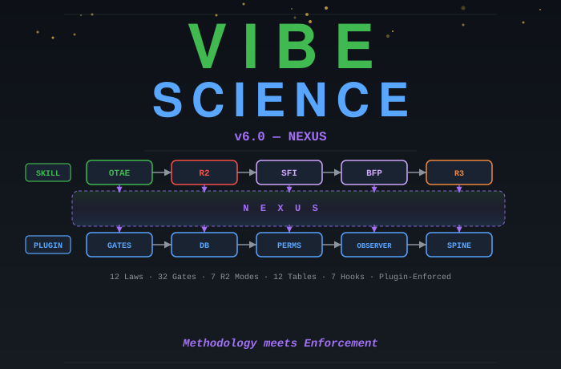

<p align="center">
  
</p>

<p align="center">
  <a href="https://doi.org/10.5281/zenodo.18665031"></a>
  <a href="LICENSE"></a>
  
  
  
</p>

# Vibe Science

> An AI-native research engine that loops until discovery — with adversarial review, quality gates, serendipity tracking, cross-session learning, and plugin-enforced integrity.

Vibe Science turns Claude Code into a disciplined research agent. Instead of letting the AI rush to conclusions, it forces every claim through adversarial review ("Reviewer 2"), 32 quality gates, confounder testing, and cross-session calibration. Only what survives gets published.

**Field-tested over 21 CRISPR research sprints** — caught a claim with p < 10^-100 whose sign reversed under propensity matching. Without Vibe Science, it would have been published.

---

## What Problem Does This Solve?

AI agents are dangerous in science. Not because they hallucinate — that's the easy problem. The dangerous problem is that they find **real patterns** in **real data** and construct **plausible narratives** around them, without ever asking: *"What if this is an artifact?"*

Over 21 CRISPR sprints, we watched the agent celebrate a result with OR=2.30 and p < 10^-100. After propensity matching, the sign reversed. Without a structural adversary, this would have been published as a finding.

**The solution:** embed a "Reviewer 2" whose ONLY job is to destroy claims. Only what survives both builder and destroyer advances.

---

## Three-Layer Architecture

Vibe Science is not a single file — it's three layers that reinforce each other:

```
┌─────────────────────────────────────────────────────────────────────────┐
│  LAYER 1: CLAUDE.md (Constitution)                                     │
│  12 immutable laws · role constraints · permission model                │
│  Loaded automatically by Claude Code at session start                   │
├─────────────────────────────────────────────────────────────────────────┤
│  LAYER 2: SKILL (Methodology Brain)                                    │
│  OTAE-Tree loop · R2 Ensemble (7 modes) · 32 gates · 21 protocols     │
│  Brainstorm engine · Serendipity radar · Evidence engine               │
│  12 constitutional laws · 7 agent roles · 34 reference documents       │
│  → Guides WHAT the agent thinks                                        │
├─────────────────────────────────────────────────────────────────────────┤
│  LAYER 3: PLUGIN (Enforcement Body)                                    │
│  7 lifecycle hooks · Gate engine · Permission engine                    │
│  SQLite persistence (12 tables) · Research spine (auto-log)            │
│  R2 auto-calibration · Pattern extraction · Silent observer            │
│  Context builder (~700 tokens) · Narrative engine                      │
│  → Controls WHAT the agent can do                                      │
└─────────────────────────────────────────────────────────────────────────┘
```

| Layer | Purpose | Bypass-proof? |
|-------|---------|---------------|
| **CLAUDE.md** | Sets dispositional rules — what agents MUST and MUST NOT do | Prompt-level (voluntary) |
| **Skill** | Teaches methodology — OTAE loop, R2 protocol, gates, evidence standards | Prompt-level (voluntary) |
| **Plugin** | Enforces behavior — hooks block session end if claims unreviewed, gates block tool use | **Code-level (structural)** |

---

## Why a Plugin, Not Just a Skill?

Versions v3.5 through v5.5 were prompt-only: the agent was *told* to run quality gates and use Reviewer 2. It worked — sometimes. But four subsystems were bypassable because they relied on voluntary compliance:

| Subsystem | As Skill (v5.5) | As Plugin (v6.0) |
|-----------|-----------------|------------------|
| **Reviewer 2** | "Please review this claim" | Hook blocks session end if claims are unreviewed |
| **Quality Gates** | "Check gate DQ4 before proceeding" | Exit code 2 = tool action blocked until gate passes |
| **Research Logging** | "Write to PROGRESS.md" | Auto-logged to SQLite after every tool use |
| **Memory Recall** | "Read STATE.md at session start" | Hook injects ~700 tokens of context automatically |

The plugin wraps the skill in **code-level enforcement**: 7 lifecycle hooks, a gate engine, a permission engine, and SQLite persistence across sessions.

---

## Key Features

### Adversarial Review (Reviewer 2)

Every claim passes through R2, which operates in 7 activation modes: INLINE (lightweight 7-point checklist), FORCED (mandatory at stage gates), BATCH (bulk review), BRAINSTORM (idea validation), SHADOW (background monitoring), VETO (can kill claims), and REDIRECT (can change investigation direction). R2's default disposition is **destruction** — it assumes every claim is wrong.

### Quality Gates (32 gates, 8 schema-enforced)

Gates block progress at critical checkpoints: data quality (DQ1-DQ4), data dictionary (DD0), design compliance (DC0), literature pre-check (L-1+), and 24 more across 5 stages. 8 gates validate artifacts against JSON Schema — prose claims of completion are ignored.

### Confounder Harness (LAW 9)

Every quantitative claim MUST pass: raw → conditioned → matched. Sign change = ARTIFACT (killed). Collapse >50% = CONFOUNDED (downgraded). Survives = ROBUST (promotable). No harness = no claim.

### Seeded Fault Injection (SFI)

The system injects known faults into claim sets before R2 reviews. R2 doesn't know which claims are seeded. If R2 misses seeded faults, the review is invalid. This tests R2's vigilance, not its knowledge.

### Tree Search Over Hypotheses

OTAE-Tree architecture explores multiple hypotheses in parallel with 7 node types, 3 tree modes, and best-first selection. Minimum 3 draft nodes before any is promoted (LAW 8).

### Cross-Session Learning (v6.0)

- **Pattern extraction**: Gate failure clusters, repeated actions, and claim lifecycle patterns are extracted at session end
- **Instinct model**: Recurring patterns become "instincts" — weighted suggestions (confidence 0.3-0.9) that decay over time and can be overridden by evidence
- **R2 calibration**: Historical weakness tracking with temporal decay (weight = e^(-0.02 × age_weeks)) informs future review priorities

### Serendipity Radar

Every cycle scans for unexpected findings. Score >= 10 → QUEUE for triage. Score >= 15 → INTERRUPT current work. Killed claims produce serendipity seeds (Salvagente rule).

---

## Plugin Subsystems (6,600 LOC)

### 7 Lifecycle Hooks

| Hook | Trigger | What It Does |
|------|---------|-------------|
| **SessionStart** | Session opens | Auto-setup, DB init, injects ~700 tokens (state, alerts, R2 calibration, seeds) |
| **UserPromptSubmit** | Before each prompt | Agent role detection, prompt logging, semantic recall via vector search |
| **PreToolUse** | Before Write/Edit tool | LAW 9: blocks CLAIM-LEDGER modifications without confounder_status |
| **PostToolUse** | After every tool | Gate enforcement, permission checks, auto-logging to research spine, observer alerts |
| **Stop** | Session ending | Narrative summary, blocks stop if unreviewed claims exist (LAW 4), STATE.md export |
| **PreCompact** | Before context compaction | Snapshots current state to DB for post-compaction recovery (LAW 7) |
| **SubagentStop** | Subagent finishes | Salvagente Rule: killed claims must produce serendipity seed |

### SQLite Persistence (12 tables)

`sessions`, `spine_entries`, `claim_events`, `r2_reviews`, `serendipity_seeds`, `gate_checks`, `literature_searches`, `observer_alerts`, `calibration_log`, `prompt_log`, `embed_queue`, `research_patterns` — plus a `vec_memories` virtual table for semantic search.

### Other Engines

- **Gate Engine**: Enforces DQ1-DQ4, DC0, DD0, L-1+ at PostToolUse. Exit code 2 = BLOCK.
- **Permission Engine**: TEAM mode with role-based access control (researcher, reviewer2, judge, serendipity, lead, experimenter).
- **Context Builder**: Progressive disclosure with semantic recall (~700 tokens per session start).
- **Narrative Engine**: Template-based session summaries (deterministic, no LLM).
- **R2 Calibration**: Weakness tracking, SFI catch rates, J0 trends across sessions with temporal decay.
- **Pattern Extractor**: Cross-session pattern detection with confidence scoring and auto-archiving.
- **Silent Observer**: Periodic health checks (stale STATE.md, FINDINGS/JSON desync, orphaned data, design drift).

---

## v6.0 Skill (34 Reference Documents)

The v6.0 skill lives in `skills/vibe/` and contains the full methodology:

| Component | Count | Examples |
|-----------|-------|---------|
| **References** | 34 | constitution, loop-otae, reviewer2-ensemble, hook-system, pattern-extraction, instinct-model, context-resilience, handoff-protocol, r2-calibration... |
| **Python scripts** | 6 | dq_gate.py, gate_check.py, spine_entry.py, sync_check.py, tree_health.py, observer.py |
| **JSON schemas** | 12 | brainstorm-quality, claim-promotion, review-completeness, serendipity-seed, data-quality-gate, finding-validation, spine-entry... |
| **Asset files** | 7 | fault-taxonomy.yaml, judge-rubric.yaml, templates.md, stage-prompts.md, metric-parser.md, node-schema.md, domain-config-example.yaml |
| **Agent roles** | 7 | researcher, r2-deep, r2-inline, observer, explorer, r3-judge, instinct-scanner |

### 6 New References (v6.0 additions)

| Reference | What It Documents |
|-----------|------------------|
| `hook-system.md` | All 7 hooks: triggers, I/O format, LAW enforcement mapping |
| `pattern-extraction.md` | Cross-session patterns: gate failure clusters, repeated actions, claim lifecycles |
| `r2-calibration.md` | Temporal decay formula, weakness tracking, SFI catch rates, J0 trends |
| `handoff-protocol.md` | Agent-to-agent handoff: Context, Findings, Files Modified, Open Questions, Recommendations |
| `instinct-model.md` | Learned behaviors with confidence (0.3-0.9), auto-promotion, decay, scope (project/global) |
| `context-resilience.md` | LAW 7 implementation: PreCompact snapshots, STATE.md, DB recovery, progressive context building |

---

## Multi-Agent Architecture (7 Roles)

| Role | Model | Disposition | Key Constraint |
|------|-------|-------------|----------------|
| **Researcher** | claude-opus-4-6 | BUILD | Cannot declare "done" — only R2 can clear |
| **R2-Deep** | claude-opus-4-6 | DESTROY | Assumes every claim is wrong. No congratulations. |
| **R2-Inline** | claude-sonnet-4-6 | SKEPTIC | 7-point checklist on every finding |
| **Observer** | claude-haiku-4-5 | DETECT | Read-only project health scanner |
| **Explorer** | claude-sonnet-4-6 | EXPLORE | Branch artifacts only, no main claim ledger |
| **R3-Judge** | claude-opus-4-6 | META-REVIEW | Reviews R2's reviews, not claims directly |
| **Instinct Scanner** | claude-haiku-4-5 | PATTERN-DETECT | Session-end pattern extraction and instinct promotion |

**Separation of powers**: R2 produces verdicts, the orchestrator writes to the claim ledger. R2 never writes to the claim ledger directly. R3 never modifies R2's report.

---

## Requirements

| Requirement | Version | Why | Check |
|-------------|---------|-----|-------|
| **Node.js** | >= 18.0.0 | Runtime for hooks and plugin scripts | `node --version` |
| **Claude Code** | >= 1.0.33 | Plugin host | `claude --version` |
| **Git** | any | Clone the repo | `git --version` |
| **C++ Build Tools** | — | Required by `better-sqlite3` (native SQLite binding) | See below |

**C++ Build Tools by platform:**
- **Windows:** Visual Studio Build Tools with "Desktop development with C++" workload, or `npm install -g windows-build-tools`
- **macOS:** `xcode-select --install`
- **Linux:** `sudo apt install build-essential` (Debian/Ubuntu) or equivalent

**Optional:**
- **Python 3.8+** — for enforcement scripts (stdlib only, no pip dependencies)

---

## Quick Start

```bash
# 1. Clone and install
git clone https://github.com/th3vib3coder/vibe-science.git
cd vibe-science
npm install

# 2. Launch Claude Code with the plugin
claude --plugin-dir .

# 3. Start a research session
/vibe
```

On first startup, the SessionStart hook auto-creates `~/.vibe-science/`, initializes the SQLite database (12 tables), and injects research context (~700 tokens).

---

## Installation Methods

### Marketplace (Recommended)

```bash
/plugin marketplace add th3vib3coder/vibe-science
/plugin install vibe-science@vibe-science
# Restart Claude Code
```

### `--plugin-dir` (Quick Test)

```bash
claude --plugin-dir /path/to/vibe-science
```

### Global Settings (Permanent)

Add to `~/.claude/settings.json` (or `%USERPROFILE%\.claude\settings.json` on Windows):

```json
{
  "plugins": ["/absolute/path/to/vibe-science"]
}
```

### Project-Level

Add to your project's `.claude/settings.json` to load only in that project.

---

## What Does It Do

When active, every Claude Code session becomes a structured research session:

```
Research question → Brainstorm (Phase 0, 10-step ideation)
                         ↓
                    OTAE-Tree Loop (repeats):
                      OBSERVE  → Read current state + hook context injection
                      THINK    → Plan next action + check instincts
                      ACT      → Execute ONE action (auto-logged to spine)
                      EVALUATE → Extract claims, score confidence, check patterns
                         ↓
                    Reviewer 2 (adversarial review, 7 modes)
                         ↓
                    Only surviving claims advance
                         ↓
                    Stop hook: narrative summary + pattern extraction
```

**What you'll notice:**
- Every claim gets a confidence score (0-1) with a mathematical formula
- Reviewer 2 assumes every claim is wrong and demands evidence
- 32 quality gates block progress — you can't skip steps
- State files are created automatically (STATE.md, PROGRESS.md, CLAIM-LEDGER.md)
- Serendipity is tracked — unexpected findings get scored (0-20 scale) and preserved
- Everything persists to SQLite — cross-session memory, R2 calibration, audit trail
- Patterns are extracted at session end and inform future sessions

---

## Repository Structure

```
vibe-science/
├── .claude-plugin/              ← Plugin manifests
│   ├── plugin.json              ← Plugin metadata (v6.0.0)
│   └── marketplace.json         ← Marketplace config
│
├── skills/vibe/                 ← v6.0 NEXUS Skill (served by plugin)
│   ├── SKILL.md                 ← Full methodology (528 lines)
│   ├── AGENTS.md                ← 7 agent roles with YAML frontmatter
│   ├── references/              ← 34 reference documents
│   ├── scripts/                 ← 6 Python enforcement scripts
│   ├── assets/
│   │   └── schemas/             ← 12 JSON validation schemas
│   └── agents/
│       └── claude-code.yaml     ← Model tier config
│
├── plugin/                      ← Enforcement engine (~6,600 LOC)
│   ├── scripts/                 ← 7 JS hook implementations
│   │   ├── session-start.js     ← Context injection + auto-setup
│   │   ├── prompt-submit.js     ← Role detection + semantic recall
│   │   ├── post-tool-use.js     ← Gate enforcement + auto-logging
│   │   ├── stop.js              ← Narrative summary + stop blocking
│   │   ├── pre-compact.js       ← Context resilience snapshots
│   │   ├── setup.js             ← DB initialization
│   │   └── worker-embed.js      ← Background embedding daemon
│   ├── lib/                     ← 8 engine modules
│   │   ├── db.js                ← SQLite operations
│   │   ├── gate-engine.js       ← DQ/DC/DD/L-1+ enforcement
│   │   ├── permission-engine.js ← Role-based access control
│   │   ├── context-builder.js   ← Progressive context disclosure
│   │   ├── narrative-engine.js  ← Template-based summaries
│   │   ├── r2-calibration.js    ← Temporal decay calibration
│   │   ├── pattern-extractor.js ← Cross-session pattern detection
│   │   └── vec-search.js        ← Vector similarity search
│   └── db/
│       ├── schema.sql           ← 12 table definitions
│       └── domain-config-template.json
│
├── commands/                    ← Slash commands (auto-discovered)
│   ├── start.md                 ← /start — conversational entry
│   ├── init.md                  ← /init — initialize RQ workspace
│   ├── loop.md                  ← /loop — run OTAE cycle
│   ├── search.md                ← /search — literature search
│   └── reviewer2.md             ← /reviewer2 — trigger R2 review
│
├── agents/reviewer2.md          ← R2 subagent definition
├── hooks/hooks.json             ← 7 hook definitions (plugin mode)
├── .claude/settings.json        ← Hook definitions (dev mode)
│
├── CLAUDE.md                    ← Project constitution (12 laws)
├── SKILL.md                     ← Legacy v5.5 methodology (1,363 lines)
├── ARCHITECTURE.md              ← Deep technical architecture
├── CHANGELOG.md                 ← Full version history
│
├── protocols/                   ← 21 methodology protocols
├── gates/gates.md               ← Gate specification
├── schemas/                     ← 9 root-level JSON schemas
├── assets/                      ← Fault taxonomy, rubrics, templates
├── logos/                       ← SVG logos (v3.5 → v6.0)
│
└── archive/                     ← Historical versions + blueprints
    ├── v6.0-NEXUS-BLUEPRINT.md
    ├── v5.5-ORO-BLUEPRINT.md
    ├── v5.0-IUDEX-BLUEPRINT.md
    ├── PHOTONICS-BLUEPRINT.md
    ├── vibe-science-v6.0-claude-code/  ← Archive copy of v6.0 skill
    ├── vibe-science-v5.5/
    ├── vibe-science-v5.5-codex/
    ├── vibe-science-v5.0/
    ├── vibe-science-v5.0-codex/
    ├── vibe-science-v4.5/
    ├── vibe-science-v4.0/
    ├── vibe-science-v3.5/
    └── vibe-science-photonics/
```

---

## Using Without Claude Code

You can use the methodology with any LLM: upload `skills/vibe/SKILL.md` as a system prompt, plus the `references/` directory. Note: without the plugin, gates are prompt-enforced only (voluntary compliance). The v5.5 `SKILL.md` at root (1,363 lines) is the legacy standalone version.

---

## Version History

| Version | Codename | Date | Key Innovation | Blueprint |
|---------|----------|------|----------------|-----------|
| **v1.0** | — | 2025-01 | Core 6-phase loop, single R2 prompt, state files | — |
| **v2.0** | NULLIS SECUNDUS | 2026-02-06 | R2 Ensemble (4 specialists), quantitative confidence (0-1), 12 gates | — |
| **v3.0** | TERTIUM DATUR | 2026-02-07 | OTAE loop, serendipity engine, knowledge base, MCP integration | — |
| **v3.5** | TERTIUM DATUR | 2026-02-07 | R2 double-pass, 3-level attack (Logic/Stats/Data), typed claims | — |
| **v4.0** | ARBOR VITAE | 2026-02-12 | Tree search, 7 node types, 5-stage experiment manager, 26 gates, 10 laws | — |
| **v4.5** | ARBOR VITAE (Pruned) | 2026-02-14 | Phase 0 brainstorm, R2 6 modes, -381 lines via progressive disclosure | — |
| **v5.0** | IUDEX | 2026-02-16 | SFI, blind-first pass, R3 judge, schema-validated gates, circuit breaker | [IUDEX](archive/v5.0-IUDEX-BLUEPRINT.md) |
| **v5.5** | ORO | 2026-02-19 | DQ1-DQ4 gates, DD0, DC0, R2 INLINE, SSOT rule (post-mortem driven) | [ORO](archive/v5.5-ORO-BLUEPRINT.md) |
| **v6.0** | NEXUS | 2026-02-20 | **Plugin architecture**, 7 hooks, SQLite, cross-session learning, 7 agent roles | [NEXUS](archive/v6.0-NEXUS-BLUEPRINT.md) |

### v6.0 NEXUS — What Changed

The jump from v5.5 to v6.0 is architectural, not incremental. The methodology (skill) was preserved and expanded with 6 new reference documents; a code-level enforcement layer (plugin) was added on top.

**New in v6.0:**
- Plugin architecture with 7 lifecycle hooks (SessionStart, UserPromptSubmit, PreToolUse, PostToolUse, Stop, PreCompact, SubagentStop)
- SQLite persistence: 12 tables tracking sessions, claims, reviews, gates, seeds, patterns
- Cross-session learning: pattern extraction, instinct model, R2 temporal decay calibration
- 7 agent roles with formal separation of powers (researcher, r2-deep, r2-inline, observer, explorer, r3-judge, instinct-scanner)
- Agent handoff protocol (Context, Findings, Files Modified, Open Questions, Recommendations)
- Context resilience: PreCompact snapshots, progressive context building, crash recovery
- Silent observer with periodic health checks
- LAW 12 — INSTINCT: learned patterns inform current behavior, decay with time
- 34 reference documents (28 from v5.5 + 6 new), 12 JSON schemas (9 + 3 new), 6 Python enforcement scripts

**Codex → Claude Code migration:** v5.0 and v5.5 had Codex-specific variants (`archive/vibe-science-v5.0-codex/`, `archive/vibe-science-v5.5-codex/`). v6.0 is Claude Code native — no Codex variant needed.

### Detailed Changelog

For the complete changelog with every feature, fix, and breaking change across all versions, see [CHANGELOG.md](CHANGELOG.md).

---

## Troubleshooting

| Problem | Cause | Fix |
|---------|-------|-----|
| Plugin not found | Wrong path | Verify `.claude-plugin/plugin.json` exists at the path |
| `npm install` fails (Windows) | `better-sqlite3` needs C++ | Install VS Build Tools with C++ workload |
| `npm install` fails (macOS) | Missing Xcode tools | `xcode-select --install` |
| Hooks don't fire | Not loaded as plugin | Use `--plugin-dir`, marketplace, or settings.json |
| SQLite errors | DB corruption | Delete `~/.vibe-science/db/` and restart |
| Embedding worker fails | Missing ONNX runtime | Non-critical — falls back to keyword search |
| "34 gates" in old docs | Pre-debug artifact | Correct count is 32 gates (8 schema-enforced). Fixed in v6.0.0. |

---

## Archive & Blueprints

Every major version has a **blueprint** documenting its design rationale, innovations, evidence base, and lineage:

| Blueprint | Content |
|-----------|---------|
| [v6.0-NEXUS-BLUEPRINT.md](archive/v6.0-NEXUS-BLUEPRINT.md) | 9 innovations, hook architecture, cross-session learning, lineage from v5.5 |
| [v5.5-ORO-BLUEPRINT.md](archive/v5.5-ORO-BLUEPRINT.md) | Post-mortem analysis, 12 mistakes → 7 new gates, evidence-driven development |
| [v5.0-IUDEX-BLUEPRINT.md](archive/v5.0-IUDEX-BLUEPRINT.md) | Verification architecture, SFI, BFP, R3 judge, schema-validated gates |
| [PHOTONICS-BLUEPRINT.md](archive/PHOTONICS-BLUEPRINT.md) | Domain fork for photonics research |

Each historical version is preserved intact in `archive/vibe-science-v{X.Y}/` with its original SKILL.md, README, and CLAUDE.md.

---

## Citation

> Vibe Science Contributors (2026). *Vibe Science: an AI-native research engine with adversarial review and serendipity tracking.* GitHub: [th3vib3coder/vibe-science](https://github.com/th3vib3coder/vibe-science) · DOI: [10.5281/zenodo.18665031](https://doi.org/10.5281/zenodo.18665031)

```bibtex
@software{vibe_science_2026,
  title     = {Vibe Science: AI-native research with adversarial review and serendipity tracking},
  author    = {{Vibe Science Contributors}},
  year      = {2026},
  version   = {6.0.0},
  url       = {https://github.com/th3vib3coder/vibe-science},
  doi       = {10.5281/zenodo.18665031},
  license   = {Apache-2.0}
}
```

## License

Apache 2.0 — see [LICENSE](LICENSE).

## Authors

**Carmine Russo, Elisa Bertelli (MD)**

---

*Built with Claude Code · Powered by Claude Opus · Made with adversarial love*
