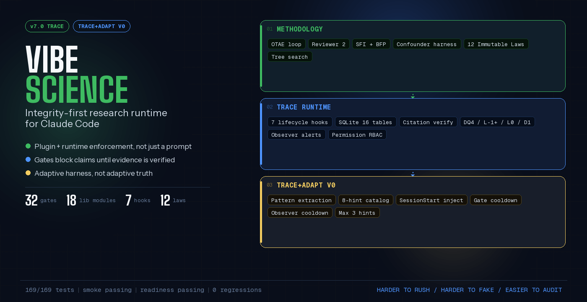

<p align="center">
  
</p>

<div align="center">
  <h2>🏛️ ACM EASE '26 · Full Paper 🏛️</h2>
  <p>
    <a href="https://doi.org/10.1145/3816483.3816631"></a>
    <a href="https://doi.org/10.1145/3816483.3816631"></a>
    <a href="https://conf.researchr.org/home/ease-2026/vibex-2026"></a>
  </p>
  <p>
    <strong>Vibe Science: How Adversarial Agent Loops Turn Vibe Researching into Verifiable Science</strong><br>
    Elisa Bertelli · Carmine Russo<br>
    Accepted at VibeX 2026, the 1st International Workshop on Vibe Coding and Vibe Researching,<br>
    co-located with the ACM International Conference on Evaluation and Assessment in Software Engineering (EASE '26).
  </p>
  <p>
    <a href="https://creativecommons.org/licenses/by/4.0/"></a>
  </p>
  <p><sub>The ACM paper is licensed under CC BY 4.0. The software in this repository remains licensed under Apache 2.0.</sub></p>
</div>

<p align="center">
  <a href="https://doi.org/10.5281/zenodo.18665031"></a>
  <a href="LICENSE"></a>
  
  
  
</p>

# Vibe Science

> Integrity-first research runtime for Claude Code. Plugin-enforced checks, adversarial review, confounder discipline, cross-session state, and audit trails for AI-assisted scientific work.

## Start Here

If you are landing on this repository for the first time, the shortest accurate summary is:

**Vibe Science is an integrity-first research runtime for Claude Code.**

It combines:

- a **plugin** that persists state and structurally enforces selected checks
- a **scientific skill** that defines the research methodology and adversarial review posture
- a **design lineage** of blueprints and archives that explains how the system evolved

It is **not** a paper-writing bot, and it is **not** just a prompt pack.  
The point is to make AI-assisted scientific work harder to rush, harder to fake, and easier to audit.

### If You Only Read Three Things

| Goal | Read | Why |
|------|------|-----|
| **Try it quickly** | [Quick Start](#quick-start) | Fastest way to run the plugin in Claude Code |
| **Understand the system** | [Three-Layer Architecture](#three-layer-architecture) | Explains the split between constitution, skill, and plugin |
| **Inspect technical depth** | [ARCHITECTURE.md](ARCHITECTURE.md) | Runtime details, version history, and subsystem internals |

## Current Release — v7.0 TRACE

`TRACE` is the runtime-closure release. v6.0 `NEXUS` built the dual architecture; v7.0 makes the critical loops actually flow through the plugin.

The repo now also includes **TRACE+ADAPT V0**, a small deterministic adaptation layer that sits on top of TRACE without changing the scientific truth model.

**Operational today in the repo:**

- 7 Claude Code lifecycle hooks
- SQLite persistence for sessions, claim lifecycle, R2 reviews, serendipity seeds, gate checks, citations, observer alerts, patterns, and benchmarks
- real `DQ4`, `L-1+`, `L0`, `D1`, and stop-time enforcement
- citation extraction plus bounded DOI/PMID/arXiv verification
- FTS5/BM25 retrieval with fallback tiers
- SessionStart context recovery, observer alerts, cross-session patterns, and advisory harness hints

**Verification status (repo state):**

- `170/170` end-to-end tests passing
- smoke passing
- readiness passing

Important scope note:

Not every methodological rule is hard-enforced in the plugin yet. The core value proposition is already real, but some methodology still lives at skill/review level rather than code-level enforcement.

### TRACE+ADAPT V0

`TRACE+ADAPT V0` is **not** a new release codename. It is a feature layer inside v7.0 TRACE.

What it adds:

- deterministic carry-over hints injected at `SessionStart`
- hints derived only from already-persisted runtime signals such as recurring gate failures and observer alerts
- max 3 hints per session, with cooldown logic so stale patterns fade out
- zero schema changes, zero LLM calls in hooks, zero protocol rewrites

Its boundary is strict:

- the harness may adapt
- the truth model may not

In practice, this means Vibe Science can improve **how it reminds and steers the workflow**, but it does not let the runtime redefine what counts as valid evidence, gate semantics, or scientific truth.

## Why This Project Exists

Vibe Science was shaped by repeated real research failure modes, not prompt aesthetics.

Across **21 CRISPR research sprints**, the system caught a result that looked extremely publishable:

- odds ratio `2.30`
- `p < 10^-100`
- clean narrative
- wrong conclusion

After propensity matching, the sign reversed. Without an adversarial structure, that claim would likely have been written up as a finding.

That is the failure mode this project is built against: an AI agent can analyze data, read papers, and produce a convincing conclusion faster than it can verify whether that conclusion is actually robust.

This is also not just a local anecdote. Recent benchmark work points in the same direction: in **[MLR-Bench](https://arxiv.org/abs/2505.19955)**, current coding agents frequently produced fabricated or invalidated experimental results in a large fraction of cases. Vibe Science is an attempt to build against that structural problem, not around it.

## What You'll See In Your First Session

When Vibe Science is active, your Claude Code session behaves differently. Here's what to expect:

| What happens | When | What you'll see |
|-------------|------|----------------|
| **Context injection** | Session starts | ~700-850 tokens of prior state, alerts, calibration hints, pending seeds, patterns, and carry-over runtime discipline |
| **Literature gate** | You try to set a research direction | Blocked if no prior literature search is logged |
| **Confounder barrier** | You write a claim to `CLAIM-LEDGER.md` | Blocked unless the claim carries the required confounder metadata; the full raw -> conditioned -> matched judgment still happens at methodology/review level |
| **Citation verification** | You reference a DOI/PMID/arXiv | Auto-extracted, verified, persisted. Unresolved sources block `L0` |
| **Promotion gate** | You advance a claim | Blocked at `D1` if citations are not all `VERIFIED` |
| **Stop blocking** | You try to end the session | Blocked if claims have not been reviewed, killed, or disputed |
| **Spine logging** | Every tool use | Auto-classified and logged to SQLite — no manual journaling needed |
| **Integrity tracking** | Infrastructure fails | Session marked `INTEGRITY_DEGRADED`; `VIBE_SCIENCE_STRICT=1` makes failures loud |

**The plugin does not replace judgment.** It removes some of the most dangerous shortcuts: promoting without verified sources, closing without adversarial review, losing context between sessions, and writing polished prose detached from structured evidence.

## Quick Glossary

| Term | Meaning |
|------|---------|
| **OTAE** | Observe-Think-Act-Evaluate — the research loop that runs each cycle |
| **R2** | Reviewer 2 — the adversarial reviewer agent whose job is to destroy weak claims |
| **R3 / J0** | Judge Agent — meta-reviews R2's reviews (scores quality of the review itself) |
| **SFI** | Seeded Fault Injection — known faults injected before R2 reviews to test vigilance |
| **BFP** | Blind-First Pass — R2 reviews claims without seeing the researcher's justification first |
| **DQ1-DQ4** | Data Quality gates at extraction, training, calibration, and finding stages |
| **L0 / L-1+** | Literature gates: `L-1+` requires search before direction, `L0` verifies citation sources |
| **D1** | Claim promotion gate — requires all citations `VERIFIED` before a claim advances |
| **SSOT** | Single Source of Truth — numbers in prose must trace back to structured data files |
| **Salvagente** | Italian for "life preserver" — when R2 kills a claim, it must produce a serendipity seed |
| **SPINE** | Research Spine — structured audit trail of every action logged to SQLite |
| **FTS5** | Full-Text Search 5 — SQLite's built-in search engine used for memory retrieval |

## What This Repository Contains

This repository is a layered system for running research-oriented AI work under stronger discipline:

- **Constitution layer**: project-level laws and behavioral constraints in `CLAUDE.md`
- **Methodology layer**: the skill in `skills/vibe/`, which defines how the research process should work
- **Enforcement layer**: the plugin in `plugin/`, which persists state and structurally enforces selected checks inside Claude Code
- **Design lineage**: blueprints and archived versions that explain why the system looks the way it does

That distinction matters because many capabilities live first as methodology, then later become plugin enforcement.

---

## Three-Layer Architecture

Vibe Science is not a single file — it's three layers that reinforce each other:

```
┌─────────────────────────────────────────────────────────────────────────┐
│  LAYER 1: CLAUDE.md (Constitution)                                     │
│  12 immutable laws · role constraints · permission model                │
│  Loaded automatically by Claude Code at session start                   │
├─────────────────────────────────────────────────────────────────────────┤
│  LAYER 2: SKILL (Methodology Brain)                                    │
│  OTAE-Tree loop · R2 Ensemble (7 modes) · 32 gates · 21 protocols     │
│  Brainstorm engine · Serendipity radar · Evidence engine               │
│  12 constitutional laws · 7 agent roles · 36 reference documents       │
│  → Guides WHAT the agent thinks                                        │
├─────────────────────────────────────────────────────────────────────────┤
│  LAYER 3: PLUGIN (Enforcement Body)                                    │
│  7 lifecycle hooks · Gate engine · Permission engine                    │
│  SQLite persistence (16 tables + FTS5) · Research spine (auto-log)     │
│  R2 calibration hints · Pattern extraction + harness hints · Silent observer │
│  Context builder (~700-850 tokens) · Narrative engine                  │
│  → Enforces selected checks and persistence                            │
└─────────────────────────────────────────────────────────────────────────┘
```

| Layer | Purpose | Enforcement level |
|-------|---------|-------------------|
| **CLAUDE.md** | Sets dispositional rules — what agents MUST and MUST NOT do | Prompt-level |
| **Skill** | Defines methodology — OTAE loop, R2 protocol, gates, evidence standards | Prompt/spec/schema-level |
| **Plugin** | Persists state and enforces selected behaviors inside Claude Code | Structural for implemented checks, not for every methodological rule |

---

## Why a Plugin, Not Just a Skill?

Versions v3.5 through v5.5 were prompt-only: the agent was *told* to run quality gates and use Reviewer 2. It worked — sometimes. But four subsystems were bypassable because they relied on voluntary compliance:

| Subsystem | As Skill (v5.5) | As Plugin (v6.0) |
|-----------|-----------------|------------------|
| **Reviewer 2** | "Please review this claim" | Hook blocks clean session end if claims are still unreviewed |
| **Quality Gates** | "Check gate DQ4 before proceeding" | Exit code 2 = tool action blocked until gate passes |
| **Research Logging** | "Write to PROGRESS.md" | Auto-logged to SQLite after every tool use |
| **Memory Recall** | "Read STATE.md at session start" | Hook injects ~700-850 tokens of context automatically |

The plugin wraps part of the skill in **code-level enforcement and persistence**: 7 lifecycle hooks, a gate engine, a permission engine, and SQLite state across sessions.

---

## Key Features

### Adversarial Review (Reviewer 2)

The methodology is built around Reviewer 2, an adversarial reviewer whose job is to destroy claims before they harden into conclusions. The skill defines 7 activation modes: INLINE, FORCED, BATCH, BRAINSTORM, SHADOW, VETO, and REDIRECT. The plugin then enforces some of the operational consequences of that posture, including stop-time checks on unreviewed claims.

The important boundary is this: the runtime can ingest review artifacts and enforce claim lifecycle consequences, but it does **not** yet semantically verify the full quality of every R2 mode or every review protocol declared in the methodology.

### Quality Gates (32 gates, 8 schema-enforced)

The methodology defines 32 gates across literature, decision, tree, brainstorm, and data-quality stages. 8 of them are schema-backed. The plugin currently hard-enforces a valuable subset of these checks and logs gate outcomes to SQLite; the rest remain skill-level methodology and review discipline.

Today the hard-stop core in the plugin is centered on `DQ4`, `L-1+`, `L0`, and `D1`. Adjacent enforcement rails also exist for stop-time claim resolution, Salvagente, and TEAM permission boundaries.

### Confounder Harness (LAW 9)

LAW 9 requires every quantitative claim to pass: raw -> conditioned -> matched. Sign change = ARTIFACT. Collapse >50% = CONFOUNDED. Survives all three = ROBUST. Today this discipline is central in the skill and partially enforced in the plugin through CLAIM-LEDGER constraints and gate logic.

The plugin's hard guarantee today is narrower than the full harness semantics: it enforces metadata and structural discipline on claim-like writes, while the actual ARTIFACT / CONFOUNDED / ROBUST judgment still depends on the methodology and adversarial review flow.

### Seeded Fault Injection (SFI)

Seeded Fault Injection is a core review protocol: known faults are introduced before R2 review so vigilance can be tested rather than assumed. Runtime support today is mainly artifact ingestion, calibration, and downstream analysis of populated SFI fields, rather than full automatic enforcement of every SFI step.

### Tree Search Over Hypotheses

OTAE-Tree architecture explores multiple hypotheses in parallel with 7 node types, 3 tree modes, and best-first selection. Minimum 3 draft nodes before any is promoted (LAW 8).

### Cross-Session Learning and Adaptation

- **Pattern extraction**: Gate failure clusters, repeated actions, and claim lifecycle patterns are extracted at session end
- **Instinct model**: The full reference model is broader than the current runtime; the live path today is pattern carry-over plus deterministic advisory hints, rather than a fully autonomous instinct lifecycle
- **R2 calibration**: Historical weakness tracking is computed at read time from ingested `r2_reviews`; it is useful, but it is not yet a closed-loop evaluator of review quality
- **Semantic recall**: Present in the architecture, but still environment-dependent and not yet the whole story of memory retrieval
- **Harness adaptation (`TRACE+ADAPT V0`)**: recurring runtime failures can now surface as short advisory hints at `SessionStart`, with deterministic activation rules and cooldowns

### Serendipity Radar

Every cycle scans for unexpected findings. Score >= 10 → QUEUE for triage. Score >= 15 → INTERRUPT current work. Killed claims produce serendipity seeds (Salvagente rule).

---

## Plugin Subsystems (~7,800 LOC)

### 7 Lifecycle Hooks

| Hook | Trigger | What It Does |
|------|---------|-------------|
| **SessionStart** | Session opens | Auto-setup, DB init, injects ~700-850 tokens (state, alerts, R2 calibration, patterns, seeds, harness hints) |
| **UserPromptSubmit** | Before each prompt | Agent role detection, prompt logging, semantic recall via vector search |
| **PreToolUse** | Before Write/Edit tool | LAW 9: blocks CLAIM-LEDGER modifications without confounder_status |
| **PostToolUse** | After every tool | Gate enforcement, permission checks, auto-logging to research spine, observer alerts |
| **Stop** | Session ending | Narrative summary, blocks stop if unreviewed claims exist (LAW 4), STATE.md export |
| **PreCompact** | Before context compaction | Snapshots current state to DB for post-compaction recovery (LAW 7) |
| **SubagentStop** | Subagent finishes | Salvagente Rule: killed claims must produce serendipity seed |

### SQLite Persistence (16 tables + retrieval virtual tables)

`meta`, `sessions`, `spine_entries`, `claim_events`, `r2_reviews`, `serendipity_seeds`, `gate_checks`, `literature_searches`, `citation_checks`, `observer_alerts`, `calibration_log`, `prompt_log`, `memory_embeddings`, `embed_queue`, `research_patterns`, `benchmark_runs` — plus `memory_fts` for TRACE retrieval and optional `vec_memories` when `sqlite-vec` is available.

### Other Engines

- **Gate Engine**: Enforces DQ4, L-1+, L0, D1, and claim-gate aggregation at PostToolUse. Exit code 2 = BLOCK. (DQ1-DQ3, DD0, and DC0 remain skill-level methodological checks until runtime producers exist.)
- **Permission Engine**: TEAM mode with role-based access control (researcher, reviewer2, judge, serendipity, lead, experimenter).
- **Context Builder**: Progressive disclosure with semantic recall (~700-850 tokens per session start, depending on carry-over).
- **Narrative Engine**: Template-based session summaries (deterministic, no LLM).
- **R2 Calibration**: Weakness tracking, SFI catch rates, J0 trends across sessions with temporal decay.
- **Pattern Extractor**: Cross-session pattern detection with confidence scoring and auto-archiving.
- **Silent Observer**: Periodic health checks (stale STATE.md, FINDINGS/JSON desync, orphaned data, design drift).

---

## v6.0 Skill (36 Reference Documents)

The v6.0 skill lives in `skills/vibe/` and contains the full methodology:

| Component | Count | Examples |
|-----------|-------|---------|
| **References** | 36 | constitution, loop-otae, reviewer2-ensemble, hook-system, pattern-extraction, instinct-model, context-resilience, handoff-protocol, r2-calibration... |
| **Python scripts** | 6 | dq_gate.py, gate_check.py, spine_entry.py, sync_check.py, tree_health.py, observer.py |
| **JSON schemas** | 12 | brainstorm-quality, claim-promotion, review-completeness, serendipity-seed, data-quality-gate, finding-validation, spine-entry... |
| **Asset files** | 7 | fault-taxonomy.yaml, judge-rubric.yaml, templates.md, stage-prompts.md, metric-parser.md, node-schema.md, domain-config-example.yaml |
| **Agent roles** | 7 | researcher, r2-deep, r2-inline, observer, explorer, r3-judge, instinct-scanner |

### 6 New References (v6.0 additions)

| Reference | What It Documents |
|-----------|------------------|
| `hook-system.md` | All 7 hooks: triggers, I/O format, LAW enforcement mapping |
| `pattern-extraction.md` | Cross-session patterns: gate failure clusters, repeated actions, claim lifecycles |
| `r2-calibration.md` | Temporal decay formula, weakness tracking, SFI catch rates, J0 trends |
| `handoff-protocol.md` | Agent-to-agent handoff: Context, Findings, Files Modified, Open Questions, Recommendations |
| `instinct-model.md` | Learned behaviors with confidence (0.3-0.9), auto-promotion, decay, scope (project/global) |
| `context-resilience.md` | LAW 7 implementation: PreCompact snapshots, STATE.md, DB recovery, progressive context building |

---

## Multi-Agent Architecture (7 Roles)

| Role | Model | Disposition | Key Constraint |
|------|-------|-------------|----------------|
| **Researcher** | claude-opus-4-6 | BUILD | Cannot declare "done" — only R2 can clear |
| **R2-Deep** | claude-opus-4-6 | DESTROY | Assumes every claim is wrong. No congratulations. |
| **R2-Inline** | claude-sonnet-4-6 | SKEPTIC | 7-point checklist on every finding |
| **Observer** | claude-haiku-4-5 | DETECT | Read-only project health scanner |
| **Explorer** | claude-sonnet-4-6 | EXPLORE | Branch artifacts only, no main claim ledger |
| **R3-Judge** | claude-opus-4-6 | META-REVIEW | Reviews R2's reviews, not claims directly |
| **Instinct Scanner** | claude-haiku-4-5 | PATTERN-DETECT | Session-end pattern extraction and instinct promotion |

**Separation of powers**: R2 produces verdicts, the orchestrator writes to the claim ledger. R2 never writes to the claim ledger directly. R3 never modifies R2's report.

---

## Requirements

| Requirement | Version | Why | Check |
|-------------|---------|-----|-------|
| **Node.js** | >= 18.0.0 | Runtime for hooks and plugin scripts | `node --version` |
| **Claude Code** | >= 1.0.33 | Plugin host | `claude --version` |
| **Git** | any | Clone the repo | `git --version` |
| **C++ Build Tools** | — | Required by `better-sqlite3` (native SQLite binding) | See below |

**C++ Build Tools by platform:**
- **Windows:** Visual Studio Build Tools with "Desktop development with C++" workload, or `npm install -g windows-build-tools`
- **macOS:** `xcode-select --install`
- **Linux:** `sudo apt install build-essential` (Debian/Ubuntu) or equivalent

**Optional:**
- **Python 3.8+** — for deterministic helper scripts used in audits and methodology support (stdlib only, no pip dependencies)

---

## Quick Start

```bash
# 1. Clone and install
git clone https://github.com/th3vib3coder/vibe-science.git
cd vibe-science
npm install

# 2. Launch Claude Code with the plugin
claude --plugin-dir .

# 3. Start a research session
/vibe
```

On first startup, the SessionStart hook auto-creates `~/.vibe-science/`, initializes the SQLite database (16 regular tables plus retrieval virtual tables), and injects structured research context (~700-850 tokens, depending on carry-over hints).

---

## Installation Methods

### Marketplace (Recommended)

```bash
/plugin marketplace add th3vib3coder/vibe-science
/plugin install vibe-science@vibe-science
# Restart Claude Code
```

### `--plugin-dir` (Quick Test)

```bash
claude --plugin-dir /path/to/vibe-science
```

### Global Settings (Permanent)

Add to `~/.claude/settings.json` (or `%USERPROFILE%\.claude\settings.json` on Windows):

```json
{
  "plugins": ["/absolute/path/to/vibe-science"]
}
```

### Project-Level

Add to your project's `.claude/settings.json` to load only in that project.

---

## What Does It Do

When active, every Claude Code session becomes a structured research session:

```
Research question → Brainstorm (Phase 0, 10-step ideation)
                         ↓
                    OTAE-Tree Loop (repeats):
                      OBSERVE  → Read current state + hook context injection
                      THINK    → Plan next action + check instincts
                      ACT      → Execute ONE action (auto-logged to spine)
                      EVALUATE → Extract claims, score confidence, check patterns
                         ↓
                    Reviewer 2 (adversarial review, 7 modes)
                         ↓
                    Only surviving claims advance
                         ↓
                    Stop hook: narrative summary + pattern extraction
```

**What you'll notice:**
- Claims are expected to carry explicit IDs, evidence, status, and confidence
- Reviewer 2 assumes every claim is wrong and demands evidence
- Selected gates block or warn at runtime; the full 32-gate system lives in the methodology
- Session state is persisted and can be exported back into durable artifacts such as `STATE.md`
- Serendipity is tracked — unexpected findings are scored and preserved
- SQLite keeps the audit trail across sessions
- Pattern extraction and resumability are part of the real working core

---

## Repository Structure

```
vibe-science/
├── .claude-plugin/              ← Plugin manifests
│   ├── plugin.json              ← Plugin metadata (v7.0.0)
│   └── marketplace.json         ← Marketplace config
│
├── skills/vibe/                 ← v7.0 TRACE skill/runtime methodology
│   ├── SKILL.md                 ← Full methodology (528 lines)
│   ├── AGENTS.md                ← 7 agent roles with YAML frontmatter
│   ├── references/              ← 36 reference documents
│   ├── scripts/                 ← 6 Python helper scripts for deterministic checks
│   ├── assets/
│   │   └── schemas/             ← 12 JSON validation schemas
│   └── agents/
│       └── claude-code.yaml     ← Model tier config
│
├── plugin/                      ← Enforcement engine (~7,800 LOC)
│   ├── scripts/                 ← 7 hook scripts + 2 utilities
│   │   ├── session-start.js     ← Context injection + auto-setup
│   │   ├── prompt-submit.js     ← Role detection + semantic recall
│   │   ├── post-tool-use.js     ← Gate enforcement + auto-logging
│   │   ├── pre-tool-use.js      ← CLAIM-LEDGER write guard (v6.0.1)
│   │   ├── stop.js              ← Narrative summary + stop blocking
│   │   ├── pre-compact.js       ← Context resilience snapshots
│   │   ├── subagent-stop.js     ← Salvagente Rule enforcement (v6.0.1)
│   │   ├── setup.js             ← DB initialization (utility)
│   │   └── worker-embed.js      ← Background embedding daemon (utility)
│   ├── lib/                     ← selected engine modules (18 total)
│   │   ├── db.js                ← SQLite operations
│   │   ├── gate-engine.js       ← Runtime gate helpers (DQ4, L0, D1, L-1+, claim gate checks)
│   │   ├── permission-engine.js ← Role-based access control
│   │   ├── context-builder.js   ← Progressive context disclosure
│   │   ├── harness-hints.js     ← Advisory carry-over hints at SessionStart
│   │   ├── narrative-engine.js  ← Template-based summaries
│   │   ├── r2-calibration.js    ← Temporal decay calibration
│   │   ├── pattern-extractor.js ← Cross-session pattern detection
│   │   ├── vec-search.js        ← Vector similarity search
│   │   └── ...                  ← Ingestion, parsing, benchmarking, and support modules
│   └── db/
│       ├── schema.sql           ← 16 regular tables + retrieval virtual tables
│       └── domain-config-template.json
│
├── commands/                    ← Slash commands (auto-discovered)
│   ├── start.md                 ← /start — conversational entry
│   ├── init.md                  ← /init — initialize RQ workspace
│   ├── loop.md                  ← /loop — run OTAE cycle
│   ├── search.md                ← /search — literature search
│   └── reviewer2.md             ← /reviewer2 — trigger R2 review
│
├── agents/reviewer2.md          ← R2 subagent definition
├── hooks/hooks.json             ← 7 hook definitions (plugin mode)
├── .claude/settings.json        ← Hook definitions (dev mode)
│
├── CLAUDE.md                    ← Project constitution (12 laws)
├── SKILL.md                     ← Legacy v5.5 methodology (1,368 lines)
├── ARCHITECTURE.md              ← Deep technical architecture
├── CHANGELOG.md                 ← Full version history
│
├── protocols/                   ← 21 methodology protocols
├── gates/gates.md               ← Gate specification
├── schemas/                     ← 12 JSON schemas
├── assets/                      ← Fault taxonomy, rubrics, templates
├── logos/                       ← SVG logos (v3.5 → v6.0)
│
└── archive/                     ← Historical versions + blueprints
    ├── v6.0-NEXUS-BLUEPRINT.md
    ├── v6.0.1-BEST-PRACTICES-BLUEPRINT.md
    ├── v5.5-ORO-BLUEPRINT.md
    ├── v5.0-IUDEX-BLUEPRINT.md
    ├── PHOTONICS-BLUEPRINT.md
    ├── vibe-science-v6.0-claude-code/  ← Archive copy of v6.0 skill
    ├── vibe-science-v5.5/
    ├── vibe-science-v5.0/
    ├── vibe-science-v5.0-codex/
    ├── vibe-science-v4.5/
    ├── vibe-science-v4.0/
    ├── vibe-science-v3.5/
    ├── vibe-science-photonics/
    └── vibe-science-legacy-pre-v5.0/
```

---

## Using Without Claude Code

You can use the methodology with any LLM: upload `skills/vibe/SKILL.md` as a system prompt, plus the `references/` directory. Note: without the plugin, gates are prompt-enforced only (voluntary compliance). The v5.5 `SKILL.md` at root (1,368 lines) is the legacy standalone version.

---

## Version History

| Version | Codename | Date | Key Innovation | Blueprint |
|---------|----------|------|----------------|-----------|
| **v1.0** | — | 2025-01 | Core 6-phase loop, single R2 prompt, state files | — |
| **v2.0** | NULLIS SECUNDUS | 2026-02-06 | R2 Ensemble (4 specialists), quantitative confidence (0-1), 12 gates | — |
| **v3.0** | TERTIUM DATUR | 2026-02-07 | OTAE loop, serendipity engine, knowledge base, MCP integration | — |
| **v3.5** | TERTIUM DATUR | 2026-02-07 | R2 double-pass, 3-level attack (Logic/Stats/Data), typed claims | — |
| **v4.0** | ARBOR VITAE | 2026-02-12 | Tree search, 7 node types, 5-stage experiment manager, 23 gates, 10 laws | — |
| **v4.5** | ARBOR VITAE (Pruned) | 2026-02-14 | Phase 0 brainstorm, R2 6 modes, -381 lines via progressive disclosure | — |
| **v5.0** | IUDEX | 2026-02-16 | SFI, blind-first pass, R3 judge, schema-validated gates, circuit breaker | [IUDEX](archive/v5.0-IUDEX-BLUEPRINT.md) |
| **v5.5** | ORO | 2026-02-19 | DQ1-DQ4 gates, DD0, DC0, R2 INLINE, SSOT rule (post-mortem driven) | [ORO](archive/v5.5-ORO-BLUEPRINT.md) |
| **v6.0** | NEXUS | 2026-02-20 | **Plugin architecture**, 7 hooks, SQLite, cross-session learning, 7 agent roles | [NEXUS](archive/v6.0-NEXUS-BLUEPRINT.md) |
| **v7.0** | TRACE | 2026-03-24 | Lifecycle closure, citation gates, strict integrity, benchmark A/B compare, FTS5 retrieval | [TRACE](blueprints/v7.0-IMPLEMENTATION-SPEC.md) |

### v7.0 TRACE — What Changed

The jump from v6.0 to v7.0 is operational, not cosmetic. NEXUS built the body; TRACE makes the critical subsystems circulate through the runtime and the database.

**New in v7.0:**
- claim lifecycle is populated for real in `claim_events`
- serendipity seeds and R2 review artifacts are ingested automatically
- DOI / PMID / arXiv citations are extracted, persisted, verified, and gated (`L0` / `D1`)
- benchmark runner writes artifacts and records to `benchmark_runs`, with readiness A/B comparison
- strict mode persists integrity degradation instead of failing open silently
- retrieval no longer depends on dead semantic memory alone: `memory_fts` provides live BM25-ranked recall
- schema migrations now carry the runtime from v6.x to TRACE (`schema_version = 4`)

**Codex → Claude Code migration:** v5.0 had a Codex-specific variant (`archive/vibe-science-v5.0-codex/`). v6.0 is Claude Code native — no Codex variant needed.

### Detailed Changelog

For the complete changelog with every feature, fix, and breaking change across all versions, see [CHANGELOG.md](CHANGELOG.md).

---

## Troubleshooting

| Problem | Cause | Fix |
|---------|-------|-----|
| Plugin not found | Wrong path | Verify `.claude-plugin/plugin.json` exists at the path |
| `npm install` fails (Windows) | `better-sqlite3` needs C++ | Install VS Build Tools with C++ workload |
| `npm install` fails (macOS) | Missing Xcode tools | `xcode-select --install` |
| Hooks don't fire | Not loaded as plugin | Use `--plugin-dir`, marketplace, or settings.json |
| SQLite errors | DB corruption | Delete `~/.vibe-science/db/` and restart |
| Embedding worker fails | Missing ONNX runtime | Non-critical — falls back to keyword search |
| "34 gates" in old docs | Pre-debug artifact | Correct count is 32 gates (8 schema-enforced). Fixed in v6.0.0. |

---

## Archive & Blueprints

Every major version has a **blueprint** documenting its design rationale, innovations, evidence base, and lineage:

| Blueprint | Content |
|-----------|---------|
| [v6.0-NEXUS-BLUEPRINT.md](archive/v6.0-NEXUS-BLUEPRINT.md) | 9 innovations, hook architecture, cross-session learning, lineage from v5.5 |
| [v6.0.1-BEST-PRACTICES-BLUEPRINT.md](archive/v6.0.1-BEST-PRACTICES-BLUEPRINT.md) | Best practices upgrade from community analysis, Claude Code spec cross-reference |
| [v5.5-ORO-BLUEPRINT.md](archive/v5.5-ORO-BLUEPRINT.md) | Post-mortem analysis, 12 mistakes → 7 new gates, evidence-driven development |
| [v5.0-IUDEX-BLUEPRINT.md](archive/v5.0-IUDEX-BLUEPRINT.md) | Verification architecture, SFI, BFP, R3 judge, schema-validated gates |
| [PHOTONICS-BLUEPRINT.md](archive/PHOTONICS-BLUEPRINT.md) | Domain fork for photonics research |

Each historical version is preserved intact in `archive/vibe-science-v{X.Y}/` with its original SKILL.md, README, and CLAUDE.md.

---

## Citation

> Vibe Science Contributors (2026). *Vibe Science: an AI-native research engine with adversarial review and serendipity tracking.* GitHub: [th3vib3coder/vibe-science](https://github.com/th3vib3coder/vibe-science) · DOI: [10.5281/zenodo.18665031](https://doi.org/10.5281/zenodo.18665031)

```bibtex
@software{vibe_science_2026,
  title     = {Vibe Science: AI-native research with adversarial review and serendipity tracking},
  author    = {{Vibe Science Contributors}},
  year      = {2026},
  version   = {7.0.0},
  url       = {https://github.com/th3vib3coder/vibe-science},
  doi       = {10.5281/zenodo.18665031},
  license   = {Apache-2.0}
}
```

## License

Apache 2.0 — see [LICENSE](LICENSE).

## Authors

**Carmine Russo, Elisa Bertelli (MD)**

---

*Built with Claude Code · Powered by Claude Opus · Made with adversarial love*
