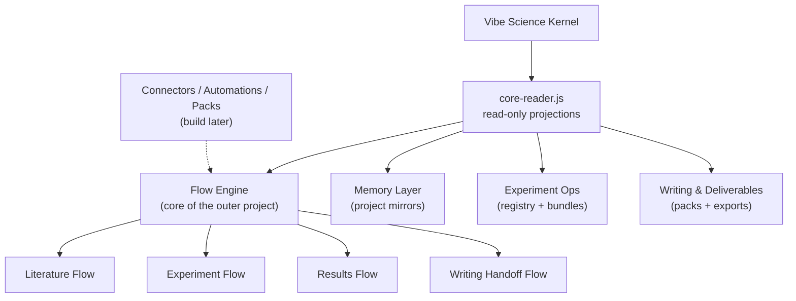

# Product Architecture

**Purpose:** Define the shape of the outer project without contaminating the Vibe Science kernel

---

## Product Shape

The outer project is a **local-first research environment** built around the Vibe Science kernel.

It should be thought of as:

The Flow Engine is the center of gravity — it consumes kernel projections and orchestrates the other modules.
The kernel remains narrow, hard, and authoritative.
Connectors, automations, and packs are deferred until the core modules work.

---

## Module 1: Flow Engine (core module — this is the product)

The Flow Engine is not one of 8 equal modules. It is the center of gravity of the outer project. Everything else supports it.

Purpose:

- guide researchers through literature, experiment, results, and writing phases
- break work into stages and tasks with explicit next actions
- maintain workflow state across sessions
- make the "what should I do next?" question trivially answerable

What this makes possible that is impossible today:

- The researcher opens a session and the flow tells them: "You are in the experiment phase. Experiment 3 is blocked on a missing control. Experiment 4 results are ready for claim formulation."
- Instead of deciding from scratch every session what to do, the researcher follows the flow and makes higher-level decisions about direction while the flow manages sequencing.
- Literature reviews become structured: papers are registered, cross-checked against methodology, and linked to specific research directions rather than scattered in notes.
- Writing handoff is traceable: the flow knows which claims are PROMOTED and packages them for the Results section with evidence chains attached.

Concrete flows to build:

1. **Literature flow** — register papers, track relevance to claims, surface gaps, flag unchecked methodology conflicts. Invoked via `/flow-literature`.
2. **Experiment flow** — register experiments, track parameters/seeds/outputs, assemble result bundles, surface blockers. Invoked via `/flow-experiment`.
3. **Results flow** — aggregate validated findings, prepare claim summaries, generate figure catalogs. Invoked via `/flow-results`.
4. **Writing handoff flow** — export PROMOTED/ROBUST claims with evidence chains for paper sections. Flag killed claims. Track which claims have been written about. Invoked via `/flow-writing`.

How flows interact with the kernel:

- Flows read kernel state (claims, gates, citations) via the read-only interface.
- Flows may create workflow artifacts (plans, checklists, task queues) in the project workspace.
- Flows may NOT promote claims, certify evidence, or reinterpret gate outcomes.
- If a flow tries to include a killed claim in a writing handoff, it must surface a warning, not silently include it.

V1 storage decision:

- How granular are flow stages? Per-session? Per-week? Per research question?
- **Flow state lives outside the kernel in workspace-scoped files for V1.**
- The kernel remains read-only from the flow's point of view.
- No new kernel tables are introduced for flow state in V1.
- If the outer project later proves that file-backed flow state is insufficient, that becomes a separate kernel-review decision rather than a default.
- What happens when the researcher wants to work on something the flow doesn't expect? Override mechanism needed.

Not allowed:

- promote claims
- certify evidence
- reinterpret gates
- block the researcher from doing work outside the current flow stage (flows guide, they don't imprison)

---

## Module 2: Memory Layer

Purpose:

- maintain typed, human-readable project memory
- expose durable project context across long-running work

What this makes possible that is impossible today:

- The researcher reads a 1-page project overview instead of parsing STATE.md + PROGRESS.md + CLAIM-LEDGER.md manually.
- Decision logs survive across sessions: "we decided not to use batch correction method X because of Y" is findable 3 weeks later.
- Advisor feedback is tracked as structured notes linked to specific claims or experiments, not lost in chat history.

Safe responsibilities:

- mirror project state into notes
- maintain paper notes, experiment notes, writing notes, decision logs, and meeting notes
- keep visible timestamps and sync provenance

Not allowed:

- act as source of truth
- certify findings
- replace kernel state

---

## Module 3: Experiment Ops

Purpose:

- plan, register, run, compare, and package experiments

What this makes possible that is impossible today:

- Every experiment has a manifest: what was run, with which parameters, which random seed, which code version, which outputs were produced. No more "I can't find the results from 2 weeks ago."
- Ablations are tracked as a group: the researcher can see all runs of the same experiment with different parameters side by side.
- Blockers are explicit: "Experiment 5 is blocked because we need the batch-corrected matrix from Experiment 3" is tracked and surfaced.

Safe responsibilities:

- experiment registry
- run manifests
- result bundle assembly
- ablation tracking
- execution status
- blocker tracking and remediation tasks

Not allowed:

- declare experiment conclusions valid
- bypass claim review or gate enforcement

---

## Module 4: Writing And Deliverables

Purpose:

- turn validated outputs into structured writing inputs and deliverable bundles

What this makes possible that is impossible today:

- Advisor meeting prep takes 20 minutes instead of 2 hours. The environment assembles claim summaries, new figures, blockers, and proposed next steps automatically.
- The Results section of a paper can be seeded from PROMOTED claims with their evidence chains, so the researcher writes prose around validated findings rather than reinventing them from memory.
- Rebuttal prep aggregates all evidence for a disputed claim in one place.

Important boundary — writing is not all claim-backed:

- **Claim-backed writing** (Results, quantitative conclusions): must reference PROMOTED/ROBUST claims. Killed/disputed claims require explicit caveat.
- **Artifact-backed writing** (Methods, preprocessing descriptions, protocol choices, thresholds, seeds, dataset provenance): must be grounded in experiment manifests, result bundles, and other structured artifacts even if it is not claim-backed in the same sense as Results.
- **Free writing** (Introduction, Discussion, hypotheses, speculation): the kernel has no authority here. The researcher writes freely. The environment may help organize but does not gate.

This distinction is critical. A system that blocks all writing until claims are promoted is unusable for real academic work. But a system that treats methods as pure free prose creates a factual bypass around provenance and reproducibility. The kernel's strongest authority is over quantitative findings; the outer project must still keep methods tied to artifacts.

Safe responsibilities:

- claim-aware export for validated findings
- artifact-backed export for Methods sections
- report assembly
- figure catalogs
- appendix / artifact bundle preparation
- advisor-meeting packs
- rebuttal prep packs
- free-writing support for non-claim sections (intro, discussion, speculative notes)

Not allowed:

- free invention of validated findings
- inclusion of killed / disputed claims in Results sections without explicit caveat
- treating Methods as ungrounded prose detached from manifests, bundles, and protocol artifacts
- blocking the researcher from writing Introduction or Discussion because claims aren't promoted yet

---

## Module 5: Connectors And Channels (build later)

Purpose: integrate with external tools (Zotero, Obsidian, notebook exports, messaging).

This module is deferred. Build it after the Flow Engine, Memory, Experiment Ops, and Writing modules are working and tested. A connector without a working inner system to connect is premature.

When built: connectors are adapters, not truth sources. They sync bibliography, mirror notes, and export artifacts. They do not define evidence semantics.

Implementation note: Claude Code v2.1.80+ ships native **Channels** — MCP servers that push external events (Telegram, Discord, iMessage, webhooks) into a running session. Channels also support two-way reply and remote permission relay. Use Channels as the transport/event ingress layer rather than building custom bridges. Channels are substrato (event pipes + mobile approval), not domain logic — our domain logic (literature tracking, experiment alerts, advisor feedback parsing) runs on top.

---

## Module 6: Automations And Digests (build later)

Purpose: reduce operator burden with session-start checks, digests, and reminders.

This module is deferred. Some automation already exists in TRACE+ADAPT (harness hints at SessionStart). Additional automations should wait until the Flow Engine defines what "stale" and "blocked" mean in practice. Otherwise we automate reminders for concepts that don't exist yet.

When built: automations assist, they do not sign off. No unsupervised claim promotion.

Implementation note: Claude Code provides **Scheduled Tasks** at three levels — session-scoped (`/loop`, CronCreate — dies when session closes, 3-day max), Desktop (durable, local machine), and Cloud (durable, Anthropic infrastructure). Use session-scoped for in-session reminders and polling. Use Desktop/Cloud for durable automations like weekly digests and advisor-prep reminders. Do not build a custom scheduler.

---

## Module 7: Domain Packs (build later)

Purpose: specialize workflows for specific research domains without forking the kernel.

This module is deferred. A pack is meaningless until the Flow Engine exists — packs are workflow presets, and you can't preset a workflow that hasn't been built.

When built: packs change presets, not truth semantics. Loaded via `domain-config.json` in project root.

---

## Context Budget Constraint

Every module in this environment runs inside Claude Code sessions with limited context. The architecture must account for this:

- Modules should be **lazy-loaded** — their skill definitions are only present when the researcher invokes them, not always in context.
- SessionStart output from the environment should be **minimal** — a few lines of "here's what's pending", not a wall of state.
- If a module can work from workspace files instead of injecting context, prefer workspace files.

A system that fills the context window with its own overhead before the researcher types anything is broken by design.

---

## Most Important Architectural Rule

The outer project may widen:

- workflow
- memory
- packaging
- visibility

It may not widen by creating a second epistemic authority.

And it may not widen by consuming so much context that the researcher can't do research.
