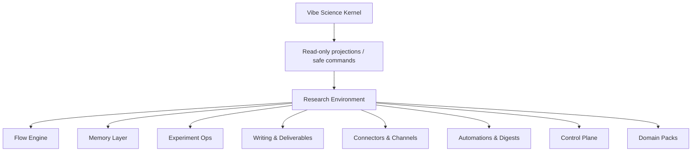

# Product Architecture

**Purpose:** Define the shape of the outer project without contaminating the Vibe Science kernel

---

## Product Shape

The outer project is a **local-first research environment** built around the Vibe Science kernel.

It should be thought of as:

The environment is broad.
The kernel remains narrow, hard, and authoritative.

---

## Host Adapter Layer

Purpose:

- bind the outer environment to a concrete host such as Claude Code
- translate host lifecycle events into kernel-safe behavior
- preserve the kernel contract even if other hosts are added later

Safe responsibilities:

- host-specific session bootstrapping
- transport of commands, prompts, and runtime events
- display of kernel projections in the host environment

Not allowed:

- redefining truth semantics at adapter level
- bypassing kernel enforcement because a host surface is more convenient

This matters because Claude Code may be the first host, but the outer project should not hardcode its entire identity to one shell forever.

---

## Module 1: Flow Engine

Purpose:

- guide researchers through literature, experiment, results, and writing flows
- break work into stages and tasks
- maintain workflow state and next actions

Safe responsibilities:

- create workflow plans
- track current stage
- generate checklists
- queue work for human or agent execution

Not allowed:

- promote claims
- certify evidence
- reinterpret gates

---

## Module 2: Memory Layer

Purpose:

- maintain typed, human-readable project memory
- expose durable project context across long-running work

Safe responsibilities:

- mirror project state into notes
- maintain paper notes, experiment notes, writing notes, decision logs, and meeting notes
- keep visible timestamps and sync provenance

Not allowed:

- act as source of truth
- certify findings
- replace kernel state

---

## Module 3: Experiment Ops

Purpose:

- plan, register, run, compare, and package experiments

Safe responsibilities:

- experiment registry
- run manifests
- result bundle assembly
- ablation tracking
- execution status
- blocker tracking and remediation tasks

Not allowed:

- declare experiment conclusions valid
- bypass claim review or gate enforcement

---

## Module 4: Writing And Deliverables

Purpose:

- turn validated outputs into structured writing inputs and deliverable bundles

Safe responsibilities:

- claim-aware export for validated findings
- report assembly
- figure catalogs
- appendix / artifact bundle preparation
- advisor-meeting packs
- rebuttal prep packs

Not allowed:

- free invention of validated findings
- inclusion of killed / disputed claims without explicit caveat

---

## Module 5: Connectors And Channels

Purpose:

- integrate with external tools and communication surfaces

Safe responsibilities:

- Zotero-like bibliography sync
- Obsidian-like mirror adapter
- local file exports
- messaging or notification channels
- notebook and figure-folder adapters

Not allowed:

- direct truth mutation
- connector-defined evidence semantics

---

## Module 6: Automations And Digests

Purpose:

- reduce operator burden without creating autonomous legitimacy

Safe responsibilities:

- session-start checks
- weekly digests
- advisor-prep packs
- stale-state reminders
- review debt summaries
- workflow blocker summaries

Not allowed:

- autonomous scientific sign-off
- unsupervised claim promotion

---

## Module 7: Control Plane

Purpose:

- give the researcher a visible operational surface

Safe responsibilities:

- dashboard of workflows, tasks, blockers, reminders, artifacts, and recent kernel state
- manual dispatch / resume / acknowledge actions for outer-layer work
- visibility into what is pending

Not allowed:

- UI actions that mutate kernel truth directly

---

## Module 8: Domain Packs

Purpose:

- specialize the environment without forking the kernel

Safe responsibilities:

- workflow presets
- literature-source presets
- reporting templates
- pack-specific automations and task patterns

Not allowed:

- domain-specific redefinition of truth semantics

---

## Most Important Architectural Rule

The outer project may widen:

- workflow
- memory
- packaging
- visibility
- integrations
- automation

It may not widen by creating a second epistemic authority.
