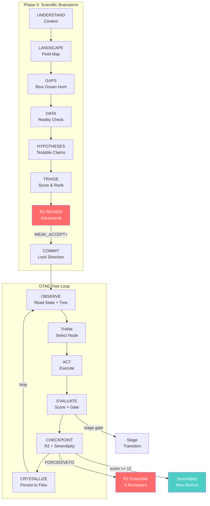
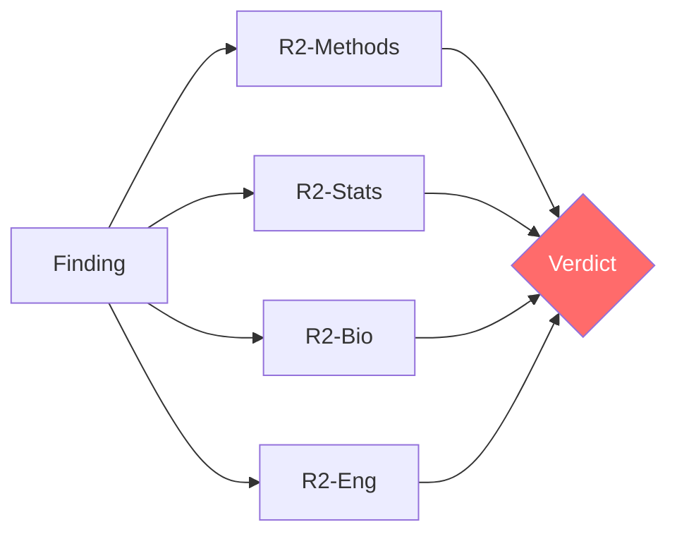
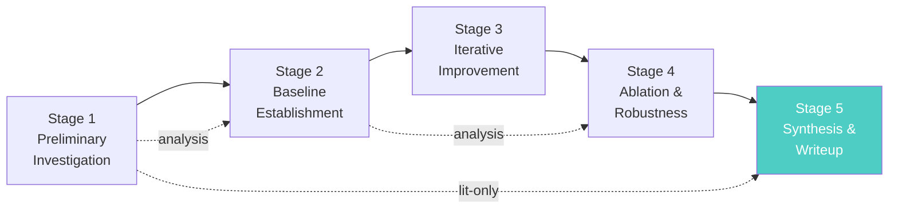
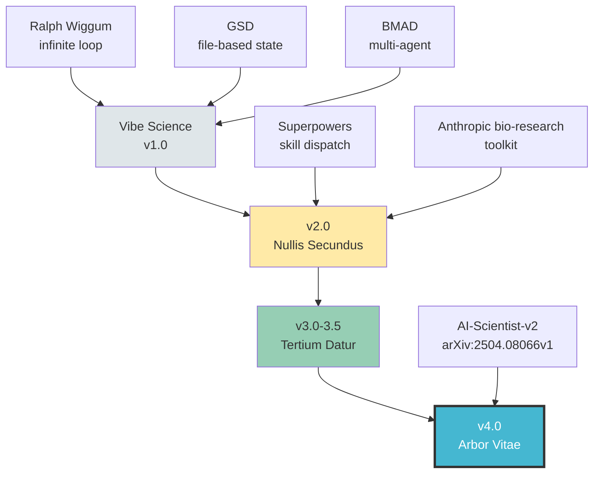

<div align="center">

# Vibe Science v4.0

### ARBOR VITAE

**Agentic tree search for scientific research.**<br>
**Infinite loops until discovery. Adversarial review at every node.**

[](https://doi.org/10.5281/zenodo.18663141)
[](#version-history)
[](../LICENSE)
[](https://docs.anthropic.com/en/docs/claude-code)
[](#10-constitutional-laws)
[](#quality-gates)
[](#protocols)

<br>

*"It's not the prompt that makes the difference.*
*It's the system that PREVENTS the prompt from lying."*

</div>

---

## The Problem

AI agents are dangerous in science. Not because they hallucinate — that's the easy problem.

The dangerous problem is that they find **real patterns** in **real data** and construct **plausible narratives** around them, without ever asking: *"What if this is an artifact?"*

<table>
<tr>
<td width="50%">

**What the agent does:**
- Optimizes for completion, not truth
- Gets excited by strong signals (p < 10⁻¹⁰⁰!)
- Constructs narratives around artifacts
- Never searches for what kills its own claims
- Declares "done" after 1 sprint

</td>
<td width="50%">

**What actually happened (21 sprints, CRISPR):**
- OR = 2.30 → **reversed sign** under propensity matching
- "Bidirectional effects" → **biologically impossible**
- "Regime switch" → Cohen's d = **0.07** (noise)
- "Generalizable rankings" → **don't generalize** between assays

</td>
</tr>
</table>

None of these were hallucinations. The data was real. The statistics were correct. The problem was dispositional: **the agent never tried to destroy its own claims.**

---

## The Solution

```
                    Builder (Researcher)              Destroyer (Reviewer 2)
                    ───────────────────               ─────────────────────
  Optimizes for:    Completion                        Survival
  Default stance:   "This looks promising"            "This is probably an artifact"
  Strong signal:    Excitement → narrative → paper     Suspicion → confounders → controls
  Web search for:   Supporting evidence               Contradictions, prior art, known artifacts
  Says "done":      When results look good            When ALL counter-verifications pass
```

**Vibe Science embeds both dispositions in the same system.** The builder builds. The destroyer destroys. Only what survives both gets published.

---

## What's New in v4.0

**ARBOR VITAE** introduces **tree search over hypotheses** — the biggest architectural change since v1.0. The flat OTAE loop of v3.5 becomes an OTAE-Tree where each cycle is a node in a branching exploration.

### v3.5 → v4.0 at a Glance

| Dimension | v3.5 (TERTIUM DATUR) | v4.0 (ARBOR VITAE) |
|-----------|---------------------|---------------------|
| Loop | Flat OTAE | **OTAE-Tree** (nodes in a tree) |
| Exploration | Sequential | **Best-first** with branching + pruning |
| Serendipity | Linear scanning | **Cross-branch** pattern detection |
| Laws | 7 | **10** (+Explore, +Confounder Harness, +Crystallize) |
| Gates | 12 | **26** (+Tree T0-T3, +Brainstorm B0, +Stage S1-S5) |
| Protocols | 9 | **16** (+7 new) |
| Assets | 3 | **6** (+3 new) |
| Stages | None | **5-stage experiment lifecycle** |
| Agents | Single context | **SOLO + TEAM** modes |
| Configuration | Plugin only | **CLAUDE.md** + hooks enforcement |
| Brainstorm | Informal | **Mandatory Phase 0** (8-step, gated) |
| Paper output | Manual | **Writeup Engine** (IMRAD from verified claims) |
| Figure validation | None | **VLM Gate** (vision-language model check) |

### 3 New Laws

| # | Law | Principle |
|---|-----|-----------|
| **8** | EXPLORE BEFORE EXPLOIT | Minimum 3 draft nodes before any promotion. A tree with one branch is a list. |
| **9** | CONFOUNDER HARNESS | Raw → conditioned → matched. Sign change = ARTIFACT. `NO HARNESS = NO CLAIM.` |
| **10** | CRYSTALLIZE OR LOSE | `IF IT'S NOT IN A FILE, IT DOESN'T EXIST.` |

### 7 New Protocols

| Protocol | File | Purpose |
|----------|------|---------|
| **Tree Search** | `protocols/tree-search.md` | 3 modes (LINEAR/BRANCHING/HYBRID), 7 node types, best-first selection, hard/soft pruning |
| **Brainstorm Engine** | `protocols/brainstorm-engine.md` | Mandatory Phase 0: 8-step structured brainstorming with Gate B0 |
| **Experiment Manager** | `protocols/experiment-manager.md` | 5-stage lifecycle (Preliminary → Baseline → Improvement → Ablation → Synthesis) |
| **Auto-Experiment** | `protocols/auto-experiment.md` | Code generation → execution → metric parsing per tree node |
| **Agent Teams** | `protocols/agent-teams.md` | TEAM mode: 4 specialized agents with shared filesystem communication |
| **VLM Gate** | `protocols/vlm-gate.md` | Optional figure validation using vision-language models (5-point assessment) |
| **Writeup Engine** | `protocols/writeup-engine.md` | IMRAD paper drafting from verified claims with confidence-calibrated language |

### 3 New Assets

| Asset | File | Purpose |
|-------|------|---------|
| **Metric Parser** | `assets/metric-parser.md` | Standardized `[METRIC] name=value` output format, domain-specific tables |
| **Node Schema** | `assets/node-schema.md` | Full TreeNode YAML schema (30+ fields), node type constraints |
| **Stage Prompts** | `assets/stage-prompts.md` | Per-stage THINK guidance with common mistakes |

---

## How It Works



### OTAE Inside Tree Nodes

v3.5 had a flat loop. v4.0 has a **branching tree** where each node is a complete OTAE cycle:

```
                         root
                        /    \
                    node-A   node-B          ← each = full OTAE cycle
                   / |  \      |
                A1  A2  A3    B1             ← children = variations
               /
             A1a                             ← deeper exploration

     Selection: Score = confidence×0.6 + metric_improvement×0.3 + novelty×0.1
     Pruning:   T1 fail / R2 VETO → hard prune | 5 non-improving → soft prune
     Health:    good_nodes / total >= 0.2 or review needed
```

**7 node types:** `root` · `draft` · `improve` · `hyper` · `ablation` · `replication` · `debug`

**3 tree modes:** `LINEAR` (literature) · `BRANCHING` (experiments) · `HYBRID` (both)

---

## Key Features

<table>
<tr>
<td width="33%" valign="top">

### Reviewer 2 Co-Pilot

Not a gate you pass — a co-pilot you can't fire.



**v4.0 upgrades:**
- R2 is **CO-PILOT** (not just gate)
- TEAM mode: R2 in separate context
- **Shadow mode**: passive every 3 cycles
- Anti-premature-closure mandate

</td>
<td width="33%" valign="top">

### Evidence Engine

Every claim is quantified, not felt.

```
confidence =
    E × 0.30  Evidence Quality
  + R × 0.25  Robustness
  + C × 0.20  Concordance
  + K × 0.15  Confounding Risk
  + D × 0.10  Directness

FLOOR: E < 0.2 → capped at 0.20
```

**Confounder Harness (LAW 9):**
- Raw → Conditioned → Matched
- Sign change = ARTIFACT (killed)
- Collapse >50% = CONFOUNDED
- Survives = ROBUST

</td>
<td width="33%" valign="top">

### Serendipity Radar

Active scanner, not passive logger.

**5 scans every EVALUATE:**
1. Anomaly detection
2. Cross-branch patterns
3. Contradiction register
4. Connection discovery
5. Score computation

**Response matrix:**
- Score >= 12 → INTERRUPT
- Score >= 8 → QUEUE
- Score >= 4 → FILE
- Score < 4 → NOISE

**Cross-branch** serendipity is new in v4.0 — patterns visible only when comparing tree branches.

</td>
</tr>
</table>

---

## 10 Constitutional Laws

> These govern ALL behavior. No protocol, no user request, no context can override them.

| | Law | Rule | Enforcement |
|---|-----|------|-------------|
| **1** | DATA-FIRST | No thesis without evidence from data | `NO DATA = NO GO` |
| **2** | EVIDENCE DISCIPLINE | Every claim: claim_id + evidence chain + confidence + status | Evidence floor gate |
| **3** | GATES BLOCK | Quality gates are hard stops, not suggestions | 26 gates block pipeline |
| **4** | R2 IS CO-PILOT | R2 can VETO, REDIRECT, FORCE. Non-negotiable. | 4+ activation modes |
| **5** | SERENDIPITY IS THE MISSION | Actively hunt the unexpected at every cycle | Radar + cross-branch |
| **6** | ARTIFACTS OVER PROSE | If it can produce a file, it MUST | LAW 10 cascades |
| **7** | FRESH CONTEXT RESILIENCE | Resumable from STATE.md + TREE-STATE.json alone | File-based state |
| **8** | EXPLORE BEFORE EXPLOIT | Minimum 3 draft nodes before promotion | Tree health gate T3 |
| **9** | CONFOUNDER HARNESS | Raw → Conditioned → Matched for every quantitative claim | `NO HARNESS = NO CLAIM` |
| **10** | CRYSTALLIZE OR LOSE | Every result written to persistent file | `NOT IN FILE = DOESN'T EXIST` |

---

## Quality Gates

26 quality gates in 6 categories:

<table>
<tr>
<td valign="top">

**Pipeline (G0-G6)**
```
G0  Input Sanity
G1  Schema Compliance
G2  Design Justification
G3  Training Integrity
G4  Metrics Decision
G5  Artifact Completeness
G6  VLM Figure Check (optional)
```

</td>
<td valign="top">

**Literature (L0-L2)**
```
L0  Source Validity (DOI verified)
L1  Coverage Adequacy (>= 3 sources)
L2  Review Completeness
```

**Decision (D0-D2)**
```
D0  Decision Justified
D1  Claim Promotion
D2  RQ Conclusion
```

</td>
<td valign="top">

**Tree (T0-T3)** — *New*
```
T0  Node Novelty
T1  Node Quality
T2  Branch Health
T3  Tree Health (>= 20%)
```

**Brainstorm + Stage** — *New*
```
B0  Brainstorm Quality
S1-S5  Stage Advancement Gates
```

</td>
</tr>
</table>

---

## 5-Stage Experiment Manager

Lifecycle adapted from Sakana AI-Scientist-v2's 4-stage model plus Synthesis.



| Stage | Activities | Gate |
|-------|-----------|------|
| **S1** Preliminary | Literature + data audit + landscape | S1 (>=3 papers + data access) |
| **S2** Baseline | First runs + calibration | S2 (reproducible baseline) |
| **S3** Improvement | Tree branching + experiments | S3 (metric improvement) |
| **S4** Ablation | Component removal + stress tests | S4 (ablation complete) |
| **S5** Synthesis | Final review + writeup | S5 (R2 clearance + all gates) |

Literature-only: S1 → S5 | Analysis: S1 → S2 → S4 → S5 | Full computational: all 5 stages

---

## SOLO vs TEAM Runtime

<table>
<tr>
<td width="50%">

### SOLO Mode (default)

```
┌──────────────────────────────────┐
│      SINGLE CONTEXT WINDOW       │
│                                  │
│  Orchestrator (OTAE loop)        │
│  + Researcher                    │
│  + Reviewer 2 (simulated)        │
│  + Serendipity Scanner           │
│  + Experiment Runner             │
│                                  │
│  Token cost: 1x                  │
└──────────────────────────────────┘
```

Best for: literature review, short sessions, token-constrained environments.

</td>
<td width="50%">

### TEAM Mode (opt-in)

```
┌────────────┐    ┌────────────┐
│  TEAM LEAD │───>│ RESEARCHER │
│            │    │  (Sonnet)  │
│            │    └─────┬──────┘
│            │          │
│            │<──>┌─────┴──────┐
│            │    │ REVIEWER 2 │
│            │    │  (Opus)    │
│            │    │ Own context│
│            │    └────────────┘
│            │<──>┌────────────┐
│            │    │SERENDIPITY │
│            │    │  (Haiku)   │
│            │    └────────────┘
└────────────┘
     Token cost: ~3-4x
```

Best for: computational experiments, high-stakes findings, long sessions.

Requires: `CLAUDE_CODE_EXPERIMENTAL_AGENT_TEAMS=1`

</td>
</tr>
</table>

Fallback from TEAM → SOLO is seamless. All state lives in files (LAW 7). Communication via shared filesystem — the filesystem IS the message bus.

---

## Phase 0: Mandatory Brainstorm

Every research session begins with an 8-step structured brainstorm. Gate B0 must pass before the OTAE-Tree begins.

| Step | Output File | What Happens |
|------|-------------|-------------|
| 1. UNDERSTAND | `context.md` | Unpack domain, constraints, prior knowledge |
| 2. LANDSCAPE | `landscape.md` | Map the field: who, what, where, gaps |
| 3. GAPS | `gaps.md` | 6 gap-hunting techniques to find blue ocean |
| 4. DATA | `data-audit.md` | Reality check: DATA_AVAILABLE score (0-1) |
| 5. HYPOTHESES | `hypotheses.md` | Testable claims with null hypothesis + predictions |
| 6. TRIAGE | `triage.md` | 5-dimension scoring (0-15) to rank hypotheses |
| 7. R2 REVIEW | — | Max 3 R2 cycles on the brainstorm itself |
| 8. COMMIT | — | Lock RQ, pass Gate B0, enter OTAE-Tree |

---

## Protocols

### Core Loop

| Protocol | File | Purpose |
|----------|------|---------|
| Loop OTAE | `protocols/loop-otae.md` | OTAE-Tree cycle with node context, best-first selection, emergency protocols |
| Evidence Engine | `protocols/evidence-engine.md` | Claim Ledger, confidence formula (E·R·C·K·D), confounder harness, evidence floor |
| Reviewer 2 Ensemble | `protocols/reviewer2-ensemble.md` | 4-domain adversarial review, CO-PILOT role, Shadow mode, TEAM support |
| Search Protocol | `protocols/search-protocol.md` | Source priority (Scopus > PubMed > OpenAlex > bioRxiv), dedup, anti-hallucination |

### Tree & Experiment (New in v4.0)

| Protocol | File | Purpose |
|----------|------|---------|
| Tree Search | `protocols/tree-search.md` | 3 modes, 7 node types, best-first selection, pruning rules |
| Experiment Manager | `protocols/experiment-manager.md` | 5-stage lifecycle with stage-aware deviation rules |
| Auto-Experiment | `protocols/auto-experiment.md` | Code generation → execution → metric parsing pipeline |
| Brainstorm Engine | `protocols/brainstorm-engine.md` | Mandatory Phase 0, 8 steps, Gate B0 |
| Agent Teams | `protocols/agent-teams.md` | TEAM mode architecture, 4 agents, shared filesystem |

### Research Support

| Protocol | File | Purpose |
|----------|------|---------|
| Analysis Orchestrator | `protocols/analysis-orchestrator.md` | Artifact contract, manifests, OAT ablation, triage |
| Data Extraction | `protocols/data-extraction.md` | NO TRUNCATION, AnnData schema, supplementary materials |
| Serendipity Engine | `protocols/serendipity-engine.md` | Active radar, cross-branch scanning, sprints, escalation |
| Knowledge Base | `protocols/knowledge-base.md` | Cross-RQ persistence (library.json, patterns, dead-ends) |
| Audit & Reproducibility | `protocols/audit-reproducibility.md` | Decision log, run comparison, snapshots, 10-point contract |

### Output (New in v4.0)

| Protocol | File | Purpose |
|----------|------|---------|
| VLM Gate | `protocols/vlm-gate.md` | Optional figure validation via vision-language model (5-point assessment, >= 0.8 to pass) |
| Writeup Engine | `protocols/writeup-engine.md` | IMRAD paper drafting from verified claims, confidence-to-language mapping |

---

## CLAUDE.md Constitution

New in v4.0: a project constitution loaded into **every agent's context**, containing:

- **The Problem Statement** — why AI agents are dangerous in science (with real examples)
- **10 Immutable Laws** — non-overridable behavioral constraints
- **Role-Specific Constraints** — behavioral rules per agent role:
  - **Researcher**: BUILD + EXECUTE. Search for confounders first, not celebrations.
  - **Reviewer 2**: DESTRUCTION. Assume every claim is wrong. Never congratulate.
  - **Serendipity Scanner**: DETECTION. Continuous, cross-branch, escalating.
  - **Experimenter**: EXECUTION. Files, seeds, versions, parameter logs.
  - **Team Lead**: COORDINATION. Delegate, never implement.
- **Hooks Documentation** — what each system-level hook enforces

---

## Hooks Enforcement

Four Claude Code hooks in `.claude/hooks.json` provide **system-level** enforcement that cannot be overridden by any agent:

| Hook | Trigger | Enforces |
|------|---------|----------|
| **Stop** | Agent attempts to stop | Claims must have confounder harness + R2 review |
| **TaskCompleted** | Task marked complete | Required artifacts must exist |
| **TeammateIdle** | Teammate goes idle | No pending work can exist |
| **SubagentStop** | Subagent attempts to stop | Must have produced output files |

---

## Installation & Quick Start

### 1. Install

```bash
git clone https://github.com/th3vib3coder/vibe-science.git
claude plugins add ./vibe-science
```

### 2. Start

```bash
/start
```

### 3. Choose runtime

```
[1] SOLO — Single agent. All roles in one context. Lower cost.
[2] TEAM — Agent Teams. R2 gets own context. Higher quality.
```

### 4. Phase 0 begins automatically

The system guides you through structured brainstorming. You don't need to know the protocol — just answer questions about your research domain.

### 5. OTAE-Tree loop begins

After Gate B0 passes, the tree search starts. Cycles continue until a stop condition is met.

---

<details>
<summary><h2>File Structure (click to expand)</h2></summary>

### Plugin Structure

```
vibe-science-v4.0/
├── .claude/
│   ├── hooks.json                 # 4 enforcement hooks
│   └── settings.json              # Agent Teams flag + permissions
├── .claude-plugin/
│   └── plugin.json                # Plugin manifest (v4.0.0, ARBOR VITAE)
├── SKILL.md                       # Core specification (~1500 lines)
├── CLAUDE.md                      # Project constitution for all agents
├── LICENSE                        # Apache 2.0
│
├── commands/
│   └── start.md                   # /start — SOLO/TEAM + session init
│
├── protocols/                     # 16 protocols, loaded on-demand
│   ├── loop-otae.md               # OTAE-Tree cycle
│   ├── tree-search.md             # Tree modes, selection, pruning
│   ├── brainstorm-engine.md       # Phase 0 (8 steps)
│   ├── experiment-manager.md      # 5-stage lifecycle
│   ├── auto-experiment.md         # Code gen + execution + metrics
│   ├── agent-teams.md             # SOLO/TEAM architecture
│   ├── reviewer2-ensemble.md      # R2: CO-PILOT, shadow, team
│   ├── evidence-engine.md         # Claims, confidence, harness
│   ├── serendipity-engine.md      # Radar, cross-branch, sprints
│   ├── search-protocol.md         # Literature search
│   ├── vlm-gate.md                # Visual validation
│   ├── writeup-engine.md          # IMRAD drafting
│   ├── analysis-orchestrator.md   # Data analysis pipeline
│   ├── knowledge-base.md          # Cross-RQ persistence
│   ├── data-extraction.md         # Supplementary extraction
│   └── audit-reproducibility.md   # Run manifests
│
├── gates/
│   └── gates.md                   # All 26 gates (6 categories)
│
├── assets/                        # 6 assets
│   ├── metric-parser.md           # [NEW] Metric output parsing
│   ├── node-schema.md             # [NEW] TreeNode YAML schema
│   ├── stage-prompts.md           # [NEW] Per-stage guidance
│   ├── obs-normalizer.md          # AnnData obs schema
│   ├── templates.md               # File templates
│   └── skill-router.md            # Tool dispatch table
│
├── examples/
│   └── walkthrough-literature-review.md
│
└── .gitignore                     # Excludes .vibe-science/
```

### Runtime Directory (created during research)

```
.vibe-science/
├── STATE.md                       # Current state (max 100 lines)
├── PROGRESS.md                    # Append-only log
├── CLAIM-LEDGER.md                # All claims + evidence + confidence
├── TREE-STATE.json                # Full tree serialization
├── ASSUMPTION-REGISTER.md         # Assumptions + risk
├── SERENDIPITY.md                 # Discovery log
├── KNOWLEDGE/
│   ├── library.json
│   └── patterns.md
│
└── RQ-001-[slug]/
    ├── RQ.md
    ├── 00-brainstorm/             # Phase 0 outputs
    │   ├── context.md
    │   ├── landscape.md
    │   ├── gaps.md
    │   ├── data-audit.md
    │   ├── hypotheses.md
    │   └── triage.md
    ├── 01-discovery/
    ├── 02-analysis/
    ├── 03-data/
    ├── 04-validation/
    ├── 05-reviewer2/
    ├── 06-runs/
    ├── 07-audit/
    ├── 08-tree/
    │   ├── tree-visualization.md
    │   ├── nodes/                 # One YAML per node
    │   ├── stage-transitions.log
    │   └── best-nodes.md
    └── 09-writeup/
```

</details>

---

## Version History

| Version | Codename | Key Changes |
|---------|----------|-------------|
| 1.0 | — | 6-phase loop, single R2 prompt, basic state files |
| 2.0 | Nullis Secundus | Modular architecture, R2 ensemble, quality gates, confidence formula |
| 3.0 | Tertium Datur | OTAE unrolled loop, MCP integration, knowledge base, Serendipity Sprints |
| 3.5 | Tertium Datur | R2 double-pass, typed claims, tool-use audit, D0-D2 gates |
| **4.0** | **ARBOR VITAE** | **Tree search, 5-stage manager, Phase 0, 10 Laws, 26 gates, SOLO/TEAM, VLM, hooks** |

---

## Lineage



> Sources: Ralph, GSD, BMAD, Codex unrolled loop, Anthropic bio-research, ChatGPT Spec Kit, Sakana AI-Scientist-v2

---

## Design Philosophy

Vibe Science was built by reverse-engineering two complementary approaches:

<table>
<tr>
<td width="50%" valign="top">

**Agentic research loops**
*(Ralph, GSD, BMAD, AI-Scientist-v2)*

Excellent as **systems**: infinite loop, state management, tree search.

Missing: executability, adversarial review, serendipity.

</td>
<td width="50%" valign="top">

**Scientific toolkits**
*(Anthropic bio-research, Claude Scientific Skills, MCP)*

Excellent as **tools**: CLI scripts, database APIs, analysis pipelines.

Missing: loop, persistence, adversarial review.

</td>
</tr>
</table>

**Vibe Science fuses both:** the systematic rigor of a research loop with the concrete executability of a scientific toolkit, bound together by an adversarial co-pilot that prevents the system from lying to itself.

---

## Known Limitations & Non-Goals

### Limitations

- Only 1 slash command (`/start`) — all phases are implicit via the OTAE loop
- LLM non-determinism means exact replication is not guaranteed (seeds are logged)
- TEAM mode requires Claude Code with Agent Teams experimental feature
- VLM gate (G6) is optional and requires vision model access
- Designed for single-operator use (one researcher + one session)
- Context window limits mean very long sessions may need manual resume via STATE.md
- R2 in SOLO mode shares the builder's context (bias risk — mitigated by shadow mode)

### Non-Goals

| Category | What Vibe Science Does NOT Do |
|----------|-------------------------------|
| **Wet-lab execution** | Cannot run experiments; all evidence is computational or from published data |
| **Model training** | Does not train or fine-tune LLMs; uses existing Claude models as-is |
| **Autonomous publication** | Cannot submit papers; human signs off on all outputs |
| **Multi-user collaboration** | Single-operator design; no access control or concurrent sessions |
| **Real-time data streams** | No streaming API; all data is batch-fetched per cycle |
| **Guaranteed reproducibility** | Tracks provenance and seeds, but LLM non-determinism means crystallized artifacts are the reproducibility anchor |
| **Domain universality** | Tested on scRNA-seq / CRISPR; other domains may need custom gates, reviewers, or MCP skills |

---

<div align="center">

## Citation & Attribution

If you use Vibe Science in your research, please cite:

> Russo, C. & Bertelli, E. (MD) (2026). *Vibe Science: an AI-native research engine with adversarial review and serendipity tracking.* https://github.com/th3vib3coder/vibe-science · DOI: [10.5281/zenodo.18665031](https://doi.org/10.5281/zenodo.18665031)

---

## License

Apache 2.0 — see [LICENSE](LICENSE).

© 2026 Carmine Russo & Dr. Elisa Bertelli (MD)

---

**Authors**: [Carmine Russo](https://github.com/th3vib3coder) · Dr. Elisa Bertelli (MD)

*Built with Claude. Tested against Reviewer 2. Survived 21 sprints.*

**Vibe Science v4.0 ARBOR VITAE** — Tree search meets adversarial science.

</div>
