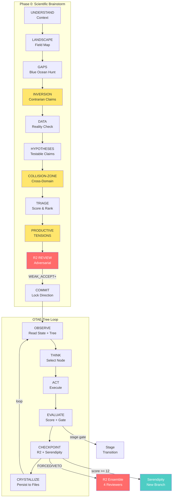
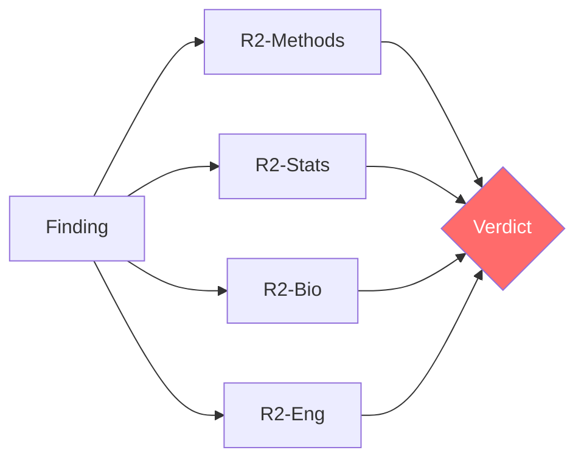
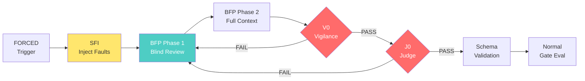
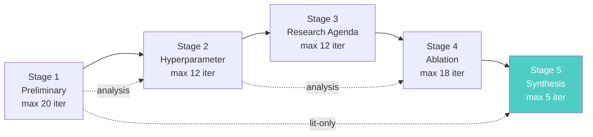
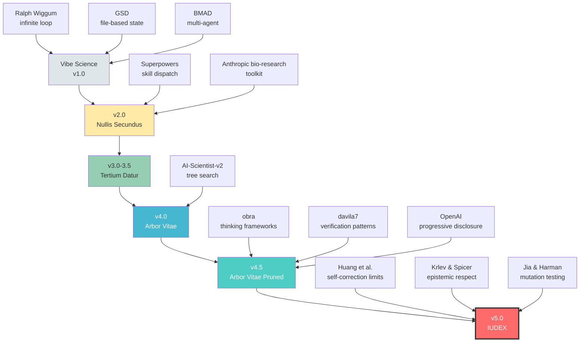

<div align="center">

# Vibe Science v5.0

### IUDEX

**Agentic tree search for scientific research.**<br>
**Infinite loops until discovery. Adversarial review at every node.**

**v5.0: R2 is structurally unbypassable. Not just prompted — architecturally enforced.**

[](https://doi.org/10.5281/zenodo.18663142)
[](#)
[](../LICENSE)

[](README.md#version-history)
[](LICENSE)
[](https://docs.anthropic.com/en/docs/claude-code)
[](#10-constitutional-laws)
[](#quality-gates)

<br>

*"It's not the prompt that makes the difference.*
*It's the system that PREVENTS the prompt from lying."*

</div>

---

## The Problem

AI agents are dangerous in science. Not because they hallucinate — that's the easy problem.

The dangerous problem is that they find **real patterns** in **real data** and construct **plausible narratives** around them, without ever asking: *"What if this is an artifact?"*

<table>
<tr>
<td width="50%">

**What the agent does:**
- Optimizes for completion, not truth
- Gets excited by strong signals (p < 10⁻¹⁰⁰!)
- Constructs narratives around artifacts
- Never searches for what kills its own claims
- Declares "done" after 1 sprint

</td>
<td width="50%">

**What actually happened (21 sprints, CRISPR):**
- OR = 2.30 → **reversed sign** under propensity matching
- "Bidirectional effects" → **biologically impossible**
- "Regime switch" → Cohen's d = **0.07** (noise)
- "Generalizable rankings" → **don't generalize** between assays

</td>
</tr>
</table>

None of these were hallucinations. The data was real. The statistics were correct. The problem was dispositional: **the agent never tried to destroy its own claims.**

---

## The Solution

```
                    Builder (Researcher)              Destroyer (Reviewer 2)
                    ───────────────────               ─────────────────────
  Optimizes for:    Completion                        Survival
  Default stance:   "This looks promising"            "This is probably an artifact"
  Strong signal:    Excitement → narrative → paper     Suspicion → confounders → controls
  Web search for:   Supporting evidence               Contradictions, prior art, known artifacts
  Says "done":      When results look good            When ALL counter-verifications pass
```

**Vibe Science embeds both dispositions in the same system.** The builder builds. The destroyer destroys. Only what survives both gets published.

---

## How It Works



### OTAE Inside Tree Nodes

v3.5 had a flat loop. v5.0 has a **branching tree** where each node is a complete OTAE cycle:

```
                         root
                        /    \
                    node-A   node-B          ← each = full OTAE cycle
                   / |  \      |
                A1  A2  A3    B1             ← children = variations
               /
             A1a                             ← deeper exploration

     Selection: Score = Evidence×0.6 + Metrics×0.3 + Novelty×0.1
     Pruning:   3 debug fails → prune | 5 non-improving → soft prune
     Health:    good_nodes / total >= 0.2 or EMERGENCY STOP
```

**7 node types:** `draft` · `debug` · `improve` · `hyperparameter` · `ablation` · `replication` · `serendipity`

**3 tree modes:** `LINEAR` (literature) · `BRANCHING` (experiments) · `HYBRID` (both)

---

## Key Features

<table>
<tr>
<td width="33%" valign="top">

### Reviewer 2 Co-Pilot

Not a gate you pass — a co-pilot you can't fire.



**6 modes:** BRAINSTORM · FORCED · BATCH · SHADOW · VETO · REDIRECT

**12 red flags** checked at every review (6 statistical + 6 methodological)

**Double-pass:** Fatal Hunt (destroy) → Method Repair (fix)

</td>
<td width="33%" valign="top">

### Evidence Engine

Every claim is quantified, not felt.

```
confidence = E × D × (R_eff × C_eff × K_eff)^(1/3)

HARD VETO: E < 0.05 or D < 0.05 → 0
FLOOR: dynamic by claim type (0.05-0.20)
```

**Confounder Harness (LAW 9):**
- Raw → Conditioned → Matched
- Sign change = ARTIFACT (killed)
- Collapse >50% = CONFOUNDED
- Survives = ROBUST

**Counter-evidence** search mandatory at confidence >= 0.60

**DOI verification** before any claim promotion

</td>
<td width="33%" valign="top">

### Serendipity Radar

Active scanner, not passive logger.

**5 scans every EVALUATE:**
1. Anomaly detection
2. Cross-branch patterns
3. Contradiction register
4. Connection discovery
5. Score computation

**Response matrix:**
- Score 15-20 → INTERRUPT
- Score 10-14 → QUEUE
- Score 5-9 → FILE
- Score 0-4 → NOISE

**Cross-branch** serendipity is v4.0+ exclusive — patterns visible only when comparing tree branches.

</td>
</tr>
</table>

---

## v5.0 — IUDEX

> *"Non e' il prompt che fa la differenza. E' il sistema che IMPEDISCE al prompt di mentire."*

Huang et al. (ICLR 2024) proved that **LLMs cannot self-correct reasoning without external feedback**. v4.5's R2 was strong but prompt-enforced. v5.0 makes adversarial review **architecturally unbypassable**.

### Four Innovations

<table>
<tr>
<td width="25%" valign="top">

**Seeded Fault Injection**

Inject known errors before R2 reviews. If R2 misses them → review invalid.

*Mutation testing for scientific claims.*

Gate: **V0** (RMS ≥ 0.80)

</td>
<td width="25%" valign="top">

**Judge Agent (R3)**

Meta-reviewer scores R2's review on 6 dimensions.

*Reviews the review, not the claims.*

Gate: **J0** (≥ 12/18)

</td>
<td width="25%" valign="top">

**Blind-First Pass**

R2 reviews claims before seeing justifications. Breaks anchoring bias.

*Think first, then compare.*

Protocol: 2-phase within one review

</td>
<td width="25%" valign="top">

**Schema-Validated Gates**

8 gates enforce JSON Schema. Prose claims ignored.

*Structure, not promises.*

9 schema files (READ-ONLY)

</td>
</tr>
</table>

### Six Enhancements

| Enhancement | What it does |
|------------|-------------|
| **A. R2 Salvagente** | Killed claims with potential preserve serendipity seeds |
| **B. Structured Seeds** | Schema-validated research objects, not notes |
| **C. Exploration Budget** | LAW 8 gains measurable 20% floor at T3 |
| **D. Confidence Formula** | Hard veto + geometric mean with dynamic floor |
| **E. Circuit Breaker** | Deadlock → DISPUTED state. S5 poison pill. |
| **F. Permission Model** | R2 produces verdicts. Orchestrator executes. Separation of powers. |

### FORCED Review Flow (v5.0)



### Agent Permission Model

```
┌─────────────┐     verdict.yaml      ┌──────────────┐
│  R2 Ensemble │ ──────────────────→  │  Orchestrator │
│  (READ only) │                      │  (READ+WRITE) │
└─────────────┘                      └──────┬───────┘
                                            │
        ┌───────────────────────────────────┤
        ↓                                   ↓
  ┌──────────┐                      ┌──────────────┐
  │  R3 Judge │                      │ Claim Ledger │
  │ (scores)  │                      │ (updated)    │
  └──────────┘                      └──────────────┘

R2 NEVER writes to the claim ledger.
R3 NEVER modifies R2's report.
Schemas are READ-ONLY for all agents.
```

---

## 10 Constitutional Laws

> These govern ALL behavior. No protocol, no user request, no context can override them.

| | Law | Rule | Enforcement |
|---|-----|------|-------------|
| **1** | DATA-FIRST | No thesis without evidence from data | `NO DATA = NO GO` |
| **2** | EVIDENCE DISCIPLINE | Every claim: claim_id + evidence chain + confidence + status | Evidence floor gate |
| **3** | GATES BLOCK | Quality gates are hard stops, not suggestions | 27 gates block pipeline (8 schema-enforced) |
| **4** | R2 IS CO-PILOT | R2 can VETO, REDIRECT, FORCE. Non-negotiable. | 6 activation modes |
| **5** | SERENDIPITY IS THE MISSION | Actively hunt the unexpected at every cycle | Radar + cross-branch |
| **6** | ARTIFACTS OVER PROSE | If it can produce a file, it MUST | LAW 10 cascades |
| **7** | FRESH CONTEXT RESILIENCE | Resumable from STATE.md + TREE-STATE.json alone | File-based state |
| **8** | EXPLORE BEFORE EXPLOIT | Minimum 3 draft nodes before promotion | Tree health gate T3 |
| **9** | CONFOUNDER HARNESS | Raw → Conditioned → Matched for every quantitative claim | `NO HARNESS = NO CLAIM` |
| **10** | CRYSTALLIZE OR LOSE | Every result written to persistent file | `NOT IN FILE = DOESN'T EXIST` |

---

## Quality Gates

<table>
<tr>
<td valign="top">

**Pipeline (G0-G6)**
```
G0  Input Sanity
G1  Schema Validation
G2  Design Review
G3  Training Health
G4  Metrics Baseline
G5  Artifacts Exist
G6  VLM Validation (optional)
```

</td>
<td valign="top">

**Literature (L0-L2)**
```
L0  Source Validity (DOI verified)
L1  Coverage (>= 3 strategies)
L2  Review Complete
```

**Decision (D0-D2)**
```
D0  Decision Justified
D1  Claim Promotion
D2  RQ Conclusion
```

</td>
<td valign="top">

**Tree (T0-T3)**
```
T0  Node Validity
T1  Debug Limit (max 3)
T2  Branch Diversity
T3  Tree Health (>= 20%)
```

**Brainstorm + Stage**
```
B0  Brainstorm Quality
S1-S5  Stage Gates
```

**Vigilance + Judge (v5.0)**
```
V0  R2 Vigilance (SFI)
J0  Judge Assessment (R3)
```

</td>
</tr>
</table>

---

## 5-Stage Experiment Manager



Literature-only: S1 → S5 | Analysis: S1 → S2 → S4 → S5 | Full computational: all 5 stages

---

## SOLO vs TEAM Runtime

<table>
<tr>
<td width="50%">

### SOLO Mode (default)

```
┌──────────────────────────────────┐
│      SINGLE CONTEXT WINDOW       │
│                                  │
│  Orchestrator (OTAE loop)        │
│  + Researcher                    │
│  + Reviewer 2 (simulated)        │
│  + Serendipity Scanner           │
│  + Experiment Runner             │
│                                  │
│  Token cost: 1x                  │
└──────────────────────────────────┘
```

Best for: literature review, short sessions, token-constrained environments.

</td>
<td width="50%">

### TEAM Mode (opt-in)

```
┌────────────┐    ┌────────────┐
│  TEAM LEAD │───>│ RESEARCHER │
│            │    │  (Sonnet)  │
│            │    └─────┬──────┘
│            │          │
│            │<──>┌─────┴──────┐
│            │    │ REVIEWER 2 │
│            │    │  (Opus)    │
│            │    │ Own context│
│            │    └────────────┘
│            │<──>┌────────────┐
│            │    │SERENDIPITY │
│            │    │  (Haiku)   │
│            │    └────────────┘
└────────────┘
     Token cost: ~3-4x
```

Best for: computational experiments, high-stakes findings, long sessions.

Requires: `CLAUDE_CODE_EXPERIMENTAL_AGENT_TEAMS=1`

</td>
</tr>
</table>

Fallback from TEAM → SOLO is seamless. All state lives in files (LAW 7).

---

## Installation & Quick Start

### 1. Install

```bash
git clone https://github.com/carminoski/vibe-science.git
claude plugins add ./vibe-science
```

### 2. Start

```bash
/start
```

### 3. Choose runtime

```
[1] SOLO — Single agent. All roles in one context. Lower cost.
[2] TEAM — Agent Teams. R2 gets own context. Higher quality.
```

### 4. Phase 0 begins automatically

The system guides you through structured brainstorming. You don't need to know the protocol — just answer questions about your research domain.

---

## v4.5 Improvements (over v4.0)

| Intervention | File | What it does |
|-------------|------|-------------|
| **Inversion Exercise** | brainstorm-engine.md | Systematically invert top 3 consensus claims to generate contrarian hypotheses |
| **Collision-Zone Thinking** | brainstorm-engine.md | Force cross-domain hypothesis (physics × biology, economics × ecology) |
| **Productive Tensions** | brainstorm-engine.md | Preserve competing paradigms instead of premature convergence |
| **R2 Red Flag Checklist** | reviewer2-ensemble.md | 12 mandatory flags (statistical + methodological) at every review |
| **Counter-Evidence Search** | evidence-engine.md | Active hunt for contradicting evidence before claim promotion |
| **DOI Verification** | search-protocol.md | Verify every citation resolves before trusting it |
| **Progressive Disclosure** | SKILL.md | -381 lines removed, pointers to protocol files, faster context loading |

**Net result:** the skill is **206 lines smaller** than v4.0 while being more capable.

---

## Protocols

21 protocols loaded on-demand via progressive disclosure:

### Core Loop

| Protocol | File | Purpose |
|----------|------|---------|
| Loop OTAE | `protocols/loop-otae.md` | OTAE-Tree cycle with node context, best-first selection, emergency protocols |
| Evidence Engine | `protocols/evidence-engine.md` | Claim Ledger, geometric confidence formula, confounder harness, counter-evidence, hard veto |
| Reviewer 2 Ensemble | `protocols/reviewer2-ensemble.md` | 4-domain adversarial review, 6 modes, 12 red flags, double-pass, circuit breaker integration |
| Search Protocol | `protocols/search-protocol.md` | Source priority, DOI verification, anti-hallucination |

### Tree & Experiment

| Protocol | File | Purpose |
|----------|------|---------|
| Tree Search | `protocols/tree-search.md` | 3 modes, 7 node types, best-first selection, pruning rules |
| Experiment Manager | `protocols/experiment-manager.md` | 5-stage lifecycle with iteration limits per stage |
| Auto-Experiment | `protocols/auto-experiment.md` | Code generation → execution → metric parsing pipeline |
| Brainstorm Engine | `protocols/brainstorm-engine.md` | Phase 0 + Inversion + Collision-Zone + Productive Tensions |
| Agent Teams | `protocols/agent-teams.md` | TEAM mode: 4 agents, shared filesystem, fallback to SOLO |

### Research Support

| Protocol | File | Purpose |
|----------|------|---------|
| Analysis Orchestrator | `protocols/analysis-orchestrator.md` | Artifact contract, manifests, OAT ablation, triage |
| Data Extraction | `protocols/data-extraction.md` | NO TRUNCATION, AnnData schema, supplementary materials |
| Serendipity Engine | `protocols/serendipity-engine.md` | Active radar (0-20 scale), cross-branch scanning, sprints, escalation |
| Knowledge Base | `protocols/knowledge-base.md` | Cross-RQ persistence (library.json, patterns, dead-ends) |
| Audit & Reproducibility | `protocols/audit-reproducibility.md` | Decision log, run comparison, snapshots, 10-point contract |

### Output

| Protocol | File | Purpose |
|----------|------|---------|
| VLM Gate | `protocols/vlm-gate.md` | Optional figure validation via vision-language model (>= 0.8 to pass) |
| Writeup Engine | `protocols/writeup-engine.md` | IMRAD paper drafting from verified claims, confidence-to-language mapping |

### v5.0 Structural Enforcement (New)

| Protocol | File | Purpose |
|----------|------|---------|
| Seeded Fault Injection | `protocols/seeded-fault-injection.md` | Inject known faults before R2 reviews. Miss = review INVALID. Gate V0. |
| Judge Agent (R3) | `protocols/judge-agent.md` | Meta-reviewer scores R2 on 6 dimensions (0-18). Gate J0 (≥ 12). |
| Blind-First Pass | `protocols/blind-first-pass.md` | R2 reviews claims before seeing justifications. Breaks anchoring bias. |
| Schema Validation | `protocols/schema-validation.md` | 8 gates enforce JSON Schema against 9 read-only schema files. Prose ignored. |
| Circuit Breaker | `protocols/circuit-breaker.md` | Same objection × 3 rounds → DISPUTED. Frozen, not killed. S5 poison pill. |

---

## CLAUDE.md Constitution

A project constitution loaded into **every agent's context**, containing:

- **The Problem Statement** — why AI agents are dangerous in science (with real examples from the 21-sprint case study)
- **10 Immutable Laws** — non-overridable behavioral constraints
- **Role-Specific Constraints** — behavioral rules for 6 agent roles:
  - **Researcher**: BUILD + EXECUTE. Search for confounders first, not celebrations.
  - **Reviewer 2**: DESTRUCTION. Assume every claim is wrong. Never congratulate.
  - **Serendipity Scanner**: DETECTION. Continuous, cross-branch, escalating. Score >= 15 → INTERRUPT.
  - **Experimenter**: EXECUTION. Files, seeds, versions, parameter logs.
  - **Team Lead**: COORDINATION. Delegate, never implement.
  - **Judge Agent (R3)**: META-REVIEW. Reviews reviews, not claims. Blind principle. Cannot modify R2's report.
- **v5.0 Structural Enforcement** — SFI, BFP, SVG, Circuit Breaker, Agent Permission Model, Salvagente Rule
- **Agent Permission Model** — separation of powers (who can read/write what)
- **Hooks Documentation** — what each system-level hook enforces

---

## Hooks Enforcement

Four Claude Code hooks in `.claude/hooks.json` provide **system-level** enforcement that cannot be overridden by any agent:

| Hook | Trigger | Enforces |
|------|---------|----------|
| **Stop** | Agent attempts to stop | Claims must have confounder harness + R2 review |
| **TaskCompleted** | Task marked complete | Required artifacts must exist |
| **TeammateIdle** | Teammate goes idle | No pending work can exist |
| **SubagentStop** | Subagent attempts to stop | Must have produced output files |

---

<details>
<summary><h2>File Structure (click to expand)</h2></summary>

### Plugin Structure

```
vibe-science-v5.0/
├── .claude-plugin/
│   └── plugin.json                 # Plugin manifest (v5.0.0)
├── SKILL.md                        # Core specification (1150 lines)
├── CLAUDE.md                       # Project constitution for all agents
├── README.md                       # This file
├── LICENSE                         # MIT
│
├── commands/
│   └── start.md                    # /start — SOLO/TEAM + session init
│
├── protocols/                      # Loaded on-demand by dispatch table
│   ├── brainstorm-engine.md        # Phase 0 + Inversion + Collision-Zone
│   ├── loop-otae.md                # OTAE-Tree cycle
│   ├── tree-search.md              # Tree modes, selection, pruning
│   ├── experiment-manager.md       # 5-stage manager
│   ├── auto-experiment.md          # Code gen + execution + metrics
│   ├── reviewer2-ensemble.md       # R2: 6 modes, 4 reviewers, red flags
│   ├── evidence-engine.md          # Claims, confidence, harness, counter-evidence
│   ├── serendipity-engine.md       # Radar, cross-branch, sprints
│   ├── search-protocol.md          # Literature search + DOI verification
│   ├── agent-teams.md              # SOLO/TEAM architecture
│   ├── vlm-gate.md                 # Visual validation (optional)
│   ├── writeup-engine.md           # IMRAD drafting
│   ├── analysis-orchestrator.md    # Data analysis pipeline
│   ├── knowledge-base.md           # Cross-RQ persistence
│   ├── data-extraction.md          # Supplementary extraction
│   ├── audit-reproducibility.md    # Run manifests
│   ├── seeded-fault-injection.md   # NEW — SFI
│   ├── judge-agent.md              # NEW — R3
│   ├── blind-first-pass.md         # NEW — BFP
│   ├── schema-validation.md        # NEW — SVG
│   └── circuit-breaker.md          # NEW — Circuit Breaker
│
├── schemas/                         # NEW — JSON Schema directory
│   ├── claim-promotion.schema.json
│   ├── rq-conclusion.schema.json
│   ├── stage4-exit.schema.json
│   ├── stage5-exit.schema.json
│   ├── source-validity.schema.json
│   ├── review-completeness.schema.json
│   ├── brainstorm-quality.schema.json
│   ├── vigilance-check.schema.json
│   └── serendipity-seed.schema.json
│
├── gates/
│   └── gates.md                    # All 27 gates with pass/fail criteria
│
├── assets/
│   ├── node-schema.md              # TreeNode YAML schema
│   ├── stage-prompts.md            # Stage-specific guidance
│   ├── metric-parser.md            # Metric extraction
│   ├── obs-normalizer.md           # AnnData obs schema
│   ├── templates.md                # File templates
│   ├── skill-router.md             # Tool dispatch table
│   ├── fault-taxonomy.yaml         # NEW — SFI faults
│   └── judge-rubric.yaml           # NEW — R3 rubric
│
├── examples/
│   └── walkthrough-literature-review.md
│
└── .claude/
    ├── settings.json               # Agent Teams, permissions
    └── hooks.json                  # Enforcement hooks
```

### Runtime Directory (created during research)

```
.vibe-science/
├── STATE.md                        # Current state (max 100 lines)
├── PROGRESS.md                     # Append-only log
├── CLAIM-LEDGER.md                 # All claims + evidence + confidence
├── ASSUMPTION-REGISTER.md          # Assumptions + risk + verification
├── SERENDIPITY.md                  # Discovery log
├── TREE-STATE.json                 # Full tree serialization
├── KNOWLEDGE/
│   ├── library.json
│   └── patterns.md
│
└── RQ-001-[slug]/
    ├── RQ.md
    ├── 00-brainstorm/              # Phase 0 outputs
    │   ├── context.md
    │   ├── landscape.md
    │   ├── gaps.md
    │   ├── data-audit.md
    │   ├── hypotheses.md
    │   └── triage.md
    ├── 01-discovery/
    ├── 02-analysis/
    ├── 03-data/
    ├── 04-validation/
    ├── 05-reviewer2/
    ├── 06-runs/
    ├── 07-audit/
    ├── 08-tree/
    │   ├── tree-visualization.md
    │   ├── nodes/                  # One YAML per node
    │   ├── stage-transitions.log
    │   └── best-nodes.md
    └── 09-writeup/
```

</details>

---

## Version History

| Version | Codename | Year | Key Changes |
|---------|----------|------|-------------|
| 1.0 | — | 2024 | 6-phase loop, basic R2, state files |
| 2.0 | Nullis Secundus | 2024 | Modular architecture, R2 ensemble, quality gates, confidence formula |
| 3.0 | Tertium Datur | 2025 | OTAE unrolled loop, MCP integration, knowledge base, Serendipity Sprints |
| 3.5 | Tertium Datur | 2025 | R2 double-pass, typed claims, tool-use audit, confounding table, No Free Lunch |
| 4.0 | Arbor Vitae | 2025 | Tree search, 5-stage manager, Phase 0, 10 Laws, Agent Teams, VLM gate, hooks |
| 4.5 | Arbor Vitae (Pruned) | 2025 | Inversion + Collision-Zone, R2 red flags, counter-evidence, DOI verification, progressive disclosure |
| **5.0** | **IUDEX** | **2026** | **SFI, Judge Agent (R3), Blind-First Pass, Schema-Validated Gates, Circuit Breaker, Agent Permission Model. 27 gates (8 schema-enforced). R2 structurally unbypassable.** |

---

## Lineage



---

## Design Philosophy

Vibe Science was built by reverse-engineering two complementary approaches:

<table>
<tr>
<td width="50%" valign="top">

**Agentic research loops**
*(Ralph, GSD, BMAD, AI-Scientist-v2)*

Excellent as **systems**: infinite loop, state management, tree search.

Missing: executability, adversarial review, serendipity.

</td>
<td width="50%" valign="top">

**Scientific toolkits**
*(Anthropic bio-research, Claude Scientific Skills, MCP)*

Excellent as **tools**: CLI scripts, database APIs, analysis pipelines.

Missing: loop, persistence, adversarial review.

</td>
</tr>
</table>

**Vibe Science fuses both:** the systematic rigor of a research loop with the concrete executability of a scientific toolkit, bound together by an adversarial co-pilot that prevents the system from lying to itself.

---

## Academic Foundations

v5.0 IUDEX is grounded in peer-reviewed research. Every architectural decision traces to an empirical finding:

### Core: LLM Self-Correction Limitations

These papers prove the fundamental problem v5.0 solves — LLMs cannot self-correct without structural intervention:

| # | Paper | Key Finding | What v5.0 Does About It |
|---|---|---|---|
| 1 | **Huang, J., et al.** (2024). "Large Language Models Cannot Self-Correct Reasoning Yet." *ICLR 2024*. arXiv:2310.01798 | Intrinsic self-correction is ineffective; 74.7% of the time the model retains its initial answer. Among changes, more flip correct→incorrect than vice versa. | Theoretical foundation for the entire v5.0 architecture. R2 must be architecturally separated (TEAM mode) and structurally enforced (SFI, schemas), not just prompted. |
| 2 | **Gou, Z., et al.** (2023). "CRITIC: LLMs Can Self-Correct with Tool-Interactive Critiquing." *ICLR 2024*. arXiv:2305.11738 | Self-correction works ONLY with external tool feedback. Model's own critiques "contribute marginally." | Validates R2's mandatory tool-use (PubMed, Scopus, OpenAlex). But prompt-level mandates can be circumvented — hence Schema-Validated Gates. |
| 3 | **Kamoi, R., et al.** (2024). "When Can LLMs Actually Correct Their Own Mistakes?" *TACL 2024*. arXiv:2406.01297 | No prior work demonstrates successful self-correction from prompted LLMs alone. | Motivates the architectural triad (SFI + BFP + R3) as structural external feedback mechanisms. |

### Multi-Agent Correction

| # | Paper | Key Finding | What v5.0 Does About It |
|---|---|---|---|
| 4 | **Du, Y., et al.** (2024). "Improving Factuality through Multiagent Debate." *ICML 2024*. arXiv:2305.14325 | Multiple LLM agents debating reduces factual errors by 30%+. | Direct empirical validation of R2 Ensemble's multi-reviewer architecture. |
| 5 | **Wang, X., et al.** (2022). "Self-Consistency Improves Chain of Thought Reasoning." arXiv:2203.11171 | Sampling N independent reasoning chains and aggregating outperforms single-pass. | In SOLO mode, R2 generates N=3 independent assessments. Most conservative verdict wins. |
| 6 | **Dhuliawala, S., et al.** (2023). "Chain-of-Verification Reduces Hallucination in LLMs." arXiv:2309.11495 | Generate verification questions, then answer them independently from the original draft. | Strengthens Blind-First Pass Phase 1: R2 generates verification questions before seeing justifications. |

### Peer Review as Model

| # | Paper | Key Finding | What v5.0 Does About It |
|---|---|---|---|
| 7 | **Krlev, G. & Spicer, A.** (2023). "Reining in Reviewer Two." *JMS*. DOI:10.1111/joms.12905 | Epistemic respect = assess on soundness, not origin. | R2's calibration: destructive but rigorous. R3 enforces review quality via the specificity dimension. |
| 8 | **Watling, C., et al.** (2021). "Don't Be Reviewer 2!" | Checklist-only reviews are mechanical. Best reviews are specific with developmental intent. | R2's Red Flag Checklist is a *floor*. R3 Judge ensures R2 goes beyond checklist compliance. |
| 9 | **Jefferson, T., et al.** (2002). "Measuring the Quality of Editorial Peer Review." *JAMA*. | Interventions to improve peer review were "relatively unsuccessful." | You cannot fix peer review with better instructions alone. You need structural change — SFI + R3. |
| 10 | **PMC** (2024). "Peer Reviews of Peer Reviews: A Randomized Controlled Trial." PMC:11964232 | Longer reviews rated as higher quality even by meta-reviewers — a length bias. | R3's rubric explicitly rewards specificity and evidence, not verbosity. Anti-gaming by design. |

### Mutation Testing Theory (SFI Design)

| # | Paper | Key Finding | What v5.0 Does About It |
|---|---|---|---|
| 11 | **Jia, Y. & Harman, M.** (2011). "An Analysis and Survey of the Development of Mutation Testing." *IEEE TSE*. DOI:10.1109/TSE.2010.62 | 10% random sampling of mutants is ~84% as effective as exhaustive testing. | Justifies 1-3 faults per FORCED review. Prioritize by fault class, not random spray. |
| 12 | **Papadakis, M., et al.** (2019). "Mutation Testing Advances: An Analysis and Survey." *Advances in Computers*. | Equivalent mutants inflate scores and are undecidable. Must be explicitly managed. | EQUIV state in fault taxonomy. Non-discriminable faults excluded from RMS denominator. |

### Concurrent Work: DeepMind Deep Think & Aletheia

| # | Paper | Key Finding | What v5.0 Does About It |
|---|---|---|---|
| 13 | **Snell, C., et al.** (2024). "Scaling LLM Test-Time Compute." arXiv:2408.03314 | Inference-time compute scaling improves reasoning more effectively than enlarging the model. | Theoretical grounding for OTAE-Tree: agent-time exploration scales analogously to inference-time compute. |
| 14 | **DeepMind — Aletheia** (2026). "Towards Autonomous Mathematics Research." arXiv:2602.10177 | Generator-Verifier-Reviser architecture for autonomous math research. Iterative loop until verified or max attempts. | Architecturally isomorphic to our Researcher-R2-Researcher loop. Independent validation of our design. |
| 15 | **DeepMind** (2026). "Accelerating Scientific Research with Gemini." arXiv:2602.03837 | Patterns for human-AI scientific collaboration: iterative refinement, problem decomposition, cross-disciplinary transfer. | Maps to OTAE loop (iterative refinement), tree search (decomposition), and Brainstorm collision-zone (cross-disciplinary). |
| 16 | **Kumar, A., et al.** (2024). "Training Language Models to Self-Correct via Reinforcement Learning (SCoRe)." *ICLR 2025*. arXiv:2409.12917 | DeepMind's own follow-up: RL fine-tuning enables genuine self-correction (+15.6% MATH). | Self-correction CAN work with structural change (RL training). Our SFI + R3 + schemas are the agent-level analog. |

### Vibe Science vs Deep Think / Aletheia

| | Deep Think / Aletheia | Vibe Science v5.0 |
|---|---|---|
| **Level** | Inference-time (within model) | Agent-time (separate agents) |
| **Verifier** | Process Reward Model (trained) | R2 Ensemble (prompted + tool-grounded) |
| **Scaling** | More compute = more hypotheses explored | More OTAE cycles = more tree nodes explored |
| **Verification type** | Logical (reasoning-based) | **Empirical** (tool-grounded: PubMed, Scopus, web) |
| **Structural enforcement** | PRM weights (non-bypassable) | JSON Schema gates + SFI + R3 |
| **Cost** | Proprietary (Google AI Ultra) | Open source (MIT, any LLM) |
| **Catches** | Logical flaws in reasoning chains | Confounded claims, known artifacts, missing controls, citation errors |

**Complementary, not competing.** Deep Think catches what pure reasoning can catch. Vibe Science catches what only external empirical verification can catch. The critical architectural difference: **Vibe Science validates against external sources** (PubMed, OpenAlex, Scopus, web) rather than relying on internal self-correction. This makes it robust to the failure mode Huang et al. proved is fundamental.

### Additional References

| # | Paper | Relevance |
|---|---|---|
| 17 | **Swanson, D.R.** (1986). "Undiscovered Public Knowledge." *The Library Quarterly*. DOI:10.1086/601720 | Foundational work on literature-based discovery. Theoretical foundation for the Serendipity Engine. |
| 18 | **Kahneman, D.** (2003). "Experiences of Collaborative Research." *American Psychologist*. | Adversarial collaboration: opponents co-design discriminating tests. Inspires R2's REDIRECT power + Salvagente. |
| 19 | **McAleese, N., et al.** (2024). "LLM Critics Help Catch LLM Bugs." (CriticGPT) arXiv:2407.00215 | Prompted critics need structural scaffolding — validates that R2 needs SFI + schemas + R3. |
| 20 | **Sentz, K. & Ferson, S.** (2002). "Combination of Evidence in Dempster-Shafer Theory." Sandia Labs, SAND2002-0835 | Motivates distinguishing "no evidence" (E=0, kills) from "no replication" (R=0, does not kill) in confidence formula. |
| 21 | **Sakana AI-Scientist-v2** (Lu et al., arXiv:2504.08066v1) | Tree search architecture and 4-stage manager. Foundation for OTAE-Tree since v4.0. |

---

## Known Limitations & Non-Goals

### Limitations

- Only 1 slash command (`/start`) — all phases are implicit via the OTAE loop
- LLM non-determinism means exact replication is not guaranteed (seeds are logged)
- TEAM mode requires Claude Code with Agent Teams experimental feature
- VLM gate (G6) is optional and requires vision model access
- Designed for single-operator use (one researcher + one session)
- Context window limits mean very long sessions may need manual resume via STATE.md
- Schema validation ensures structural completeness, not truthfulness (defense is layered)
- SFI fault taxonomy is domain-specific (CRISPR-derived) — needs customization for other domains
- R3 in SOLO mode has limited independence (mitigated by self-consistency N=2)
- v5.0 empirical data came from cross-model R2 (Claude+GPT) — SOLO mode results may differ

### Non-Goals

| Category | What Vibe Science Does NOT Do |
|----------|-------------------------------|
| **Wet-lab execution** | Cannot run experiments; all evidence is computational or from published data |
| **Model training** | Does not train or fine-tune LLMs; uses existing Claude models as-is |
| **Autonomous publication** | Cannot submit papers; human signs off on all outputs |
| **Multi-user collaboration** | Single-operator design; no access control or concurrent sessions |
| **Real-time data streams** | No streaming API; all data is batch-fetched per cycle |
| **Guaranteed reproducibility** | Tracks provenance and seeds, but LLM non-determinism means crystallized artifacts are the reproducibility anchor |
| **Domain universality** | SFI taxonomy and gates tested on scRNA-seq / CRISPR; other domains need custom faults, gates, and MCP skills |

---

<div align="center">

## License

MIT — see [LICENSE](LICENSE).

---

**Built by [carminoski](https://github.com/carminoski)**

*Built with Claude. Tested against Reviewer 2. Survived 21 sprints. Validated by 3 models.*

</div>
